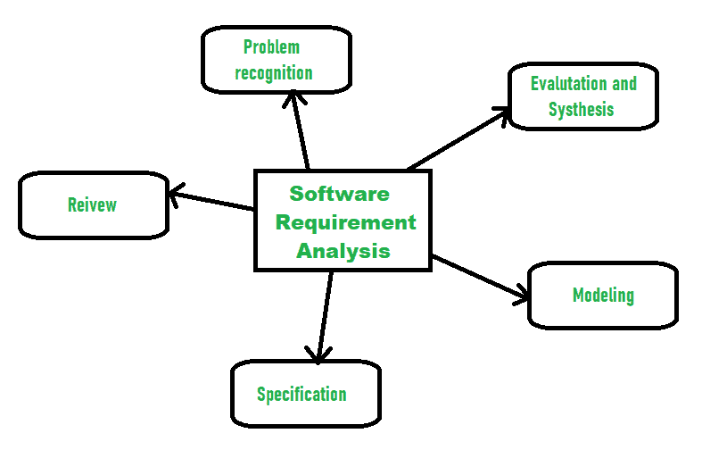

# 软件需求分析中涉及的活动

> 原文:[https://www . geesforgeks . org/activities-in-software-requirement-analysis/](https://www.geeksforgeeks.org/activities-involved-in-software-requirement-analysis/)

[软件需求](https://www.geeksforgeeks.org/software-engineering-classification-of-software-requirements/)是指软件为提高[软件产品](https://www.geeksforgeeks.org/software-engineering-software-product/)的质量所需要的需求。这些需求通常是用户对软件产品的一种期望，这种期望很重要，需要通过软件来实现。分析意味着以一种有组织的和具体的方式检查某件事，以了解它的全部细节。

因此，**软件需求分析**简单来说就是完成对软件需求的研究、分析、描述，从而满足真实的、需要的需求来解决问题。分析软件需求涉及几个活动。其中一些如下:

1.  **问题识别:**
    需求分析的主要目的是充分理解需求的主要目标，包括为什么需要它，它是否给产品增加价值，它是否有益，它是否提高项目质量，它是否会有任何其他影响。所有这些要点在问题识别中都得到了充分的认可，这样就可以满足必要的需求来解决业务问题。

2.  **评价与综合:**
    评价意味着对某事物是否值得的判断，综合意味着创造或形成某事物。这里给出了一些在软件需求评估和综合中很重要的任务:
    *   定义软件的所有必要功能。
    *   定义所有外部存在且易于观察的数据对象。
    *   评估数据流是否值得。
    *   充分理解系统的整体行为，即系统的整体工作。
    *   识别和发现设计的约束。
    *   定义和建立系统接口的特征，以充分理解系统如何与两个或多个组件或彼此交互。
3.  **建模:**
    完成上述任务的信息收集后，使用领域模型(也称为概念模型)检查系统的功能和行为后，建立功能和行为模型。

4.  **规范:**
    [软件需求规范(SRS)](https://www.geeksforgeeks.org/software-requirement-specification-srs-format/) 是指规定需求是功能性的还是非功能性的都要开发。

5.  **评审:**
    开发 SRS 后，必须进行评审，检查是否可以改进，必须进行细化，使之更好，提高质量。