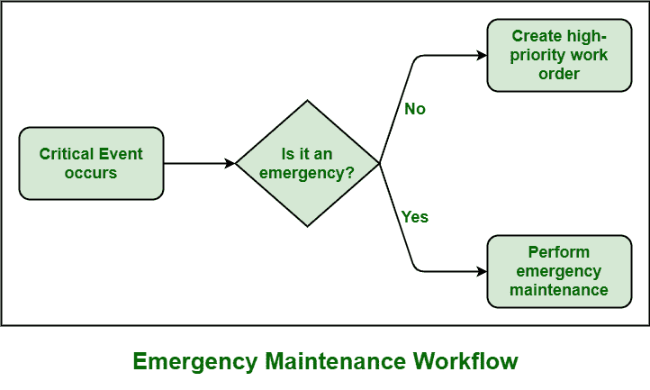

# 应急维护(EM)的优缺点

> 原文:[https://www . geesforgeks . org/紧急维护的优缺点-em/](https://www.geeksforgeeks.org/advantages-and-disadvantages-of-emergency-maintenance-em/)

**紧急**，这个词我想大家都很熟悉。顾名思义，这是一个严重的意外情况，需要立即解决。可以说，紧急情况是一种危险的情况，需要立即采取快速行动。紧急情况总是在没有任何警告的情况下发生。同样，在软件工程中，有些情况需要立即采取行动。

**紧急维护(EM)** 是每当资产发生任何意外故障或资产发生故障时需要立即采取的行动。这些意外故障可能是危险的，可能会对健康、安全和工作环境造成更大的损害。紧急维护是指如果故障设备在故障后没有立即修复，则可能会造成更大的损坏，影响健康，并导致生产损失。

**应急维护工作流程(EM) :**

**优势:**

*   紧急维护的主要优势之一是不涉及初始规划，因此在故障发生前维护设备的初始成本是安全的。
*   由于不涉及计划，解决问题所需的团队成员数量将会减少。
*   EM 通常会指导技术人员采取预防措施，以防止系统受到更大的损坏。
*   电磁还可以帮助人们立即确定故障的主要原因，然后将资产或设备恢复到正常工作状态。反过来，它可以最大限度地减少损失。

**缺点:**

*   不可预测性是紧急维护的主要缺点之一，因为当故障将要发生时，人们不会这样做。这可能会导致生产延迟、产品质量下降、劳动力成本增加等。
*   不涉及规划，也不收集解决问题所需的工具和资源，因为此类问题会意外发生。
*   紧急维护不会增加设备的寿命。事实上，这通常会降低设备的寿命。
*   它可能比定期实施预防性维护的费用更昂贵。
*   每个人的主要优先事项是不要处理这种类型的维护。但无论如何，一个人必须计划克服这种紧急情况。