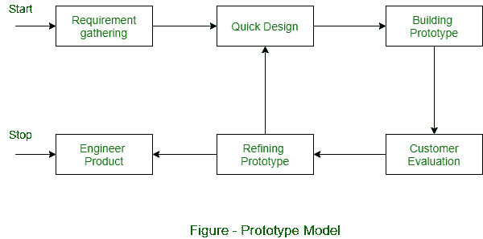

# 原型模型的优缺点

> 原文:[https://www . geesforgeks . org/原型模型的优缺点/](https://www.geeksforgeeks.org/advantages-and-disadvantages-of-prototype-model/)

[原型模型](https://www.geeksforgeeks.org/software-engineering-prototyping-model/)在客户事先不知道确切的项目需求时使用。在该模型中，首先根据客户反馈反复开发、测试和完善最终产品的原型，直到获得最终可接受的原型，这形成了开发最终产品的基础。

系统在分析阶段之前或期间被部分实现，从而使客户有机会在生命周期的早期看到产品。

**使用原型模型的优势:**

1.  这种模型设计灵活。
2.  很容易发现错误。
3.  我们可以很容易地找到缺失的功能。
4.  有改进的余地，这意味着新的需求可以很容易地适应。
5.  它可以被开发人员在将来更复杂的项目中重用。
6.  它确保更高水平的客户满意度和舒适度。
7.  非常适合在线系统。
8.  它帮助开发人员和用户更好地理解系统。
9.  集成需求非常容易理解，部署渠道也是在很早的阶段就决定的。
10.  它可以让用户积极参与开发阶段。

**使用原型模型的缺点:**

1.  这种模式成本很高。
2.  由于不断变化的客户需求，它的文档记录很差。
3.  需求可能会有太多的变化。
4.  客户有时会要求在看到早期原型后立即交付实际产品。
5.  可能会有次优的解决方案，因为开发人员急于构建原型。
6.  客户在看到最初的原型后，可能对产品不满意或不感兴趣。
7.  确定迭代次数是有把握的。
8.  可能存在不完整或不充分的问题分析。
9.  这可能会增加系统的复杂性。