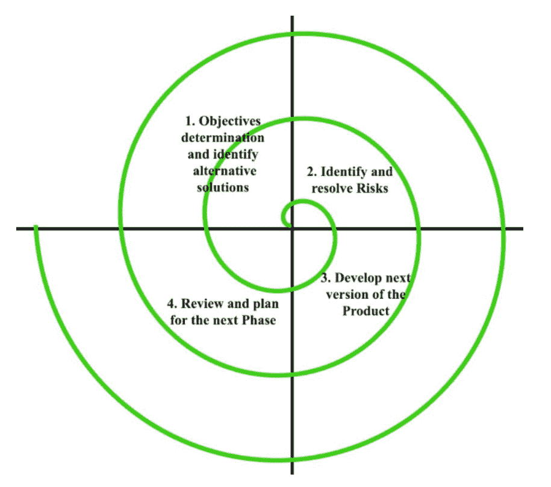

# 使用螺旋模型的优缺点

> 原文:[https://www . geeksforgeeks . org/使用螺旋模型的优缺点/](https://www.geeksforgeeks.org/advantages-and-disadvantages-of-using-spiral-model/)

[螺旋模型](https://www.geeksforgeeks.org/software-engineering-spiral-model/)也被称为元模型，因为它包含了所有其他的 SDLC 模型。在它的图解表示中，它看起来像一个有许多环的螺旋，这就是它被称为螺旋的原因。螺旋的每个循环被称为软件开发过程的一个阶段。这种模式具有处理风险的能力。

以下是使用螺旋模型的优点和缺点

**螺旋模型优势:**

1.  软件是在软件生命周期的早期产生的。
2.  风险处理是螺旋模型的重要优势之一，由于每个阶段都有风险分析和风险处理，因此它是最好的开发模型。
3.  需求的灵活性。在这个模型中，我们可以很容易地在后期阶段改变需求，并且可以被精确地合并。此外，还可以在以后添加其他功能。
4.  对于大型复杂的项目很有好处。
5.  这对顾客满意有好处。在软件开发的早期阶段，我们可以让客户参与产品的开发。此外，软件是在软件生命周期的早期生产的。
6.  强有力的批准和文件控制。
7.  适用于业务需求可能不稳定的高风险项目。使用这个可以开发高度定制的产品。

**螺旋模型的缺点:**

1.  它不适合小项目，因为它很贵。
2.  它比其他 SDLC 模型复杂得多。过程很复杂。
3.  过于依赖风险分析，需要高度具体的专业知识。
4.  时间管理困难。由于项目开始时阶段数量未知，因此时间估计非常困难。
5.  螺旋可能会无限期地持续下去。
6.  项目的结束可能还不知道。
7.  不适合低风险项目。
8.  可能很难定义客观的、可验证的里程碑。大量的中间阶段需要过多的文档。