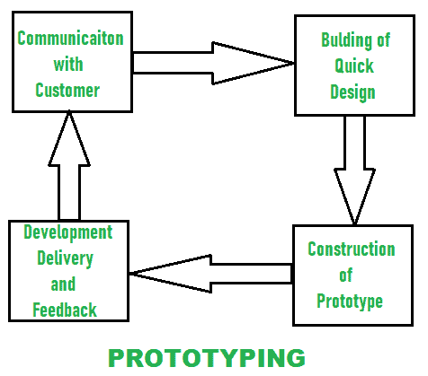

# 原型法在软件过程中的优势

> 原文:[https://www . geeksforgeeks . org/软件过程原型化方法的优势/](https://www.geeksforgeeks.org/advantages-of-prototyping-approach-in-software-process/)

客户需求是非常重要的，需要开发人员来满足。但有时客户的要求是不可理解或难以理解的。在这种情况下，当客户需求不明确且技术问题仍未解决时，首选原型模型。在每个阶段，可以为开发制作工作原型，并提交给客户批准。因此，原型在开发工作模型的每个阶段都会被细化。

对于大型或更大的系统，这种模式是非常必要和合适的。在建立原型时，开发人员和客户的参与是必须的。为了建立下一个原型，可以使用可重用的组件。

首先，在原型模型中进行需求收集。

*   总体目标由开发人员和客户定义，并且确定了需要或需要更多需求收集的领域。
*   然后准备一个快速设计，它代表了对客户或用户可见的输入和输出格式。
*   根据上面的快速设计准备了一个原型。为了细化需求，原型由客户或用户进行评估。当迭代原型被调优时，客户需求被满足。因此，在识别软件需求时，原型是非常重要的。
*   为了扔掉原型并将系统重建为高质量，开发人员在建立工作原型期间使用现有的程序片段或程序生成器。
*   使用原型范式，开发特定类别的数学算法、命令驱动系统的子集，以及无需实时交互即可轻松检查结果的其他应用程序。

**什么时候选？**

*   当相对容易原型化的软件应用程序总是涉及**人机交互(HCI)** 时，建议使用原型化模型。
*   原型模型在定义了软件目标但没有定义详细的输入、处理或输出需求的情况下是有用的。
*   在开发人员不确定算法的效率或操作系统的适应性的情况下，原型是更好的选择。