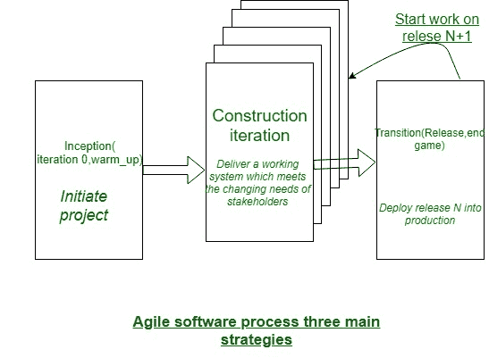

# 敏捷软件过程及其原理

> 原文:[https://www . geesforgeks . org/agile-software-process-and-its-principles/](https://www.geeksforgeeks.org/agile-software-process-and-its-principles/)

任何[敏捷软件](https://www.geeksforgeeks.org/software-engineering-agile-software-development/)方法的特征在于，以一种方式解决与大量软件项目相关的各种关键假设:

*   很难预测软件需求是否会持续，以及哪些需求可以修改。预测客户优先级会因为项目收益而改变，这同样很麻烦。
*   对于许多种类的软件，风格和结构是交错的。也就是说，每个活动都应该被执行，以便样式模型在创建时得到验证。在使用建筑来证明外观之前，很难预测什么比例设计是关键的
*   Analysis, design, construction, and testing aren’t as inevitable (from a designing purpose of view) as we’d like.

    鉴于这 3 个假设，一个关键问题出现了:然而，我们会产生一种管理不可预测性的方法吗？正如我已经提到的，解决方案在于方法能力(快速动态项目和技术条件)。因此，相关敏捷方法应该是可适应的。

    

    但是持续的适应，而不是前进，收效甚微。因此，相关的敏捷软件方法应该逐渐适应。为了实现渐进的适应，相关的敏捷团队需要客户反馈(以便经常做出合适的变化)。

    客户反馈的一个很好的催化剂是一个相关的操作范例或一个小的操作系统。因此，应该制定相关渐进发展战略。软件增量(可执行原型或相关操作系统的部分)应在短时间内交付，以便适应与修改保持同步(不可预测性)。

    这种不变的方法允许客户频繁地评估包增量，向软件团队提供必要的反馈，并影响为适应反馈而创建的方法变化。

    **敏捷原则:**
    敏捷联盟为那些需要获得敏捷的人定义了十二个轻盈原则:

    1.  我们最优先考虑的是通过早期和持续交付有价值的计算机软件来满足客户。
    2.  欢迎动态需求，即使在开发后期。敏捷流程利用修改来获得客户的竞争优势。
    3.  经常交付操作计算机软件，从几周到几个月，优先选择较短的时间。
    4.  商业人士和开发人员应该在整个项目中每天一起工作。
    5.  这座建筑围绕着受驱动的人们建造。向他们提供他们所拥有的环境和支持，并相信他们会督促完成任务。
    6.  在开发团队之间传递信息最经济有效的方法是面对面的演讲。
    7.  运行计算机软件是进步的主要动力。
    8.  敏捷过程促进了财产开发。赞助商、开发者和用户能够无限期地保持不懈的步伐。
    9.  持续关注卓越的技术和聪明的风格增强了灵活性。
    10.  简单性——最大化未完成工作数量的艺术——至关重要。
    11.  最有效的架构、必需品和风格来自自组织团体。
    12.  每隔一段时间，团队会思考一种变得更简单的方法，然后调整和调整自己的行为。