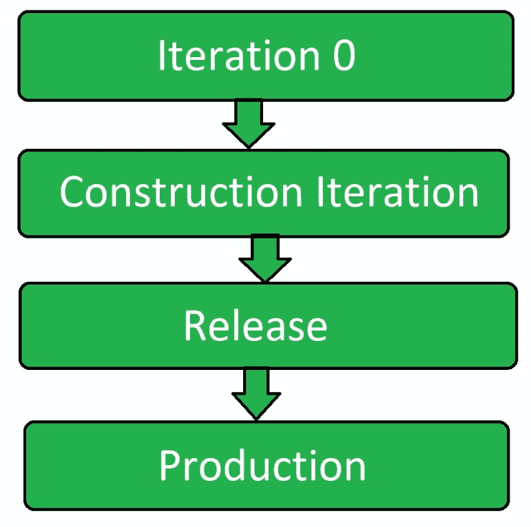

# 敏捷软件测试

> 原文:[https://www.geeksforgeeks.org/agile-software-testing/](https://www.geeksforgeeks.org/agile-software-testing/)

**敏捷测试**是一种遵循敏捷软件开发原则来测试软件应用的软件测试类型。

项目团队的所有成员以及特殊的专家和测试人员都参与敏捷测试。敏捷测试不是一个单独的阶段，它与所有的开发阶段一起执行，即需求、设计和编码以及测试用例生成。敏捷测试在整个开发生命周期中同时发生。

敏捷测试人员与开发团队成员一起参与整个开发生命周期，测试人员帮助根据客户需求构建软件，并进行更好的设计，因此代码成为可能。

敏捷测试团队作为一个团队朝着实现质量的单一目标而工作。敏捷测试有更短的时间框架，称为迭代或循环。这种方法也被称为交付驱动方法，因为它可以在更短的时间内对可行的产品进行更好的预测。

**敏捷测试原则:**

*   **Shortening feedback iteration:**
    In Agile Testing, testing team get to know the product development and its quality for each and every iteration. Thus continuous feedback minimizes the feedback response time and the fixing cost is also reduced.
*   **Testing is performed alongside:**
    Agile testing is not a different phase. It is performed alongside the development phase. It ensures that the features implemented during that iteration are actually done. Testing is not kept in pending for a later phase.
*   **Involvement of all members:**
    Agile testing involves the each and every member of the development team and the testing team. It include various developers and experts.
*   **Documentation is weightless:**
    In place of global test documentation, agile testers use reusable checklists to suggest tests and focus on the essence of the test rather than the incidental details. Lightweight documentation tools are used.
*   **干净代码:**
    检测到的缺陷在同一个迭代中被修复。这确保了在开发的任何阶段都有干净的代码。

**敏捷测试生命周期:**

1.  **Iteration 0:**
    It is the first stage of the testing process and initial setup are performed in this stage. Testing environment is set in this iteration.
2.  **Construction Iteration:**
    It is the second phase of the testing process. It is the major phase of the testing and most of the works are performed in this phase. It is a set of iterations to build an increment of the solution.
3.  **Release:**
    This phase includes the full system testing and the acceptance testing. To finish the testing stage, the product is tested more relentless while it is in construction iterations. In this phase testers work on the defect stories.
4.  **生产:**
    这是敏捷测试的最后阶段。移除所有缺陷和提出的问题后，在此阶段最终确定产品 id。

**敏捷测试活动:**
敏捷测试包括以下活动:

*   参与迭代计划
*   从测试的角度评估任务
*   使用特性描述编写测试用例
*   单元测试
*   集成测试
*   特征测试
*   缺陷修复
*   集成测试
*   验收测试
*   测试进度状态报告
*   缺陷跟踪