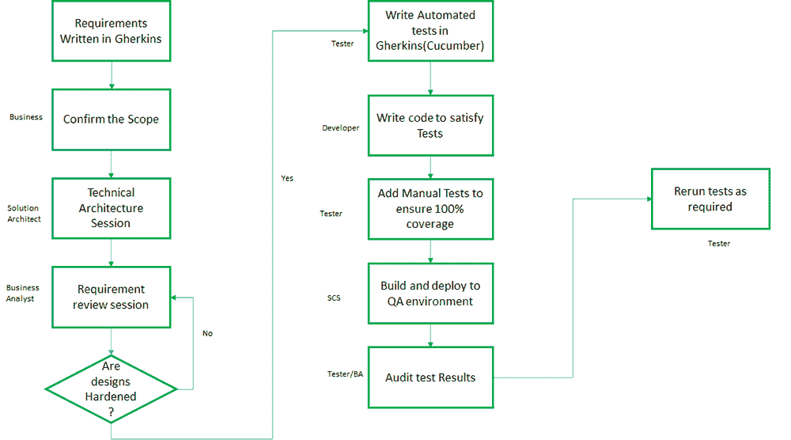

# 敏捷测试方法——行为驱动测试

> 原文:[https://www . geesforgeks . org/agile-testing-methods-行为驱动-testing/](https://www.geeksforgeeks.org/agile-testing-methods-behavior-driven-testing/)

敏捷测试是相对较新的软件测试方法。它遵循敏捷宣言中提出的敏捷软件开发的原则。大约 10-12 年前，大多数项目都是以瀑布的方式运行的。然而，敏捷方法具有上市时间更快的基本优势，现在正变得越来越流行。
在敏捷中，软件开发和测试是连续的，它是测试人员、开发人员、产品所有者甚至客户之间的协作努力，测试不像瀑布模型那样是一个单独的阶段。

敏捷方法的不同之处在于，测试从项目一开始就开始了，甚至在开发开始之前就开始了，并且对开发活动给出了持续的反馈。

同样，作为一个思维过程，敏捷方法中的测试是不同的，因为质量的责任在于敏捷团队中的每一个人，而不仅仅是质量保证，也就是说，团队中的每一个人都有责任进行测试。

**敏捷测试方法:**
**1。测试驱动开发(TDD) :**

*   术语 TDD 是由肯特·贝克在 2002 年创造的
*   在这种方法中，测试写在函数之前。
*   它依赖于非常短的开发周期的重复
*   首先，开发人员编写一个最初失败的自动化测试用例，定义一个期望的改进或新功能
*   第二，开发人员生成最小数量的代码来通过测试
*   最后，将新代码重构为可接受的标准

测试驱动开发背后的思想是使每个变化足够小，以便快速迭代。当您自动化并实现每个功能或变更时，您基本上已经为您的整个系统添加了一些有价值的东西，并且您已经准备好接受可发货产品和产品所有者的反馈。

**(一)。行为驱动测试(BDD) :**

*   丹·诺斯在 2009 年首次描述了它。
*   BDD 是测试驱动开发(TDD)的扩展。
*   产品所有者、程序员和测试人员(三个朋友)从一开始就参与其中。
*   通过使用给定的表示测试的方式，从涉众的角度帮助应用程序实现。
*   BDD 将词汇从基于测试转变为基于行为。
*   它可以互换/松散地称为
    *   讲故事
    *   功能测试
    *   验收测试驱动开发(ATDD)

因为，BDD 涉及用一种通用语言思考，它帮助团队在正确的时间进行正确的对话，从而最大限度地增加有价值的代码量。它还有可能在我们真正知道要做什么之前，找出理解上的差距和我们需要更多信息的领域。

**2。BDD 测试涉及的步骤:**

*   首先，对系统进行一个小的即将到来的更改，即用户故事或场景(也称为黄瓜上下文中的示例)。
*   通过 BA、开发人员和测试人员这三个朋友之间的讨论，分析新功能，以探索和商定预期要完成的工作的细节。
*   以一种可以自动化的方式记录场景。
*   最后，实现每个文档化的例子所描述的行为，从自动化测试开始，指导代码的开发。

下图描述了一个实用的 BDD 项目流程。

**3。BDD vs ATDD vs TDD:主要区别**
**行为驱动开发(BDD) :**

*   本质上更面向客户，帮助开发人员编写测试时记住涉众期望的行为，而不是验证代码实现的测试。
*   以客户为中心，使用类似英语的语言，使与非技术利益相关方的合作变得更加容易。
*   从开发人员和客户的角度清楚地了解系统应该做什么。
*   在 BDD 测试中，失败是因为功能没有开发出来，
    *   功能基于客户需求

**验收测试驱动开发(ATDD) :**

*   首先指导开发团队实际需要构建哪些特性，然后测试这些特性以验证它们的功能。因此，ATDD 侧重于高层次，而贸发会议侧重于低层次。
*   做正确的事(商业观点)。
*   让开发人员了解系统应该做什么。
*   最近的 ATDD 工具更倾向于使用类似 BDD 的语言“给定，当，然后”。

#### 测试驱动开发

*   告诉开发人员她的/他的代码是否工作正常。
*   做正确的事情(发展观点)。
*   在 TDD 中，测试失败是因为算法/函数没有开发出来。
    *   算法是基于程序员所知道的

BDD/TDD 中的一般流程

**4。黄瓜和小黄瓜:**
**黄瓜:**

*   需要注意的重要一点是，黄瓜不是一个测试工具。
*   黄瓜是一个基于行为驱动开发(BDD)框架的工具，用于编写用户验收测试。
*   黄瓜读取用英文文本编写的可执行规范，并验证软件是否按照规范的建议运行。
*   黄瓜的方案或规格按以下格式编写:

**场景** : <详细场景描述>

**给定**:本条款描述了前置条件

**当**时:该条款定义了一个操作的触发点。

**然后**:本条款定义事件或操作的结果。

**小黄瓜:**

*   小黄瓜是一种商业可读的领域专用语言。
*   这很容易理解，因为它从行为测试中移除了逻辑和语法细节。
*   它使用一组关键词来使测试更容易理解。最常用的关键词有:特征、给定、何时、规则等等。
*   小黄瓜已经被翻译成多种语言，可以使用。这有助于利益相关者和业务用户之间的轻松沟通。

**优缺点:**

*   用小黄瓜写的测试具有测试和项目文档的双重目的。
*   采用 BDD 方法确保开发过程是在考虑用户体验的情况下构建的。
*   这种方法需要 3 个朋友的大量参与。根据项目情况，这可能是有利的，也可能是不利的。

**结束想法:**
当你需要团队中的每个人都参与进来而不深入技术方面时，BDD 方法可能是一个不错的选择。此外，这种方法并不适合所有项目类型。使用这种方法，较短的项目可能会延迟。它还会使项目变得复杂，有时还会拖慢进度。这也需要从传统的工作方式中进行重大的思维转变。