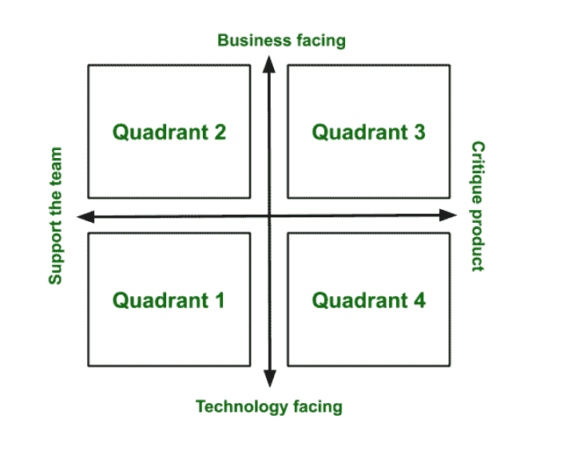

# 敏捷测试象限

> 原文:[https://www.geeksforgeeks.org/agile-testing-quadrants/](https://www.geeksforgeeks.org/agile-testing-quadrants/)

[敏捷测试](https://www.geeksforgeeks.org/agile-software-testing/)象限被认为是工具或手册，由 Brain Marick 设计，将整个敏捷测试方法论划分为四个基本象限。敏捷测试象限帮助整个团队在短时间内沟通并交付高质量的产品。在敏捷测试象限的帮助下，整个测试过程可以用一种非常容易理解的语言来解释，整个团队可以有效地开发产品。
这些象限是:

*   象限 1:支持团队的面向技术的测试
*   象限 2:支持团队的面向业务的测试
*   象限 3:面向业务的测试，对产品进行评论
*   象限 4:面向技术的测试，对产品进行评论

象限编号系统并不意味着任何顺序。你不会以瀑布的方式完成从 1 到 4 的象限。这只是一个任意的编号。

**象限 1:**

*   象限 1 由技术驱动的所有测试用例组成。执行这些是为了支持团队。
*   在这个象限中，开发人员的参与非常重要，因为代码质量是这里的主要焦点。
*   象限 1 与自动化测试相关联，涵盖了单元测试、组件测试、应用编程接口测试和网络服务测试等测试。
*   在这个象限中获得即时反馈，从而可以轻松提高代码质量。
*   该象限有助于在不影响产品功能的情况下改进产品的设计。

**象限 2:**

*   象限 2 由所有业务驱动的测试用例组成，执行这些测试用例是为了支持团队和客户。
*   大多数项目都是从这个象限开始的。
*   这个象限的主要焦点是业务需求。
*   为了相应地构建测试用例，测试人员与客户一起收集需求。
*   象限 2 与功能测试、故事测试、原型和模拟以及配对测试相关联。
*   在这个象限中，手动和自动测试都可以轻松地处理业务需求。

**象限 3:**

*   象限 3 由所有业务驱动的测试用例组成，这些测试用例被执行来评论产品。
*   该象限的主要重点是向象限 1 和象限 2 提供反馈。
*   基于测试人员的逻辑思维、直觉和用户需求进行手动测试，以评估应用程序。
*   象限 3 与客户配对测试、探索性测试、可用性测试、用户接受度测试、协作测试和 alpha & beta 测试相关联。

**象限 4:**

*   象限 4 由所有技术驱动的测试用例组成，这些测试用例是为了评论产品而执行的
*   象限 4 主要关注性能、安全性、压力、可维护性、稳定性等非功能性需求。
*   该象限负责向客户交付最终产品。
*   这个象限与性能测试、负载测试、压力测试、可维护性测试、基础设施测试、数据迁移测试、安全性测试、可靠性测试、恢复测试等等相关联。