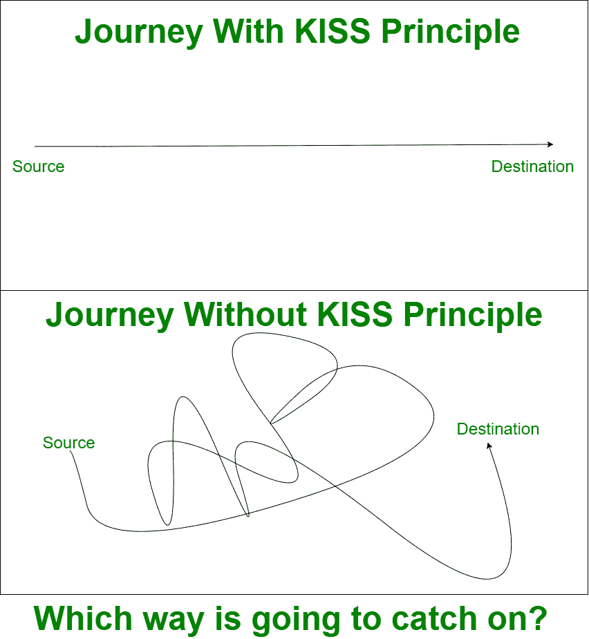

# 软件开发设计原理介绍

> 原文:[https://www . geesforgeks . org/an-软件开发-设计-原理入门/](https://www.geeksforgeeks.org/an-introduction-to-software-development-design-principles/)

这篇介绍性文章讲述了软件开发人员在开发任何软件时必须牢记的事情。它还讨论了日常编写代码时应该考虑的一些关键原则。

**概述:**
让我们以一个问题开始话题——在软件开发的背景下，什么被认为是好的设计？
大多数人认为这个问题没有具体答案！但是在设计时，最突出的是软件开发和维护的成本和时间应该是最小的，更重要的是维护。由于 IT 行业在软件方面经历了大量的改进和升级，如果改变设计的成本和时间最小，那么可以说是一个好的设计。原因是执行改进和推动更新/升级速度快，成本低。

虽然这可能是一个好设计的好方法，但仍然有一个相关的问题，问题是当改变设计的时候，它意识到改变设计已经太晚了。所以现在问题仍然是什么是好的设计？

为了以更好的方式回答这个问题，让我们开始让设计一路经历变化，看看设计是如何站起来的？如果没有，让我们继续发展，更接近更容易改变的东西，这是许多有经验的开发人员迄今为止所做的。因此，软件开发设计原则是由经验丰富的开发人员给出的一套特定的指导方针，这些指导方针是他们在软件开发阶段从错误中吸取的。

> 第一次得到一个好的设计几乎是不可能的。

**设计原则:**
到目前为止，这篇文章谈论的是对好的设计概念的理解，现在让我们详细介绍一套好的设计可用的指导方针。

**1。保持简单，愚蠢(KISS)原则:**
这是第一原则，缩写代表**保持简单，愚蠢**。其他著名的备用首字母缩略词是

*   保持愚蠢。
*   保持简洁明了。
*   保持简单明了。
*   保持简单和聪明。

它建议不要在代码中涉及复杂性，并尽可能避免它。这是因为编写的代码越复杂，以后修改就越困难。阿尔伯特·爱因斯坦有一句名言说得很好，它将为上面所说的事情开绿灯——如果你不能解释它，你就没有很好地理解它。因此，简单应该是我们设计软件的主要目标。

上图清楚地说明 KISS 的原则目标是通过让事情尽可能简单和使用最简单的解决方案来实现目标，就像一条笔直的道路，而不是通过让事情变得复杂和来回挣扎来实现目标。

**KISS 的违规示例–**
一个人可能经历过这样的情况:他/她写了一段凌乱的代码，要么是在编程生涯的早期阶段，要么是在编程旅程的某个地方。在这里，混乱的代码意味着在一个块、方法或类中编写多个问题的解决方案。这可能会导致在代码中添加一些不必要的行。也可能出现一个问题可能有多个解决方案的情况。例如，在某些情况下，switch 语句和 if-else 语句都为问题提供了解决方案。现在，需要根据上下文来选择使用哪一个，哪一个是更简单的解决方案。当然，这只是一个简单的例证。但是在日常的编程和开发生活中，人们经历了许多这样的问题。它需要一个停顿来正确思考和明智地选择解决方案。

> 软件开发团队的任务是设计简单的假象。–格雷迪·布奇

**KISS 的优势–**

1.  它有助于快速解决问题。
2.  由于解决方案很简单，它有助于维护代码。
3.  它提供了修改或重构代码的灵活性。
4.  它为发热代码行中的复杂问题提供了解决方案。
5.  最终，它交付了高质量的代码。

**2。你不会需要它(YAGNI)原则:**
YAGNI 代表你不会需要它。也就是说，如果以后用不上，就不要现在做。作为一名程序员，开发人员通常会实现很多他们真的不需要的东西。实现现在根本不需要的东西，总是会消耗成本、时间和精力。所以，把今天不需要的东西推迟到将来总是一个好的做法。简而言之，YAGNI 只是简单地说，不要真的做某件事，直到你真正发现做这件事的价值。

这个原则在极限编程(XP)背后起作用，但是它适用于所有类型的软件开发过程和方法。实施 YAGNI 节省了时间，并有效地交付了项目。简而言之，这一原则反对开发目前不需要的任何功能。这样开发人员可以节省时间，并专注于代码的其他部分或组件。

**3。干燥原理:**
程序员通常会意外或非意外地编写大量的重复代码。这个原则迫使我们避免这个习惯。上面写着不要重复自己。这意味着，系统中的每一条知识都应该有一个明确的表示。程序员可以通过使用像 CPD 和 Simian 这样的工具来摆脱代码的重复。CPD 代表复制粘贴检测器。而且，猿猴的意思是猴子，自然会复制这样或那样的东西。

**违规示例–**
程序员以多种方式一遍又一遍地重复代码。一些例子可能是为每个赋值和初始化声明过多的局部变量。一次又一次地为同一个任务编写多个方法和类。考虑这样一种情况:在服务或数据层之外编写一个方法，从存储库中获取一组用户数据，并且需要对该组数据应用一些过滤。现在，如果在另一个层中有相同类型的需求，则需要再次编写逻辑，因为从这个层无法访问那个层。通常，这种任务驻留在服务/数据层。因此，只要有相同类型的需求，就可以调用该服务或层的相关方法。

**如何避免干燥–**
要避免干燥，请遵循以下几点。

*   重用你的代码，永远不要重复它
*   遵循命名约定，为方法、变量、类和对象等分配清晰的名称。
*   在适当的层、位置和服务中编写代码

**注意–**
遵循命名约定，将代码添加到适当的位置，有助于识别代码中的重复。

**4。固体原理:**
固体是下面一组设计原理的组合，它的助记首字母缩略词就是从这里取的。

1.  单一责任原则
2.  开/闭原理
3.  利斯科夫替代原则
4.  界面分离原理
5.  依赖倒置

**5。单一责任原则(SRP) :**
这个原则说我们的代码本质上应该是内聚的。这里的内聚指的是，它要有重点，要窄，要做好一件事，只做好一件事。这反过来意味着一个内聚的代码不需要承担很多责任，它只专注于做一件事。在面向对象设计的环境中，人们常说一个类应该只有一个职责，这样它就不必频繁地改变。

> 如果一个代码是内聚的，它就有一个，也是唯一一个改变的理由。

因此，如果有一段代码做了几件事，那么这个模块必须不断地改变，这更昂贵，因为当一个程序员来改变它时，他必须确保这些改变不会破坏其他东西，不会真正受到影响，这变得非常昂贵。另一方面，当一段代码被分成几段，每段代码只做好一件事，那么修改这段代码的成本就容易得多。

**注意–**
当它说“一段代码”时，把它当成一个类、方法或函数。违反单一责任原则会增加程序员的难度，并且很难测试、阅读、记忆和重用代码。

**6。开放/封闭原则(OCP) :**
这个原则说一段代码(一般来说是类、模块或组件)应该开放扩展，封闭修改。这意味着类、方法或函数应该以一种准备好采用/添加新特性但对任何修改不感兴趣的方式编写。在面向对象设计的环境中，这可以通过抽象和多态的概念来实现。

**7。利斯科夫替代原则(LSP) :**
该原则规定，使用父类引用的函数必须能够在不知道的情况下也使用子类的对象。这意味着可以使用超类类型的方法必须能够毫无问题地处理派生类的对象。

基类的用户应该能够在不知道区别的情况下使用派生类的实例。

**8。接口隔离原则(ISP) :**
该原则规定，如果客户端不需要某个接口，就不应该强制其实现该接口。当一个接口包含多个函数，而客户端只需要一个而不是全部时，通常会出现这种情况。在这种情况下，客户端被迫实现该接口的所有功能。这是疯狂的，应该避免。
因此，必须始终保持界面的内聚性和狭窄性，并专注于一件事。

**9。依赖反转或依赖注入(DI) :**
这个原理讲的是耦合。耦合是事物之间的连接程度，也就是你的代码是如何相互连接的。这里要记住的一点是，当我们的代码与其他代码片段对话时，它总是会增加耦合。简而言之，耦合取决于我们的代码所依赖的东西。一个很好的例子是传统的基于类的继承。

继承实际上大大增加了耦合。按照这个原则，要么消除依赖，要么尽可能减少依赖。如果你不能消除所有的依赖，那么至少最小化它，这被称为松散耦合。在面向对象设计的上下文中，依赖一个类叫做**紧耦合**，而依赖一个接口叫做**松耦合**。

一个好的设计总是以高内聚和松散耦合而告终

该原则与 OCP 原则协同工作，为了避免 OCP 违反，使用依赖倒置原则。面向依赖注入的框架，比如 Spring，就是这个原则的一个真实例子和实现

**回顾–**
这不是一个设计原则，而是许多开发人员或公司遵循的良好实践。一旦软件或组件的开发完成，在推进到下一阶段之前，必须进行代码评审过程。你的团队中的任何人都可以完成这项审查。

> 记住，人类很快就能判断别人的错误，但从不指出自己的错误。

一旦它被评审，评审意见可用，远离我们的自我，看一看它，如果需要的话进行修改。

**结论:**
以上是一些高度讨论的设计原则，这些原则极其重要，有助于我们避免重复代码、工作，并帮助我们将复杂性保持在尽可能低的水平。所以你可以在我们的日常编码生活中应用这些原则，无论你是在开发一个软件还是它的一个组件。在设计和开发过程中，与你一起工作的同事或队友讨论这些原则也是一个很好的做法，这样如果你遗漏了任何一个原则或违反了任何一个原则，它都会在早期被指出，而不是在后期犯错误。