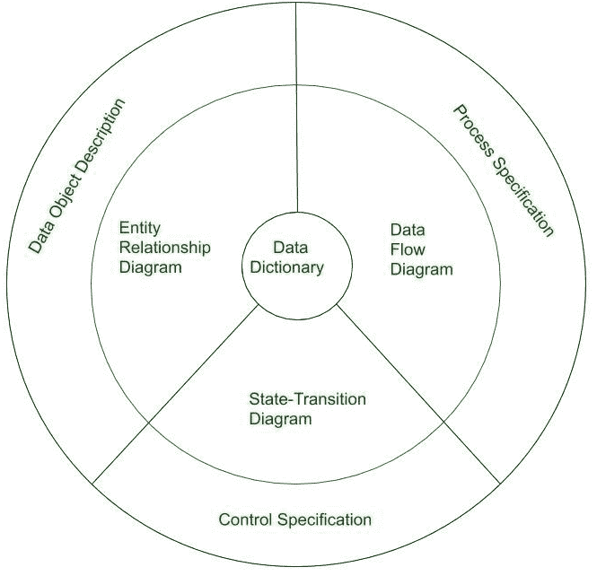

# 分析原理|软件工程中的分析建模

> 原文:[https://www . geesforgeks . org/analysis-modeling-in-software-engineering/](https://www.geeksforgeeks.org/analysis-modelling-in-software-engineering/)

**分析模型**是系统的技术表示。它是系统描述和设计模型之间的纽带。在分析建模中，系统的信息、行为和功能被定义并转化为设计建模中的体系结构、组件和接口级别的设计。

### **分析建模的目标:**

*   它必须建立一种创造软件设计的方法。
*   它必须描述客户的要求。
*   一旦构建了软件，它必须定义一组可以验证的需求。

### **分析模型的要素:**

*   **数据字典:**
    它是一个存储库，由软件使用或产生的所有数据对象的描述组成。它存储软件中存在的数据集合。这是分析模型的一个非常关键的元素。它作为一个集中的存储库，也有助于对软件需求期间定义的数据对象进行建模。

*   **实体关系图(ERD):**
    描述数据对象之间的关系，用于进行数据建模活动。实体关系图中每个对象的属性可以用数据对象描述来描述。它为与数据设计相关的活动提供了基础。

*   **数据流图(DFD):**
    它描述了转换数据流的函数，还显示了数据从输入移动到输出时是如何转换的。它提供在信息域分析期间使用的附加信息，并作为功能建模的基础。它还使工程师能够同时开发功能和信息领域的模型。

*   **状态转移图:**
    它显示了系统的各种行为模式(状态)，也显示了系统中从一种状态到另一种状态的转移。它还提供了由于外部事件的后果而导致的系统行为的细节。它通过呈现系统的状态和导致系统改变状态的事件来表示系统的行为。它还描述了由于特定事件的发生而采取的操作。

*   **流程规范:**
    存储数据流图中出现的每个功能的描述。它描述了函数的输入、用于输入转换的算法以及产生的输出。它还显示了适用于流程的性能特征的规定和障碍，以及可能影响流程实施方式的布局限制。

*   **控制规范:**
    它存储关于软件控制方面的附加信息。它用于指示事件发生时软件的行为，以及由于事件的发生而调用了哪些进程。它还提供了为管理事件而执行的流程的详细信息。

*   **数据对象描述:**
    它存储并提供软件中存在和使用的数据对象的完整知识。它还为我们提供了实体关系图中数据对象属性的详细信息。因此，它包含了所有的数据对象及其属性。