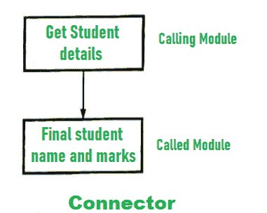
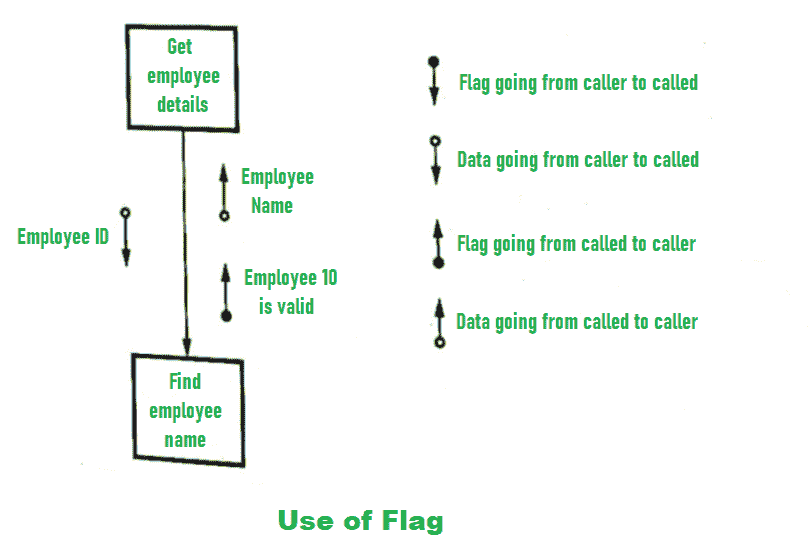
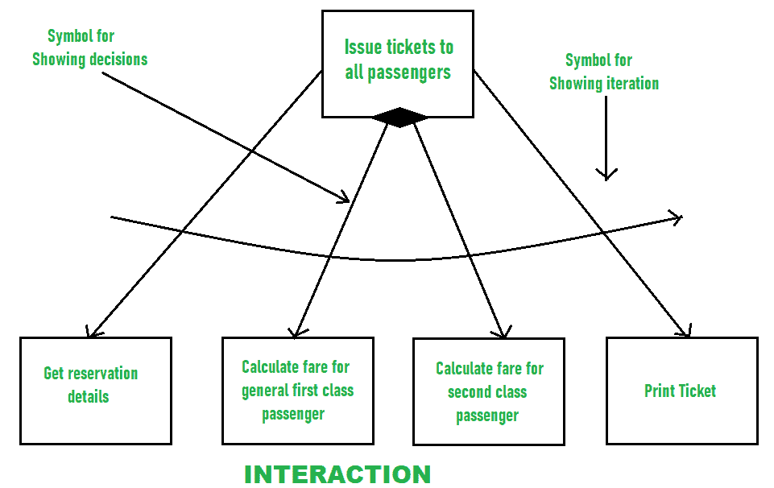

# 软件工程中的结构分析和设计

> 原文:[https://www . geeksforgeeks . org/软件工程中的分析和设计结构/](https://www.geeksforgeeks.org/analyzing-and-designing-structure-in-software-engineering/)

**结构图**是结构化设计的主要工具。它是一种标准化格式，用于显示页面的详细信息并对页面内容进行分类。

1.  结构化图表中的基本元素是模块。该模块被定义为具有四个属性的程序语句的集合。
    *   **输入输出–**
        模块从调用者那里得到的信息称为输入，接收方从模块那里得到的信息称为输出。
    *   **函数–**
        函数处理输入并产生输出。
    *   **力学–**
        仅仅是代码或逻辑，在它们的帮助下，功能得以实现。

*   **内部数据–**
    是自己的工作空间。*   The two modules can be connected to each other by a connector as shown below –

    

    *   The module uses data and flags. The data is processed by different modules. The flag is used as a control signal. It can be set or reset.
    For example, if we have two modules, one for getting the employee detail (caller) and another module is for finding the employee name (called), then the caller module will send the data as an employee’s ID and using that ID the called module will find the name of the employee. If the employee ID is valid then that message will be given by the called module to caller module.

    数据和标志的使用如下所示:

    

    *   The iteration and decisions on a structured chart are shown below –

    

    *   The example of the structure chart is given below –

    