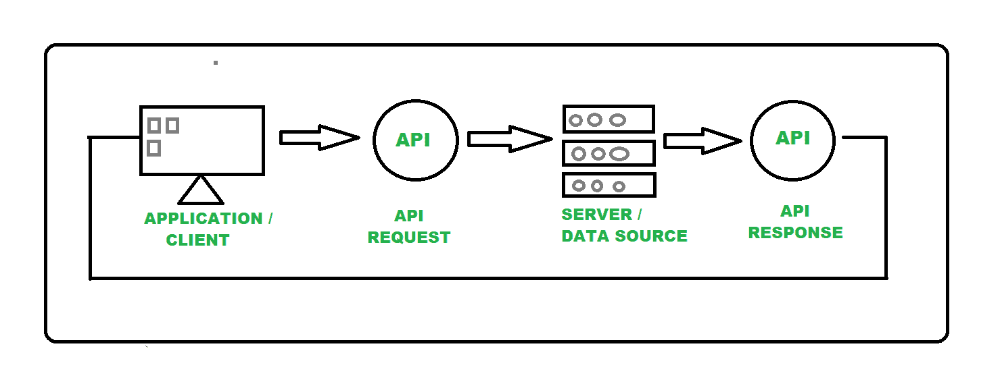
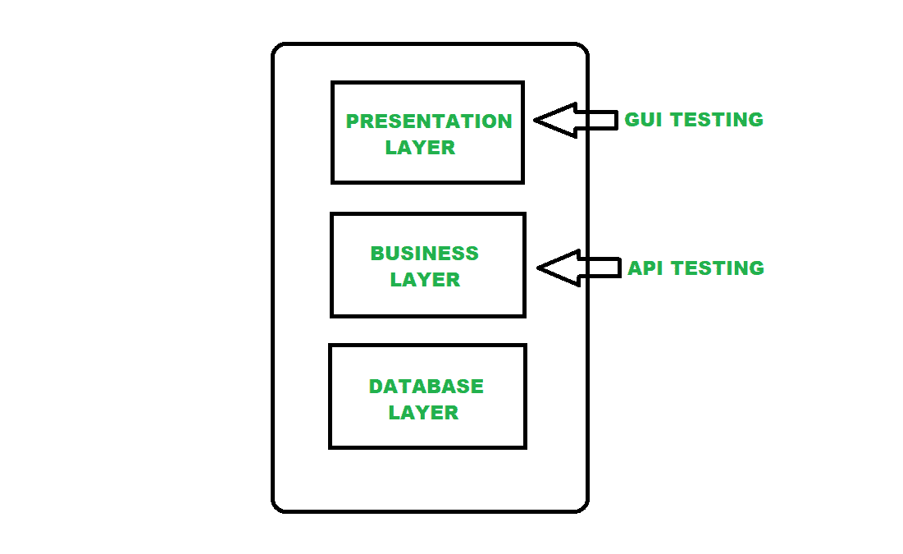

# 软件测试中的 API 测试

> 原文:[https://www . geesforgeks . org/API-软件测试-测试/](https://www.geeksforgeeks.org/api-testing-in-software-testing/)

**API 测试:**
众所周知，API 代表应用程序编程接口，充当两个应用程序之间的通信媒介。由于 API(应用程序编程接口)的这种中介作用，两个应用程序相互对话，并高效地执行所需的操作。应用编程接口包含一套开发应用程序所依据的规则和指南。因此，简单地说，我们可以说一个应用编程接口充当两个软件应用程序之间的接口，以便两个软件应用程序可以相互通信。

下图**表示应用程序中的一个应用编程接口:**

****

**应用编程接口测试是指测试应用程序中使用的应用编程接口，只是为了验证应用编程接口是否正常工作。当一个系统有一组应用编程接口时，需要对它们进行测试，以了解系统是否工作正常。我们可以说，应用编程接口测试证实了系统的性能、可靠性、安全性和功能性。**

****下面列出了一些用于原料药测试的工具:****

*   **邮递员**
*   **加泰罗尼亚工作室**
*   **soapui**
*   **扑朔迷离**
*   **放心**
*   **咳咳咳咳咳咳咳咳咳咳咳咳咳咳咳咳咳咳咳咳咳咳咳咳咳咳咳咳咳咳咳咳咳咳咳咳咳咳咳咳咳咳咳咳咳咳咳咳咳咳咳咳咳咳咳咳**
*   **Ping API**
*   **可断言的**

**图形用户界面测试不同于应用编程接口测试，因为图形用户界面测试存在于表示层，而应用编程接口测试存在于业务层。如果我们举一个典型应用的例子，那么应用编程接口是用户界面层和数据库层之间的中间层，由于这个应用编程接口，应用程序之间的通信和数据交换就发生了。**

**下图**表示进行原料药测试的层:****

********

******原料药测试类型:**
有多种类型的测试，它们最常被用作原料药测试的一种形式，这意味着在多种类型的测试期间，可以同时测试原料药。****

****下面的列表代表了应用编程接口测试的类型，即****

1.  ****[单元测试](https://www.geeksforgeeks.org/unit-testing-software-testing/)****
2.  ****[集成测试](https://www.geeksforgeeks.org/software-engineering-integration-testing/)****
3.  ****[端到端测试](https://www.geeksforgeeks.org/difference-between-system-testing-and-end-to-end-testing/)****
4.  ****[性能测试](https://www.geeksforgeeks.org/performance-testing-software-testing/)****
5.  ****[功能测试](https://www.geeksforgeeks.org/software-testing-functional-testing/)****
6.  ****[安全测试](https://www.geeksforgeeks.org/software-testing-security-testing/)****
7.  ****[负载测试](https://www.geeksforgeeks.org/software-testing-load-testing/)****
8.  ****[渗透测试](https://www.geeksforgeeks.org/software-testing-penetration-testing/)****
9.  ****[可靠性测试](https://www.geeksforgeeks.org/software-testing-reliability-testing/)****
10.  ****[模糊测试](https://www.geeksforgeeks.org/software-testing-fuzz-testing/)****

******我们在原料药测试期间具体检查什么:******

*   ****数据准确性。****
*   ****响应时间。****
*   ****功能重复或缺失。****
*   ****授权检查。****
*   ****多线程问题。****
*   ****安全和性能问题。****
*   ****如果应用编程接口返回错误代码。****
*   ****可靠性问题。****

******API 测试的好处:**
就像我们在应用程序中使用 API 获得了很多优势一样，同样通过执行 API 测试，我们为开发的应用程序的成功实现了很多事情。以下是一些好处，即****

*   ****响应和数据正确性的早期验证。****
*   ****早期测试维护。****
*   ****更好的测试速度和覆盖范围。****
*   ****图形用户界面独立测试。****
*   ****降低测试成本。****
*   ****语言独立测试。****
*   ****有助于测试核心功能。****