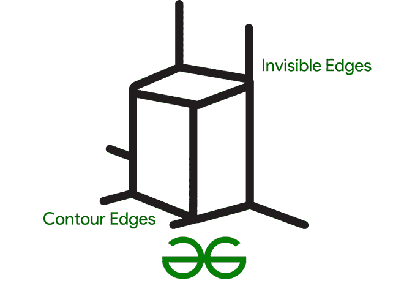

# 阿佩尔隐线去除算法

> 原文:[https://www . geesforgeks . org/appels-hidden-line-remove-algorithm/](https://www.geeksforgeeks.org/appels-hidden-line-removal-algorithm/)

**概述:**

*   在[隐藏表面算法](https://www.geeksforgeeks.org/computer-graphics-scan-line-algorithm-in-3d-hidden-surface-removal/)分类移除中，生成的对象可以表示为等高线的集合，例如上诉或沃特金斯技术，或者恩卡那卡的优先级方法要求作为三角形输入数据，并从表面前面依次计算绘图的每个部分。
*   在计算机表示法中，固体一般用多面体表示。n 个隐藏区间的并集必须在隐藏线方法的面上定义。答:打电话。帕特里克·吉勒斯·麦洛特的论文扩展了三维隐藏线删除布雷森汉画线技术。
*   隐藏线去除系统提供了一种计算快速的方法。处理具有曲面的对象的情况，而不是多边形。该技术将曲线在空间上组织成许多分割绘图平面的正方形网格单元，以减少线交叉的复杂几何计算量。隐藏线在算法中分为两类，分几个步骤处理。平均而言，该算法几乎达到线性时间。
*   隐藏线消除用于确定哪些线不应在三维图像中绘制。这一直是人们感兴趣的。隐藏线移除的主要目标是确定一个有限的表面是否位于视点和要绘制的线或点之间，以及点或线部分是否不可见且未被绘制。

**图 1。**理解阿佩尔的隐藏线

*   所提供的技术允许从图像平面上面向凹面和凸面的物体的视图中去除隐藏线。遮挡每个边缘点的所有拐角和所有平面都是连续计算的。

**边界:**

*   随着边框数量的增加，计算机时间也在增加。凹点数量的减少利用算法并自动检测没有凹点的项目。在后一种情况下，得到结果要简单得多。
*   线隐藏如果显示项目的轮廓相当于对窗口裁剪线段，则大多数表面算法可用于消除隐藏线。隐藏线的移除意味着对象是建模的线。产生表面相交的线
*   Giloi 的工作包含基于形式的输入数据分类，并给出了方法示例。这种分类(从四组到三组)已经稍微简化，并确定了算法。它不是完全的，一些算法没有被分类到这些类别中，并且替代方法也可用于分类这些算法。
*   一方面是光线跟踪和光能传递等方法，另一方面是纹理映射和高级着色模型，这些方法和方法使照片真实感合成图片的制作成为可能。

**理解使用 FORTRAN :**
许多编程方法都适用于晕线。最好的代码应该考虑显示、所需的程序语言、可用的存储空间和适当的数据存储介质。我们创建的过程很好，正如在 FORTRAN 中实现的那样，照片在不同的存储大小上，打印机绘图仪和照片编辑器在 VM/168 计算机上工作。

*   形式凸性
*   隐蔽线路测试通常是好的:
*   把脸移出视野
*   但是:非凸形状问题

**注意–**
如果表单包含大量几何复杂内容，测试可能会失败。

**粗凸性检验:**
在几何内点之间画直线——它们停留在多边形中吗？

*   给定一组三维对象和查看要求，确定应该显示项目的哪些线或表面。
*   其他项目或同一对象可能会遮挡曲面(自遮挡)
*   计算的持续时间主要与最终图像的视觉复杂性有关，但根据显示的特定环境，可能会因输入多边形的数量而从线性变化到指数变化。
*   该执行利用屏幕区域预处理器来构建多个窗口，每个窗口具有一定数量的多边形，以防止不必要的计算时间。
*   每一个窗口都被隐藏面方法独立覆盖。
*   该策略消除了按屏幕区域划分屏幕分辨率级别的问题，同时保留了多边形排序方法的优势。