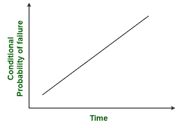
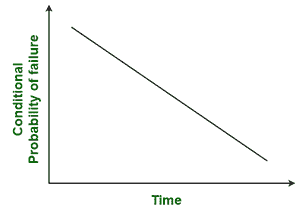
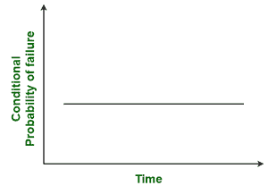
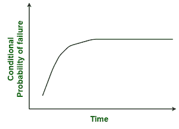
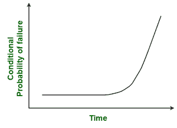

# RTF 维护的应用

> 原文:[https://www . geesforgeks . org/applications-of-rtf-maintenance/](https://www.geeksforgeeks.org/applications-of-rtf-maintenance/)

**从运行到故障(RTF)** 维护是一种维护策略，其中维护仅在故障或资产崩溃后执行。直到失败，资产才被允许运行。在某些情况下，这种策略被认为是有效的，而在某些情况下，它被认为是最差的。对于 RTF，计划外的被动维护是唯一用于维护的任务。

**RTF 适用于哪里？**

1.  **Probability of Failure :**
    In several cases, chances of occurrence of failure are very high with increasing time. In such cases, equipment fail more often with increasing time. In other cases, chances of occurrence of failure are very low with increasing time. In such cases, equipment fail less with increasing time. Probability of failure occurrence is shown below for both cases :

     

    **还有其他情况也如下所示:**

     

    

    RTF 主要适用于故障发生几率随时间增加或未来减小的情况。故障可能性较小的设备最适合这种类型的维护策略。

2.  **所需费用:**
    如果防止设备故障所需的费用少于故障后修理设备所需的费用，在这种情况下，RTF 不适用。但是在故障前的维护成本大于故障后的维护成本的情况下，那么在这种情况下，RTF 是最合适和适用的。
3.  **低设备危险度:**
    有几个设备的故障会造成更大的损坏，并会影响员工或工作团队成员的健康和安全。这样的设备也会对工作环境产生负面影响。对于这样的设备状况，人们不能等到它出现故障时才采取维护策略，因为它不安全。因此，RTF 不适用于这类非常关键和严重的设备。但是不太关键和严格的设备最适合这种类型的维护策略。

5.  **执行预防性维护的难度:**
    预防性维护需要规划策略和时间表，以防止设备出现故障。这不是一项容易的任务，对一个人来说进行预防性维护是非常困难的。而另一方面，RTF 不涉及防止设备故障的计划。因此，RTF 的维护过程相当简单，也很容易理解。对于难以进行预防性维护的情况，由于其简单性，可以进行 RTF 维护。
6.  **预防性维护的成本:**
    在某些情况下，预防性维护的成本要高得多，因为它需要大量的计划和维护策略以及资源来防止设备故障。应该分析执行任何类型的维护策略所需的总成本，然后选择合适的策略。在进行预防性维护比进行实时频率维护需要更多成本的情况下，应该选择实时频率而不是预防性维护。但是，在执行 RTF 之前，需要全面分析并包括与 RTF 相关的所有类型的成本，即客户不满意、设备故障、生产损失和其他间接成本。
7.  **耐用资产或不可维护资产:**
    有几种资产或设备不需要持续维护就能定期履行功能，预计不会出现故障。在这种情况下，如果出现任何故障，则可以进行 RTF 维护。