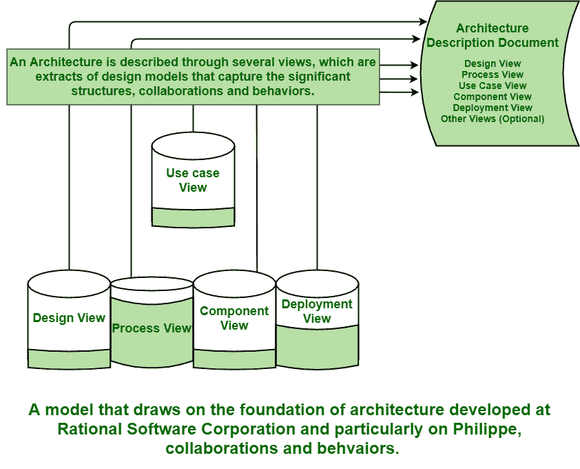

# 技术透视图中的架构

> 原文:[https://www . geesforgeks . org/技术视角架构/](https://www.geeksforgeeks.org/architecture-in-technical-perspective-view/)

**视角**基本上是从特定的固定视点观看。技术视角通常解释系统的技术视角。软件体系结构简单地包含和包含软件系统结构、它们的行为以及指导和建议这些元素的模式、它们的协作和它们的组成。不同的模型定义了人们如何在系统内的不同动作中与过程交互或连接，以及他们控制和使用的东西。

**架构框架:**
架构框架基本上是用于描述系统架构的工件的最小实践和需求集合的封装。它还解释了被称为互补投影的视图术语，这些视图通常是设计集中[统一建模语言(UML)](https://www.geeksforgeeks.org/unified-modeling-language-uml-introduction/) 的抽象。它只是为开发、解释、分析和利用特定应用领域或利益相关者社区中的系统架构描述提供了原则和实践。

**架构视图:**
通常用于表示对系统中的一个或多个涉众有用且有意义的整个架构。架构视图或观点是一组涵盖涉众问题的架构表示。它还表示软件应用程序的功能性和非功能性需求。观点基本上是从特定角度对系统的部分表达。一个视点通常是模式、模板，甚至是开发一种视图的约定的集合。

**在上图中，可以看到以下几点:**

*   **Use case view –**
    A use case view is generally used in requirements discipline to provide and give basis for planning technical contents of iterations. Using use case diagrams, it is modeled statically, and using UML behavioral diagrams, it is modeled dynamically.
*   **Design View –**
    A design view generally means to organize design information and addresses basic structure and also functionality of solution. It simply explains architecturally important and significant features. It is used to organize design information. It also describes overall design entities and attributes.
*   **Process View –**
    It generally deals with dynamic aspects of system, describes processes of system, and even how they communicate and emphasizes behavior of system during run time. It simply describes different activities of system. It also describes control thread relationships between components of design and deployment views. It also describes synchronization aspects of the design.
*   **Component View –**
    It addresses source code realization of system software from perspective of integrators and developers of project. It simply explains structure and design of implementation set. It has basically three different views i.e. conventional view, process-related view, and also object-oriented view.
*   **部署视图–**
    它通常解释系统中一组节点之间的处理分布，以及流程和字段的物理分布。简单说明了部署集的结构和设计。它还显示了系统内处理的物理分布。它基本上描述和解释了系统运行和执行的环境。