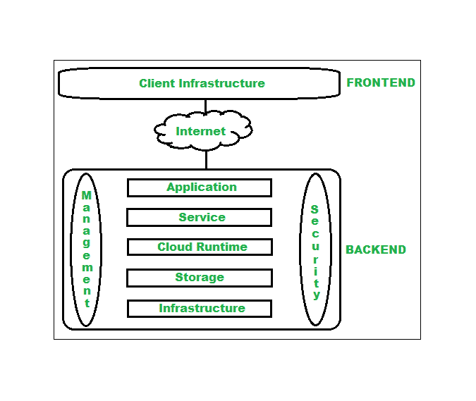

# 云计算架构

> 原文:[https://www . geeksforgeeks . org/云计算架构/](https://www.geeksforgeeks.org/architecture-of-cloud-computing/)

[云计算](https://www.geeksforgeeks.org/cloud-computing/)，这是当前要求最高的技术之一，通过提供按需虚拟化服务/资源，正在给每个组织赋予新的形态。从小型到中型和中型到大型，每个组织都使用云计算服务来存储信息，并仅在互联网的帮助下随时随地访问信息。在本文中，我们将更多地了解云计算的内部架构。

透明度、可扩展性、安全性和智能监控是每个云基础架构都应该经历的一些最重要的限制。当前对其他重要约束的研究正在帮助云计算系统提出新的特性和策略，具有提供更先进的云解决方案的强大能力。

**云计算架构:**
云架构分为两部分，即

1.  前端
2.  后端

下图展示了云计算的内部架构视图。

云计算的架构

云计算的架构是 [SOA(面向服务架构)](https://www.geeksforgeeks.org/service-oriented-architecture/)和 EDA(事件驱动架构)的结合。客户端基础设施、应用、服务、运行时、存储、基础设施、管理和安全所有这些都是云计算架构的组成部分。

**1。**
云架构的前端是指云计算系统的客户端。意味着它包含客户端用来访问云计算服务/资源的所有用户界面和应用程序。例如，使用网络浏览器访问云平台。

*   **客户端基础设施–**客户端基础设施是指前端组件。它包含访问云平台所需的应用程序和用户界面。

**2。后端:**
后端是指服务提供商使用的云本身。它包含资源，管理资源并提供安全机制。除此之外，它还包括巨大的存储、虚拟应用程序、虚拟机、流量控制机制、部署模型等。

1.  **应用–**
    后端的应用是指客户端访问的软件或平台。意味着它根据客户需求在后端提供服务。
2.  **服务–**
    后端的服务指的是三大类基于云的服务，如 [SaaS、PaaS 和 IaaS](https://www.geeksforgeeks.org/cloud-based-services/) 。还管理用户访问的服务类型。
3.  **云运行时–**
    后端的运行时云是指向虚拟机提供执行和运行时平台/环境。
4.  **存储–**
    后端存储是指对存储的数据提供灵活、可扩展的存储服务和管理。
5.  **基础设施–**
    后端的云基础设施是指云的硬件和软件组件，像它包括服务器、存储、网络设备、虚拟化软件等。
6.  **管理–**
    后端管理是指对应用、服务、运行时云、存储、基础设施和其他安全机制等后端组件的管理。
7.  **安全性–**
    后端安全性是指在后端实施不同的安全机制，为最终用户保护云资源、系统、文件和基础设施。
8.  **互联网–**
    互联网连接充当前端和后端之间的媒介或桥梁，建立前端和后端之间的交互和通信。

**云计算架构的优势:**

*   使整个云计算系统更简单。
*   提高数据处理要求。
*   有助于提供高安全性。
*   使其更加模块化。
*   结果更好的灾难恢复。
*   为用户提供良好的可访问性。
*   降低信息技术运营成本。