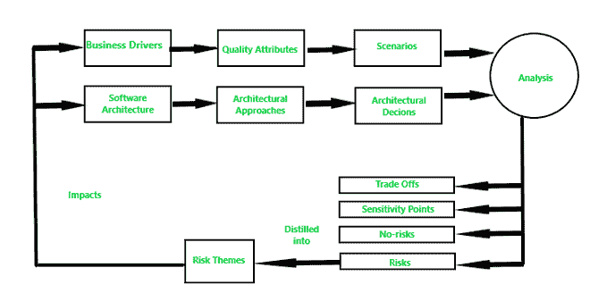

# 架构权衡分析方法(ATAM)

> 原文:[https://www . geesforgeks . org/architecture-权衡-分析-方法-atam/](https://www.geeksforgeeks.org/architecture-tradeoff-analysis-method-atam/)

**架构权衡分析:**
该方法是一种用于评估软件架构质量属性(如性能、可用性和安全性)的方法。ATAM 用于在[软件开发生命周期(SDLC)](https://www.geeksforgeeks.org/software-development-life-cycle-sdlc/) 的早期阶段减轻软件架构中的风险。

**ATAM 的参与者:**
ATAM 要求以下三组人参与。

1.  **评估团队–**
    评估团队由项目外部的成员组成。这个团队由 3-5 名成员组成，他们在团队中扮演特定的角色。
2.  **项目决策者–**
    项目决策者有权为项目的发展说话，并有权要求变更。

*   **Architecture stakeholders –**
    Any individual, team, or organization who has an interest in the realization of the architecture and is somehow related to the architecture is a stakeholder of that architecture. Stakeholders include users, maintainers, performance engineers, testers, integrators, developers.

    **架构权衡分析方法的流程:**
    ATAM 流程从让所有利益相关者找到业务驱动因素开始，如系统目标、约束、系统功能和期望的非功能属性。然后从这些驱动因素中创建质量属性和业务场景。然后，结合架构方法和架构设计，这些场景被用来创建权衡、敏感点和风险(或非风险)的分析。

    然后，该分析被转换为风险主题及其影响，在此过程可以重复。随着每个分析周期的进行，过程逐渐从更一般的到更具体的进行。整个架构将被微调，风险主题将通过检查在前一个周期中发现的问题来解决。

    

    atma

    **ATAM 进程的步骤:**
    ATAM 进程有如下九个步骤。

    1.  **展示 ATAM–**
        向流程的所有利益相关方展示流程的概念，并回答参与者提出的问题。这一步让参与者熟悉流程。
    2.  **展示业务驱动因素–**
        所有参与展示的参与者都应该展示、理解和评估系统的业务驱动因素。
    3.  **呈现架构–**
        架构的简要概述由架构师以适当的详细程度呈现，即至少讨论模块和 C & C 视图。
    4.  **确定架构方法–**
        架构师向团队介绍一些具体的架构方法，然后讨论建议的架构。
    5.  **生成质量属性效用树–**
        在这一步，定义系统的核心业务和技术需求，然后映射到合适的架构属性。将评估、设计和需求引出的所有这些部分放入一棵树中。

    *   **分析架构方法–**
    每个场景都按照优先级进行比较和评级，然后将评级较高的场景映射到架构上。*   **集思广益场景–**
    较大的利益相关方群体展示并贡献当前场景及其关注点。*   **分析架构方法–**
    步骤 6 再次重复，在步骤中增加了来自更大的利益相关者的知识。*   **Present results –**
    At the end of the evaluation, the team reviews the existing and newly discovered risks, non-risks, sensitivities, and tradeoffs. The team discusses whether any new risk themes have arisen. Then the team provides all the documentation to the stakeholders.

    **ATAM 的阶段:**
    ATAM 由以下四个阶段组成。

    1.  **阶段 0–**
        准备、规划、利益相关者招募和团队组建都在此阶段进行。参与者是评估团队的关键项目决策者。
    2.  **第 1 阶段–**
        该阶段由评估流程的步骤 1-6 组成。参与者是评估团队的关键项目决策者。它的典型持续时间是 1 天，然后是 2 到 3 周的间歇。
    3.  **阶段 2–**
        该阶段由评估流程的步骤 7-9 组成。参与者是评估团队的关键项目决策者和利益相关者。此阶段的持续时间为 2 天。
    4.  **第三阶段–**
        这一阶段是后续阶段。报告的生成和交付在此阶段完成。过程中的任何改进范围也被考虑。参与者是评估团队和评估客户。持续时间为 1 周。

    **ATAM 输出:**

    1.  建筑的简明介绍。一小时后展示建筑。
    2.  商业目标的表达。这有助于新参与者理解业务目标。
    3.  优先质量属性需求表示为质量属性场景。
    4.  一组风险和非风险如下-
        *   风险被定义为根据质量属性需求可能导致不良后果的架构决策。
        *   无风险是一种架构决策，根据质量属性，它可能导致不良后果。
    5.  一组风险主题。这个集合帮助评估团队检查所有发现的风险主题，这些主题确定了架构、过程和团队中的系统弱点。
    6.  架构决策到质量需求的映射。对于在 ATAM 期间检查的每个质量属性场景，那些有助于实现它的架构决策被确定和捕获。