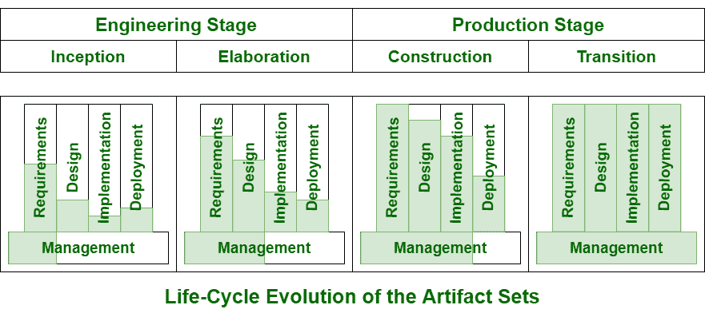

# 生命周期内的神器进化

> 原文:[https://www . geesforgeks . org/artifact-evolution-over-life-cycle/](https://www.geeksforgeeks.org/artifact-evolution-over-life-cycle/)

**工件**通常用于表示作为单个实体创建和审查的内聚信息。

在一个工件中，在开发的每个阶段，最终系统描述的描述都有一定的精确度。在生命周期过程的早期，精度非常低，表示也很高。

最终，表达的精确度很高，所有的东西都被解释，甚至被详细地指定。每个开发状态通常都集中在一个特定的工件集上。在每个状态或阶段结束时，系统的整体状态也将在所有集合上进行。如下图所示。

*   **Inception Phase :**
    This phase mainly focuses on requirements that are critical usually with a secondary focus on an initial view of deployment. To achieve concurrence among all stakeholders on the objectives of lifecycle for project is the overriding target or goal of this phase. It also focuses on estimating potential risks, estimating the cost and schedule for the overall project.
*   **Elaboration Phase :**
    There is a very larger depth in requirements or needs, even more breadth in the design set, and further focus on the issues of implementation and deployment during this phase. The activities of elaboration phase must be able to ensure and confirm that architecture, requirements or needs, and plans are stable enough, and sufficiently mitigation of the risks, that cost and schedule for completeness of the establishment and development can be predicted within a range that can be acceptable.
*   **Construction Phase :**
    Design and implementation are the main and primary goal of this phase. At this phase, software that is developed newly is integrated and inserted where and whenever required. The primary goal and objectives of this phase are to minimize or reduce costs of development by optimizing resources and even avoiding unnecessary scrap, achieve high quality fastly, and even to achieve versions that are useful as fast as possible.
*   **过渡阶段:**
    在其他集合的上下文中实现部署集合的一致性和完整性是这个阶段的主要目标。这一阶段必须包括一些活动，如验证新系统的 beta 测试、beta 测试以及类似于或相对于它正在替换的遗留系统的并行操作等。