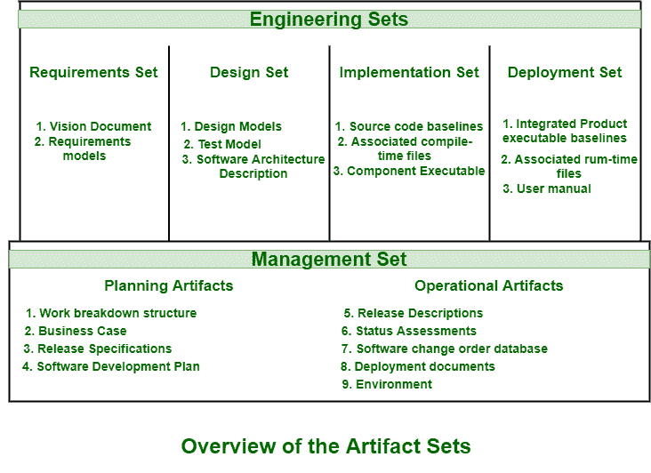

# 神器(软件开发)

> 原文:[https://www . geesforgeks . org/artifact-software-development/](https://www.geeksforgeeks.org/artifact-software-development/)

**神器**与开发的特定方法或过程高度关联和相关。方法或流程可以是项目计划、业务案例或[风险评估](https://www.geeksforgeeks.org/risk-assessment/)。详细信息的不同收集和集合通常被组织并合并到工件集中。集合通常代表系统的完整方面。这样做只是为了以可管理的方式开发和建立完整的软件系统。

软件生命周期的工件通常被组织并分成两组，即管理组和工程组。这些集合被集合的底层语言进一步划分或划分。这些工件集如下图所示:

**1。工程集合:**
在这个集合中，在信息从一个集合到另一个集合的转换中，形成关于这些工件集合的进化质量的想法的主要机制或方法。这个集合进一步分为四个不同的集合，包括需求集合、设计集合、实现集合和部署集合。

1.  **Requirement Set –**
    This set is primary engineering context simply used for evaluating other three artifact sets of engineering set and basis of test cases. Artifacts of this set are evaluated, checked, and measured through combination of following:
    *   当前愿景和需求模型的一致性分析。
    *   管理集补充规范的一致性分析。
    *   需求模型间的一致性分析。
2.  **设计集–**
    可视化建模工具中使用的工具。为了设计设计模型，使用了 [UML(统一建模语言)](https://www.geeksforgeeks.org/unified-modeling-language-uml-introduction/)符号。这个集合仅仅包含许多不同层次的抽象。设计模型通常包括确定材料清单的所有结构和行为数据或信息。这些集合工件主要包括测试模型、设计模型、软件架构描述。
3.  **实现集–**
    使用的工具是调试器、编译器、代码分析器、测试管理工具。这个集合通常包含作为组件实现的源代码、它们的形式、接口和独立测试组件所必需的可执行文件。
4.  **开发集–**
    使用的工具有网络管理工具、测试覆盖、测试自动化工具等。为了简单地在其应该使用的环境中使用最终结果或产品，这些集合通常包含可执行软件、构建脚本、ML 符号、安装脚本。

**2。管理集合:**
这个集合通常捕获简单地与计划和执行或运行过程相关联的工件。这些工件通常使用特殊的符号。它还包括文本、图形或任何需要或需要的表示，以简单地捕获所有项目人员(如项目开发人员、项目管理人员等)之间的“合同”。)，在不同的利益相关者(如用户、项目经理等)之间。)，甚至在涉众和项目人员之间。

这个集合包括各种工件，例如工作分解结构、业务案例、软件开发计划、部署、环境。通过以下组合来评估、检查和测量该组工件:

*   对相关利益相关方的审查。
*   分析工件当前版本和以前版本之间的变更或变化。
*   关于所有工件之间平衡的主要里程碑的演示，特别是商业案例和视觉工件的准确性。