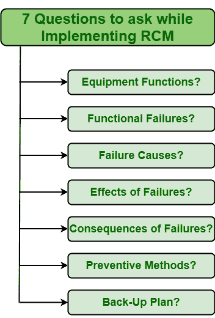

# 游乐设备控制模块的评估标准

> 原文:[https://www.geeksforgeeks.org/assessment-criteria-for-rcm/](https://www.geeksforgeeks.org/assessment-criteria-for-rcm/)

**以可靠性为中心的维护(RCM)**是建立、发展和改进预防性维护计划的最有效方法之一。它只是使系统更加可靠和安全。它侧重于保存和保护系统的功能，即保持系统的功能在其现有或原始状态，而不是保护和保存设备的功能。评估，即 RCM 的评估标准并不是很难。它只是问了七个关于特定资产、系统或设备的问题。这些问题如下:

这些解释如下。

1.  **Identify System or equipment Functions :**

    您将测量和评估哪些设备，它们的性能应该如何？需要首先确定需要分析的设备或资产，然后确定特定设备的工作原理和方式。人们应该知道特定的设备如何满足公司期望的目标，以及它如何提高客户满意度和满足客户需求。

2.  **识别故障模式:**
    你选择的设备可能会以哪些不同的方式出现故障？在确定设备的功能后，需要分析和确定特定设备可能发生故障或失效的不同方式。简单地说，人们需要确定特定设备所有可能的故障源。不同的故障模式可以是:
    *   人为误差
    *   制造缺陷
    *   设计失败
    *   发动机故障等。
3.  **确定故障原因:**
    确定的每个故障的不同原因是什么？在确定不同的故障模式后，需要确定可能导致设备特定故障的各种原因。简单地说，人们需要确定特定失败的主要根本原因。人们应该知道为什么会发生特定的故障，导致故障发生的主要原因是什么。
4.  **识别故障的影响:**
    如果发生故障，故障对系统可能产生什么影响？在确定所有可能的故障根本原因后，需要确定特定故障对系统的总体影响，如果故障以某种方式发生。人们需要确定特定故障如何影响系统、生产率、总体成本、最终产品质量等。简而言之，人们需要确定如果失败了会有多严重。
5.  **识别失败的后果:**
    被识别的每一个失败是如何影响公司的底线的？在确定故障的影响后，需要确定特定故障如何影响系统的健康和环境。一个人应该知道特定的故障如何影响个人的安全和系统的工作环境以及系统或设备的物理条件。还应该确定与特定故障相关的成本。
6.  **确定预防任务:**
    有哪些不同的方法可以防止每次故障的发生？在确定了失败的后果之后，应该确定哪些可能的任务或方法可以简单地实现，以防止失败的发生。在分析了故障的严重程度、危险程度和设施需求后，应选择最合适的方法来防止特定故障。这样做是主要任务之一，而且并不容易。确定最有效的成本效益高的维护任务或方法也需要更加仔细和有选择性。所选择的特定任务应该防止失败在将来发生。
7.  **确定替代方案:**
    如果没有确定合适的预防方法，还能做些什么来确保故障得到快速解决？如果以某种方式选择的维护方法失败或不能防止失败的发生，那么人们应该知道还有哪些其他方法可用，并且可以用来防止失败。如果某个方法以某种方式失败或不能正常工作，RCM 团队应该有一个替代方法。这个替换决定非常关键和必要。