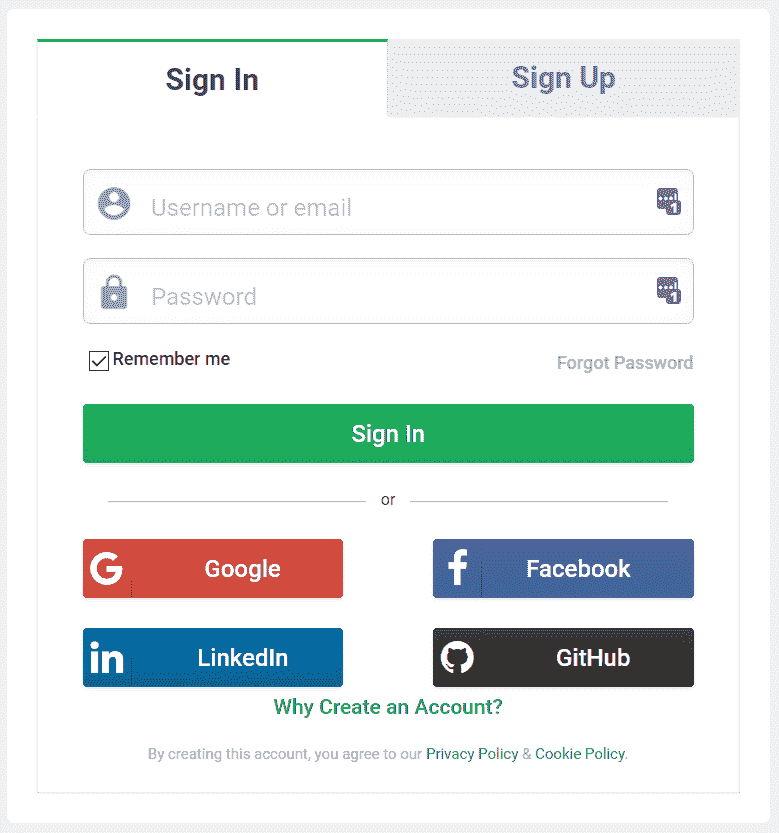
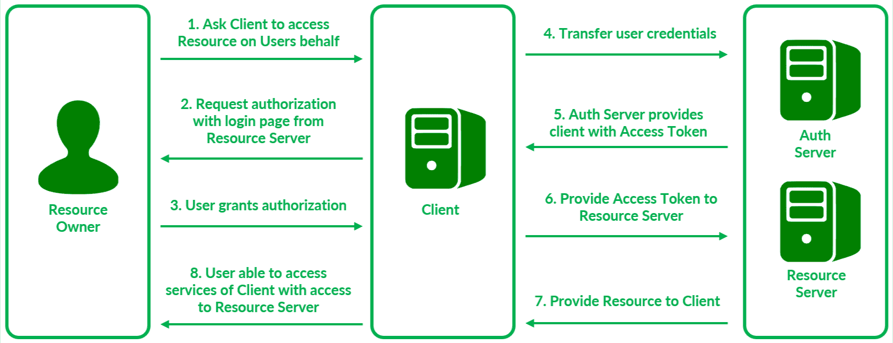

# 通过 OAuth 2.0 跨服务授权

> 原文:[https://www . geesforgeks . org/authorization-跨服务-直通-oauth-2-0/](https://www.geeksforgeeks.org/authorization-across-services-through-oauth-2-0/)

[OAuth](https://www.geeksforgeeks.org/what-is-oauth-open-authorization/) 是一个**授权**协议，允许第三方服务代表资源所有者访问安全资源。授权不同于身份验证，因为身份验证是验证用户身份的过程，而授权是验证他们有权访问什么的过程。因此，OAuth 是允许试图代表用户访问彼此的服务的标准。

OAuth 提供**委托访问。**这个概念可以用代客钥匙的例子来解释。在许多酒店，顾客可以将车钥匙交给代客，代客泊车。为了防止被盗，一些汽车配有代客钥匙，这减少了进入。在这个例子中，代客服务需要通过代客钥匙进入汽车服务，对于汽车服务，客户只提供所需的服务子集。这代表委托访问。

图:通过脸书谷歌登录，谷歌使用 OAuth 授权第三方服务访问用户数据。

因此，OAuth 是一个开放的访问授权标准，它通常被用作互联网用户授予网站或应用程序访问他们在其他网站上的信息的方式，但不需要给他们密码。

**OAuth 的元素:**
为了描述 OAuth 中涉及的元素，我们挑选了可能使用 OAuth 的示例场景。考虑到在线照片打印服务的客户需要允许打印服务直接从他们的谷歌照片帐户获取用户照片的功能。为了实现这样的功能，简单的方法包括打印服务请求用户的谷歌帐户的登录凭证。这种方法显然是非常不安全的，因为用户不能信任打印服务访问他们的整个谷歌帐户。这是 OAuth 进来的地方。

用于描述 OAuth 系统中参与者/元素的术语有:

1.  **资源–**
    它代表将由第三方服务访问的数据。在我们的例子中，用户的照片代表资源。
2.  **资源所有者–**
    资源所有者是资源的实际所有者。对于我们的场景，照片的原始所有者是资源所有者。
3.  **客户端–**
    客户端代表第三方服务，需要代表资源所有者访问资源。在我们的例子中，照片打印服务是客户端。
4.  **资源服务器–**
    表示安全存储资源的服务器。在我们的示例中，照片托管在 Google 服务器上，该服务器充当资源服务器。
5.  **授权服务器(Auth Server)–**
    要实现 OAuth 协议，必须由拥有资源服务器的实体即谷歌提供额外的服务器，因为谷歌托管资源，有安全负担。

不是在资源服务器本身上提供授权服务器的功能，而是使用单独的服务器来减轻资源服务器上不必要的过载。

**OAuth 工艺流程:**

OAuth 过程以下列方式进行:

1.  资源所有者向客户请求服务，在我们的例子中，打印照片。
2.  客户端联系授权服务器请求资源，即谷歌服务器上的照片。授权服务器以谷歌登录窗口的形式向资源所有者发送提示，询问其从客户端收到的请求。
3.  用户确认客户端请求的服务，并代表客户端向授权服务器授予授权。这提供了对客户端的委托访问。
4.  授权服务器接收来自资源所有者的授权请求。
5.  在资源所有者进行身份验证和确认后，授权服务器向客户端发送**访问令牌**，允许其访问托管在资源服务器上的所需资源。
6.  客户端向资源服务器提供访问令牌。
7.  在验证**访问令牌**时，资源被提供给客户端。
8.  最后，用户能够访问客户端的服务，客户端可以代表用户访问安全资源。

上面详述的流程被称为**隐式流程**。在一些 OAuth 流中，不是直接向客户端提供**访问令牌，**中介**授权令牌**可以由授权服务器提供给客户端。要访问资源，客户端需要首先向授权服务器提供授权令牌，并请求访问令牌。这样的 OAuth 流被称为**授权代码流。**

直接提供访问令牌(隐式流)的缺点是访问令牌可能被未授权方使用。授权代码流更安全，因为访问令牌交换机制可以使用授权令牌来保护。

隐式流更适合与 JavaScript 应用程序一起使用的短期访问令牌。