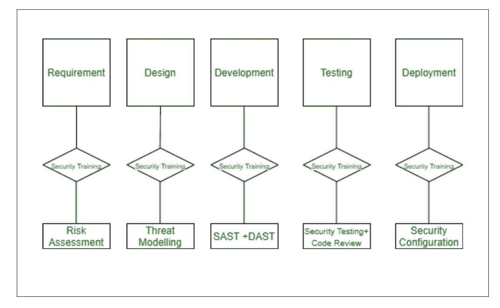

# 自动安全代码审核

> 原文:[https://www.geeksforgeeks.org/automated-secure-code-review/](https://www.geeksforgeeks.org/automated-secure-code-review/)

[静态应用程序安全测试(SAST)](https://www.geeksforgeeks.org/difference-between-sast-and-dast/) 审查应用程序的源代码，以识别可能使应用程序容易被破坏的安全缺陷。它被认为是白盒测试。SAST 工具发现应用程序中的安全缺陷(有很多误报)，但是它只是作为网络安全分析师的辅助工具，帮助他们专注于与安全相关的代码领域，以便他们能够更有效地发现漏洞。

**如何通过可用的 SAST 工具执行代码评审评估？**
这里我们将学习如何审查安全评估工具生成的报告，以进行代码审查。各种工具的报告格式相似，我们将讨论评估过程中需要考虑的一些主要因素。

由于不安全的代码、设计或配置，应用程序中可能存在漏洞。可以对代码进行自动安全分析，通过以下两个选项之一来识别漏洞:

*   基于模式搜索的静态代码扫描脚本(内部和开源)。
*   静态代码分析器(商业和开源)。

**SAST 工具是如何工作的？**
SAST 工具检查代码而不试图执行它。它们是德索普战略不可或缺的一部分，因此进行了大量的研究和概念验证，以确定适合组织的工具。

**SAST 工具优势:**

*   减少分析师的手动分析工作。
*   高效识别特定漏洞的所有实例。
*   精心设计的自动化报告格式。

**SAST 工具劣势:**

*   业务逻辑缺陷仍未被发现。
*   应用程序中针对其特性和设计实施的安全控制通常不会被发现。
*   检测到大量假阳性。

因此，任何希望通过在构建结束时运行 SAST 工具来完全自动化安全代码检查的人都会失望，因为安全分析师仍然需要大量的手动干预。

虽然所有工具几乎都有类似的功能，但是您应该理解并使用任何一个工具，并且能够使用任何 SAST 工具。你总能在网站上找到如何使用特定工具的指南。

**分析 SAST 工具生成的报告重点是什么？**

*   关注已识别的漏洞和报告的漏洞实例数量。为了更好地理解，报告中始终提供漏洞详细信息、缓解措施和参考。
*   始终查看漏洞图，了解什么是源(漏洞的入口点)和汇(漏洞的执行点)，以便更好地理解。
    **例如:**如果我们报告了文本框的输入验证问题，我们需要查看输入值的位置以及输入值的执行位置。我们需要检查这个参数允许什么值，以及我们是否进行了验证。如果缺少验证，我们将检查该值是否可以作为跨站点脚本有效负载执行，或者该值是否存储在数据库中并可以作为 SQL 注入有效负载(可能有更多相关的场景)。基于这样的分析，脆弱性被标记为假阳性或真阳性
*   确定漏洞后，根据 CVSS 分配严重性。自动化工具提供的严重性通常是不正确的，应该由安全分析师审查。与开发人员分享报告漏洞，向他们建议缓解措施。

通常，自动化工具会产生大量的误报，因此安全分析师仔细检查报告和验证的每个漏洞实例非常重要。由于大量的误报，总是需要安全分析师的介入来完善报告并与开发人员共享误报。

以下是一些流行的 SAST 工具列表，可用于 **[【安全代码审查评估】](https://www.geeksforgeeks.org/secure-code-review-assessment/)** :

| 商业 | 开源的 |
| 强化静态代码分析器 | 红移安全性 |
| Checkmarx CxSAST | 司闸员 |
| 覆盖扫描 | Findbugs |
| 真代码 | JsHint(联合提示) |
| AppScan | -代号 |

