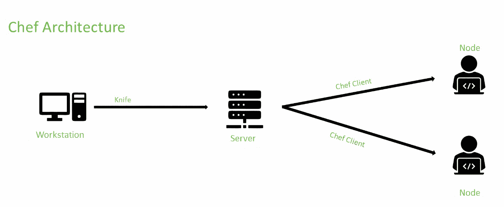

# 使用厨师的自动化

> 原文:[https://www.geeksforgeeks.org/automation-using-chef/](https://www.geeksforgeeks.org/automation-using-chef/)

**Chef** 是 Opscode 开发的配置管理技术，用于管理物理机或虚拟机上的基础设施。它是使用 Ruby 和 Erlang 开发的开源工具。我们生活在一个充满活力的世界里，每天都有新的功能出现，我们需要适当的机制来管理快速的发展。

**厨师架构:**

**厨师架构组件:**
厨师有工作站、菜谱、节点、厨师-服务器等主要组件。让我们详细看看整个主要部分。

1.  **工作站–**
    工作站用于与主厨服务器和主厨节点进行交互。它也用于创建烹饪书。工作站是所有交互发生的地方，是创建、测试和部署烹饪书的地方，也是测试代码的地方。工作站还用于根据开发和生产环境定义角色和环境。
    刀用于与厨师节点交互。
2.  **厨师服务器–**
    厨师服务器包含所有配置数据，它还存储描述厨师-客户端中每个节点的食谱、食谱和元数据。配置细节通过厨师长客户端提供给节点。所做的任何更改都必须通过厨师服务器进行部署。在推送更改之前，它会验证节点和工作站是否通过使用授权密钥与服务器配对，然后允许工作站和节点之间的通信。
3.  **节点–**
    节点由厨师管理，每个节点通过在其上安装厨师客户端进行配置。主厨节点是一台机器，如物理云、虚拟云等。
4.  **烹饪书–**
    烹饪书使用 Ruby 语言创建，特定资源使用领域特定语言。烹饪书包含指定要使用的资源和使用顺序的食谱。烹饪书包含了关于工作的所有细节，它改变了厨师节点的配置。

**使用厨师的优势:**

*   **持续部署–**
    软件持续部署，使公司能够跟上市场需求和用户对特定产品行为的动态变化。我们需要不断创新才能在竞争激烈的软件行业中生存，我们需要一套工具来帮助我们快速持续地部署。
*   **提高系统健壮性–**
    由于一个组织有很多服务器，大型科技巨头不仅拥有非常大的服务器群，而且他们还需要保留冗余服务器来管理少数不会使整个机构瘫痪的服务器故障，因此我们需要基础设施自动化，以确保在部署软件之前捕获并移除所有 bug。
*   **适应云–**
    大厨轻松与云上的基础设施集成，实现一键自动化。它可以轻松地与亚马逊网络服务(AWS)和 GCP 等主要云服务提供商集成。
*   **管理数据中心和云环境–**
    大型科技公司使用它来管理他们的云基础架构，在 chef 的管理下，我们可以管理您的所有云和内部平台，包括服务器。

**厨师的劣势:**

*   《厨师》的一个巨大缺点是烹饪书的控制方式。它需要不断的呵护，这样工作的人就不会弄乱别人的食谱。
*   如果这个人不熟悉 Ruby，学习起来就不是很容易。
*   仍然缺乏好的文档。