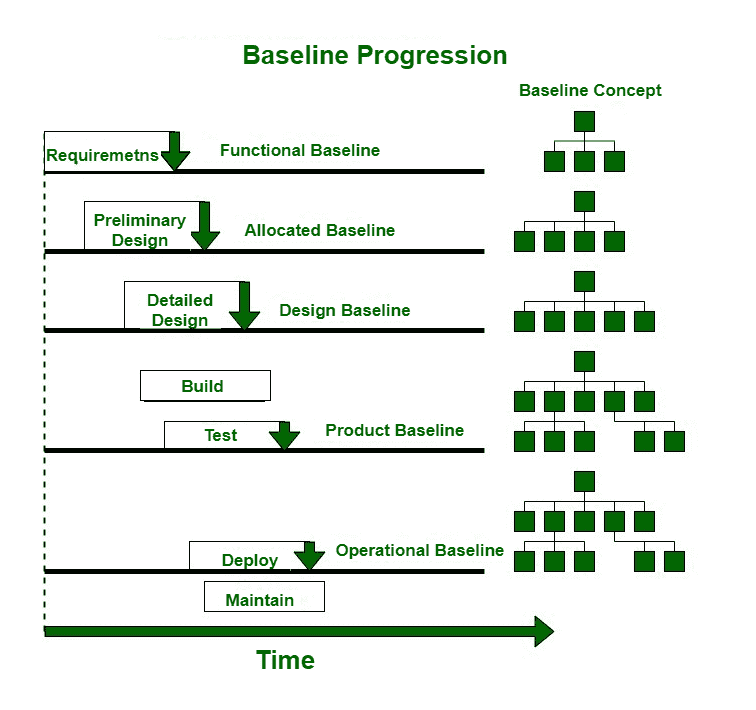

# 软件开发中的基线项目

> 原文:[https://www . geesforgeks . org/baseline-items-in-software-development/](https://www.geeksforgeeks.org/baseline-items-in-software-development/)

[IEEE](https://www.geeksforgeeks.org/ieee-full-form/) (IEEE 标准。第 610.12-1990 号)将基线定义为对产品属性的约定描述和审查，随后作为进一步开发和定义变更的基础，并且这种变更只能通过正式的变更控制程序来完成”。

基线是软件开发中的里程碑和参考点，以一个或多个软件配置项目的完成或交付为标志，通过正式的技术审查获得一组预定义产品的正式批准。基线是共享的项目数据库。软件配置管理的任务是维护一套产品的完整性。

基线的主要目的是减少和控制脆弱性，即容易影响项目并导致无法控制的变化的项目弱点。这可以通过在产品的开发生命周期中的某些关键点固定和改变配置项(各种关键的可交付成果)来实现。与基线相关的每个元素都需要保持在正式的变更控制之下。

**流程:**

1.  需要以适当的方式记录元素，并进行审查，以发现是否存在设计模型问题。如果发现任何错误或缺陷，那么这些错误和缺陷将被纠正和修复。
2.  模型的所有部分都经过了适当的审查，发现的所有问题都得到解决和批准。
3.  设计基础模型现在是基线。
4.  设计模型中实际记录的程序体系结构中的任何进一步变化，只有在每一个都经过评估和批准后，才允许进行。

**基线成分:**
典型的基线包括以下成分:

1.  **功能基线–**
    运行文件，系统要求。
2.  **分配基线–**
    高级文档、初步设计、界面控制文档。
3.  **设计基线–**
    详细设计文件。
4.  **产品基线–**
    源代码和可执行代码单元、最终系统规范、用户和维护手册、硬件和软件规范，
5.  **运行基线–**
    源代码和可执行代码单元、最终系统规范、用户和维护手册、验收测试计划、测试程序、现场集成测试案例和数据集以及测试报告
6.  **验收测试–**
    源代码和可执行代码单元、集成测试计划、测试过程、测试用例以及数据集和测试报告
7.  **集成测试–**
    源代码和可执行代码单元、单元测试计划、测试过程、测试用例以及数据集和测试报告
8.  **单元测试–**
    源代码和可执行代码模块

**示例:**

