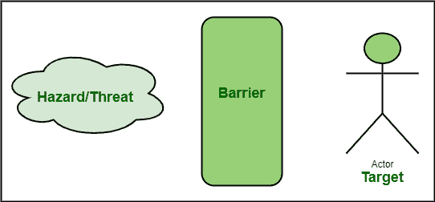

# 障碍分析的基本要素

> 原文:[https://www . geeksforgeeks . org/basic-elements-of-barrier-analysis/](https://www.geeksforgeeks.org/basic-elements-of-barrier-analysis/)

**先决条件–**[障碍分析](https://www.geeksforgeeks.org/Short-Note-on-Barrier-Analysis/)

每当出现问题时，解决问题只是解决方案的一部分。一个人需要消除或解决特定问题的主要根源，以便特定问题不再发生。为了永久解决问题，识别根本原因很重要。这种根本原因分析被称为根本原因分析。现在有几种 [RCA](https://www.geeksforgeeks.org/basic-principle-of-root-cause-analysis/) 技术可用。障碍分析是 RCA 技术之一。

在障碍分析中，通常分析问题影响主要目标的途径。它只是确定了两条途径，一条是问题影响软件质量的途径，另一条是保持软件质量的途径。障碍分析也被称为目标-危险-障碍分析。

**障碍分析中的不同元素:**
在障碍分析中，基本上有四个不同的元素，如下所示–

障碍分析中的要素

*   **目标:**
    目标基本上是被选择作为需要实现的目标的东西。在软件工程中，主要目标是实现最高质量的软件。这是一个需要保护的目标，需要在特定的条件下保持。
*   **危害/威胁:**
    危害或线程被简单地认为是对软件产品和组织有负面影响的危害或问题。In 会降低软件质量，因为它会对软件质量产生负面影响。危险可能包括电力、工作不当、功能故障等。危险也可能不止一种。
*   **屏障:**
    屏障被认为是通过简单地阻止危险或威胁到达目标来控制危险或威胁的预防方法。障碍可以是身体上的，程序上的，或者个人的行为。简单地说，障碍阻止了不想要的效果以及对软件质量有负面影响的效果。障碍分析可能有多个障碍。如果存在一个屏障，那么它只能为目标提供一层保护。
*   **路径:**
    路径被简单地认为是危险可以影响目标的路径。它只是为有害地影响目标和降低软件质量提供途径的路线或机制。

**优势:**

*   障碍分析不是复杂的方法。它非常容易使用和处理。
*   障碍分析是成功完成所需资源非常少的最佳方法之一。
*   它还决定了通常失效的安全系统元件。
*   在屏障分析中，结果可以用图形表示，这使得人们很容易理解能量流和导致事故的失败屏障。
*   它是最好的方法之一，当与其他各种方法结合时，效果会更好。
*   它帮助专家简单地分析与之相关的问题和风险。
*   它基本上为目标的任何部分提供了防护。
*   它通常提供关于各种问题或危险以及屏障控制的可靠、详细和独立的调查结果。
*   这是最简单的学习技巧之一，不需要任何训练。
*   它提供了系统和更好的方法。

**缺点:**

*   障碍分析的一个主要缺点是，它有时表现出主观性，依赖于成员和观点的知识。
*   它有时会使原因和对策难以理解和混淆，因此不应用于确定根本原因。它应该与其他方法一起使用。
*   它需要熟悉流程才能更有效。