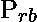
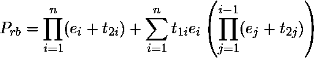
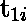
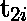
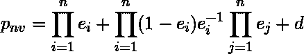

# 基本容错软件技术

> 原文:[https://www . geesforgeks . org/basic-容错-软件-技术/](https://www.geeksforgeeks.org/basic-fault-tolerant-software-techniques/)

与容错硬件的研究相比，软件容错的研究相对较新。一般来说，**容错**方法可以分为故障排除和故障屏蔽方法。故障排除技术可以是前向错误恢复，也可以是后向错误恢复。

前向错误恢复旨在识别错误，并基于此知识纠正包含错误的系统状态。高级语言(如 Ada 和 PL/1)中的异常处理提供了支持前向恢复的系统结构。反向错误恢复通过将系统恢复到故障出现之前的状态来纠正系统状态。恢复块方案提供了这样的系统结构。另一种常用的容错软件技术是错误屏蔽。NVP 方案使用几个独立开发的算法版本。最终投票系统应用于这些 N 个版本的结果，并生成正确的结果。

提高软件系统可靠性的一个基本方法取决于设计多样性的原则，即实现不同版本的功能。为了防止由不可预测的条件导致的软件故障，不同的程序(替代程序)被分开开发，优选地基于不同的编程逻辑、算法、计算机语言等。这种多样性通常以恢复块或 N 版本编程的形式应用。

容错软件通过在软件级别使用保护冗余来确保系统的可靠性。获取容错软件有两种基本技术:RB 方案和 NVP。这两种方案都基于软件冗余，假设巧合的软件故障事件很少。

1.  **Recovery Block Scheme –**
    The recovery block scheme consists of three elements: primary module, acceptance tests, and alternate modules for a given task. The simplest scheme of the recovery block is as follows:

    ```
    Ensure T
       By P
        Else by Q1
          Else by Q2
             .
             .
             .
          Else by Qn-1
        Else Error 
    ```

    其中 T 是验收测试条件，预期通过成功执行主模块 P 或备用模块 Q2 Q1 来满足。。。，Qn-1。
    当测试主模块输出的可接受性时，该过程开始。如果验收测试确定主模块的输出不可接受，它将在执行主模块之前恢复或回滚系统状态。它允许第二个模块 Q1 执行。重复验收测试以检查 Q1 模块的成功执行。如果失败，则执行模块 Q2，等等。

    备用模块由关键字“else by”标识当所有备用模块耗尽时，恢复块本身被认为已经失败，最后的关键字“else error”声明了这一事实。换句话说，当所有模块都执行，没有一个产生可接受的输出时，系统就会崩溃。Pham (1989b)研究了可靠性优化模型，以确定在给定单个模块可靠性的情况下，最小化总系统成本的恢复块方案中的最佳模块数量。

    在恢复块中，编程功能由 n 个备选程序实现，P1，P2。。。。，Pn。每个备选程序产生的计算结果由验收测试检查。如果结果被拒绝，则执行另一个备选程序。该程序将被重复，直到 n 个备选程序中的一个产生可接受的结果，或者直到所有备选程序都失败。

    RB 方案失败的概率如下:

    

    其中
     =版本 Pi 的失败概率
     =验收测试 I 判断不正确结果为正确的概率
    t  =验收测试 I 判断正确结果为不正确的概率。

    上述等式对应于所有版本都通过验收测试的情况。第二项对应于验收测试 I 在 n 个版本的第 I 次试验中判断不正确结果为正确的概率。

2.  **N-version Programming –**
    NVP is used for providing fault-tolerance in software. In concept, the NVP scheme is similar to the N-modular redundancy scheme used to provide tolerance against hardware faults.

    NVP 被定义为从相同的初始规范独立生成个功能等同的程序，称为版本。程序的独立生成意味着编程工作由 N 个不与编程过程交互的个人或团体来完成。只要有可能，不同的算法、技术、编程语言、环境和工具都会用到每一项工作中。在这种技术中，N 个程序版本在相同的输入上并行执行，结果通过对单个程序的输出进行表决而获得。NVP 的优点是，当版本失败时，不需要额外的时间来重新配置系统和重新计算。

    考虑一个由 n 个程序和投票机制组成的 NVP 方案。与 RB 方法相反，所有 n 个备选程序通常同时执行，它们的结果被发送到选择最终结果的决策机制。决策机制通常在有两个以上版本(或者，通常有 k 个以上版本)时是投票者，而在只有两个版本(k 个版本)时是比较者。NVP 的句法结构如下:

    ```
    seq
     par
      P1(version 1)
      P2(version 2)
      .
      .
      .
      Pn(version n)
      decision V 
    ```

    假设在至少有两个正确结果的情况下，期望有一个正确的结果。

    NVP 方案失败的概率 Pn 可以表示为

    

    这个等式的第一项是所有版本失败的概率。第二项是只有一个版本是正确的概率。第三项，d，是至少有两个正确结果但决策算法未能给出正确结果的概率。

    值得注意的是，NVP 方法的目标是确保多个版本不太可能在相同的输入上失败。每个版本由不同的编程团队、设计方法等独立开发。，目标是版本之间有足够的差异，以便在相同的输入上不会经常失败。然而，多版本编程仍然是一个有争议的话题。

恢复块方案和 N 版本编程的主要**区别**在于前者中模块是按顺序执行的。恢复块通常不适用于实时响应非常重要的关键系统。