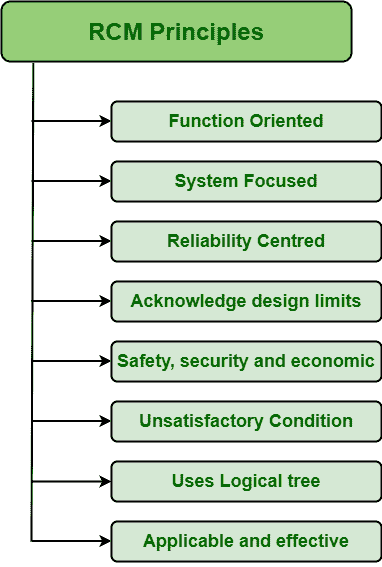

# RCM 的基本原理

> 原文:[https://www.geeksforgeeks.org/basic-principles-of-rcm/](https://www.geeksforgeeks.org/basic-principles-of-rcm/)

**[【以可靠性为中心的维护(RCM)](https://www.geeksforgeeks.org/types-of-rcm-approaches/)** 是一种旨在简单维护系统功能的方法。一般认为，开发或建立维护改进计划的最佳方法之一，只是为了确保资产(设备、工艺、设备等)的设计可靠性。).一个人应该从最关键的资产开始 RCM，如果它失败或崩溃，可能会引起最大的问题。这是一个耗时的过程，但它只是帮助一个人在生产可用性、与总成本相关的其他因素等方面有效地运作。

**RCM 原则:**
RCM 有以下几个原则:

1.  **面向功能:**
    RCM 是面向功能的程序，即关注系统或设备的功能。RCM 只是分析和评估选定资产的功能和可能的故障。这些分析帮助人们专注于保护系统功能，而不是专注于保护资产。

*   **聚焦系统:**
    RCM 是一个聚焦系统的项目，也就是说，它不仅仅关注单个资产，而是关注整个系统。RCM 的主要目标是保护整个系统免受最关键的故障影响。通过关注系统，RCM 维护系统每个部分的功能，这将有助于提高产量和客户满意度。*   **以可靠性为中心:**
    RCM 以可靠性为中心。RCM 的主要目标是保持系统的可靠性，即使其在没有任何中断和故障的情况下始终保持良好的性能。它只是识别最关键的系统资产，然后专注于它们的维护策略，以减少系统故障。这将有助于提高系统或资产的可靠性及其可用性。*   **承认设计限制:**
    RCM 一般承认并认可系统的设计限制。对一个人来说，识别和承认设计的局限性比让其他人指出它们更好，这会降低质量，因为看起来好像一个人忽略了它。无论多么好的维护，都无法覆盖和克服系统的糟糕设计。*   **安全、安保和经济:**
    RCM 通常由安全、安保和经济驱动。因为安全是主要的，所以 RCM 是一个首先维护安全，然后维护经济的过程。无论如何都要保护安全。*   **不满意的情况:**
    RCM 通常将任何故障定义为不满意的情况，即不满足或不符合某人的要求。失败可能导致功能丧失或质量下降，任何人都不能接受。它被认为是高度危险的。因此，故障被定义为不令人满意的情况，应小心处理以永久消除它。*   **使用逻辑树:**
    RCM 一般借助逻辑树来监控所有的维护任务。逻辑树是一种分析技术，用于选择合适的维护任务。这是解决和处理任何问题的最好方法。*   **适用且有效:**
    RCM 是一个简单地确保系统继续按照用户要求运行的过程。只有成功实施区域合作机制，才能实现成本效益。RCM 还指出，如果选定的维护任务不适用且无效，可以采取哪些措施。选定的维护任务必须能够降低故障概率，并且具有成本效益。