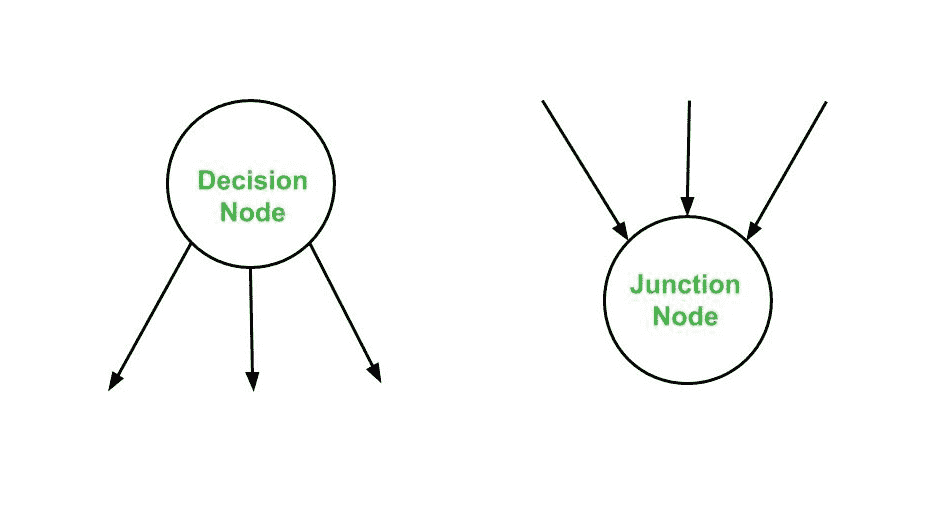
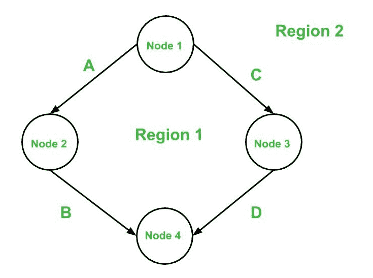
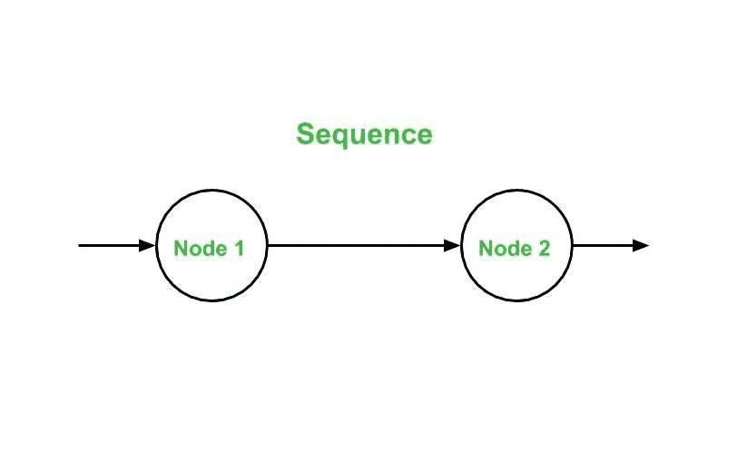
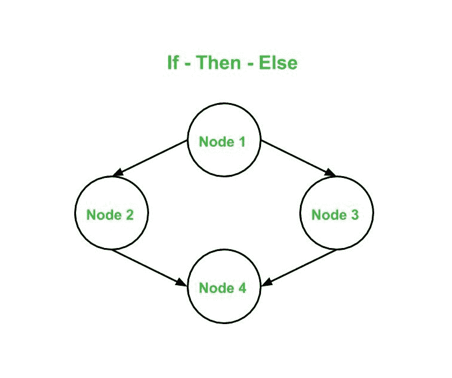
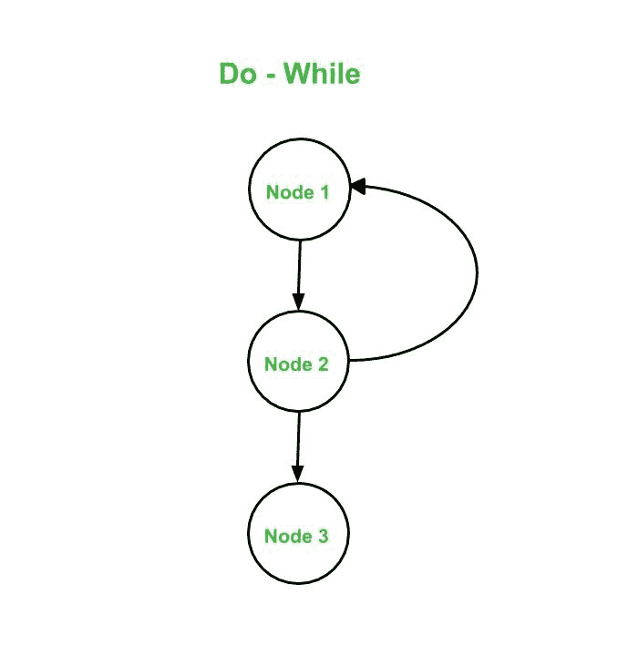
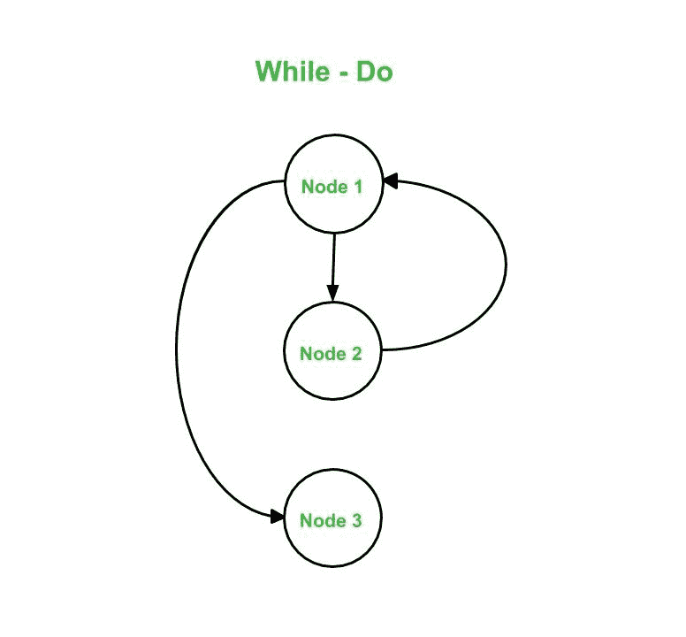
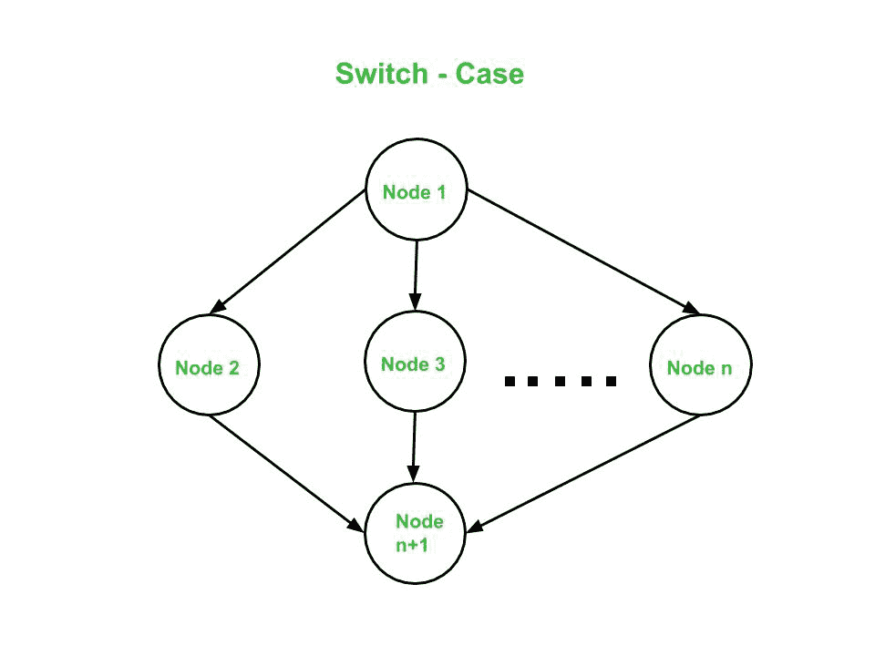

# 软件测试中的基本路径测试

> 原文:[https://www . geesforgeks . org/basis-path-testing-in-software-testing/](https://www.geeksforgeeks.org/basis-path-testing-in-software-testing/)

先决条件–[路径测试](https://www.geeksforgeeks.org/path-testing/)
**基本路径测试**是基于程序或模块控制结构的[白盒测试](https://www.geeksforgeeks.org/software-engineering-white-box-testing/)技术。使用这种结构，准备了一个控制流图，图中出现的各种可能的路径作为测试的一部分被执行。因此，根据定义，

基本路径测试是一种在[控制流图](https://www.geeksforgeeks.org/software-engineering-control-flow-graph-cfg/)中选择路径的技术，它提供了通过程序或模块的一组基本执行路径。

由于这种测试是基于程序的控制结构，因此需要对程序的结构有完整的了解。要使用这种技术设计测试用例，需要遵循四个步骤:

1.  构建控制流图
2.  计算图的圈复杂度
3.  确定独立路径
4.  从独立路径设计测试用例

让我们一步一步来理解。

**1。控制流程图–**
控制流程图(或简称流程图)是表示程序或模块控制结构的有向图。控制流图(V，E)中有 V 个节点/顶点和 E 个边。控制图还可以具有:

*   **连接节点–**有多个箭头进入的节点。
*   **决策节点–**有一个以上箭头离开的节点。
*   **区域–**由边和节点界定的区域(图外的区域也算作区域。).





以下是构建流程图时使用的**符号**:

*   **Sequential Statements –**

    

*   **If – Then – Else –**

    

*   **Do – While –**

    

*   **While – Do –**

    

*   **Switch – Case –**

    

**圈复杂度–**
圈复杂度 V(G)据说是程序逻辑复杂度的度量。它可以用三个不同的公式计算:

1.  **Formula based on edges and nodes :**

    ```
    V(G) = e - n + 2*P
    ```

    其中，
    e 为边数，
    n 为顶点数，
    P 为连通分量数。

    例如，考虑上面给出的第一个图表，

    ```
    where, e = 4, n = 4 and p = 1 

    So,
    Cyclomatic complexity V(G) 
    = 4 - 4 + 2 * 1 
    = 2 
    ```

2.  **Formula based on Decision Nodes :**

    ```
    V(G) = d + P 
    ```

    其中，
    d 为决策节点数，
    P 为连通节点数。

    例如，考虑上面给出的第一个图表，

    ```
    where, d = 1 and p = 1

    So, 
    Cyclomatic Complexity V(G) 
    = 1 + 1 
    = 2 
    ```

3.  **Formula based on Regions :**

    ```
    V(G) = number of regions in the graph
    ```

    例如，考虑上面给出的第一个图表，

    ```
    Cyclomatic complexity V(G) 
    = 1 (for Region 1) + 1 (for Region 2)
    = 2 
    ```

因此，使用上述三个公式，得到的圈复杂度保持不变。这三个公式都可以用来计算和验证流程图的圈复杂度。

**注–**

1.  对于一个函数[例如 Main()或阶乘()]，只构造一个流图。如果在一个程序中有多个函数，那么为每个函数构造一个单独的流程图。此外，在圈复杂度公式中,“p”的值是根据总共存在的图的数量来设置的。
2.  If a decision node has exactly two arrows leaving it, then it is counted as one decision node. However, if there are more than 2 arrows leaving a decision node, it is computed using this formula :

    ```
    d = k - 1
    ```

    这里，k 是离开决策节点的箭头数量。

**独立路径:**
控制流图中的独立路径是指在定义路径之前至少引入一条尚未遍历的新边的路径。圈复杂度给出了流图中独立路径的数量。这是因为圈复杂度被用作应该执行的测试数量的上限，以确保程序中的所有语句至少已经被执行一次。

考虑上面给出的第一个图，独立路径是 2，因为独立路径的数量等于圈复杂度。
那么，上面第一个给定图中的独立路径:

*   **路径 1:**

    ```
    A -> B 
    ```

*   **路径 2:**

    ```
    C -> D 
    ```

**注–**
独立路径不是唯一的。换句话说，如果一个图的圈复杂度是 N，那么就有可能得到本质上独立的两组不同的路径。

**设计测试用例:**
最后，在获得独立路径后，可以设计测试用例，其中每个测试用例代表一个或多个独立路径。

**优势:**
基础路径测试可适用于以下情况:

1.  **更多覆盖–**
    基本路径测试提供了最佳的代码覆盖，因为它旨在实现最大的逻辑覆盖，而不是最大的路径覆盖。这导致了对代码的全面彻底的测试。
2.  **维护测试–**
    当软件被修改时，仍然需要测试软件中所做的更改，因此需要路径测试。
3.  **单元测试–**
    当开发人员编写代码时，他或她首先自己测试程序或模块的结构。这就是为什么基础路径测试需要足够的代码结构知识。
4.  **集成测试–**
    当一个模块调用其他模块时，出现接口错误的几率很高。为了避免这种错误的情况，执行路径测试来测试模块接口上的所有路径。
5.  **测试工作–**
    由于基本路径测试技术在计算圈复杂度的同时考虑了软件(即程序或模块)的复杂度，因此可以直观地注意到，在基本路径测试的情况下，测试工作与软件或程序的复杂度成正比。