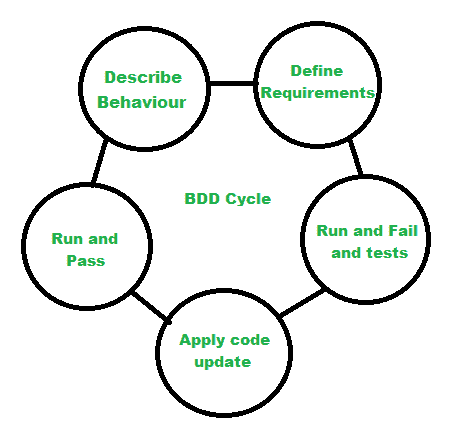

# 软件工程中的行为驱动开发(BDD)

> 原文:[https://www . geesforgeks . org/行为驱动-开发-BDD-in-software-engineering/](https://www.geeksforgeeks.org/behavioral-driven-development-bdd-in-software-engineering/)

**行为驱动开发(BDD)** 指的是一个[敏捷软件开发](https://www.geeksforgeeks.org/software-engineering-agile-software-development/)过程，该过程源自[测试驱动开发(T5)方法论。BDD 被认为是说明系统行为的测试。它鼓励参与开发的每个人使用简单语言的对话和具体示例，以更好地阐明系统的行为。在这个开发中，技术定义了基于系统行为开发特性的各种方法，这些技术是从测试驱动开发(TDD)和领域驱动开发(DDD)中结合起来的。](https://www.geeksforgeeks.org/test-driven-development-tdd/)

行为驱动开发是[自动化测试](https://www.geeksforgeeks.org/software-engineering-automated-testing/)中的一个好方法，因为它更关注系统的行为，而不是代码的实现。BDD 通过自然语言来表达系统的行为和系统的预期结果。在 BDD 中，所有各方都像客户、开发人员、测试人员、利益相关者一样参与到协作对话和系统行为说明中。

**敏捷开发中的行为驱动开发:**

*   客户和服务提供商就他们需要什么进行对话。
*   客户/顾客、开发人员和测试人员一起详细说明需求。
*   然后在结构化的场景中定义需求。
*   有助于开发并充当自动化测试，
*   这些场景被测试人员用作测试的基础。

**BDD 生命周期:**

1.  **描述行为–**
    这包括产品的流量和特征意味着主要的视觉。
2.  **定义需求–**
    用业务规则建模需求，以便达成共识。
3.  **运行测试并失败–**
    开发并运行测试用例。
4.  **应用代码更新–**
    根据需求重构。
5.  **运行并通过测试–**
    运行更新后的代码并通过测试用例。

但重要的一点是，BDD 不像 TDD 那样是关于测试的。BDD 是关于实现业务目标和需求的。

**让 SDLC 变得更简单:**
[SDLC(软件开发生命周期)](https://www.geeksforgeeks.org/software-development-life-cycle-sdlc/)被认为是任何软件开发的框架或规范。在使 SDLC 过程更简单方面，BDD 有很大的贡献。

*   用标准英语定义需求/系统的行为使得[软件需求规格说明](https://www.geeksforgeeks.org/software-requirement-specification-srs-format/)更加容易和清晰。
*   在客户、开发人员和测试人员之间提供更好的协作。
*   它对测试和部署阶段有很大的积极影响。

**行为驱动开发的好处:**

*   业务目标和客户需求更加清晰。
*   因为它使用非技术语言，所以能接触到更大的客户群。
*   有助于在开发前定义验收标准。
*   从客户和开发者的角度关注系统的行为。
*   有助于避免不必要的功能，包括重要的功能。
*   减少修改后和部署后缺陷的工作量。
*   避免开发过程中的误解。