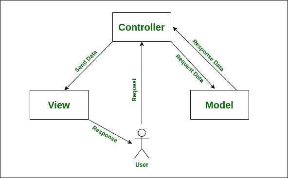

# 使用 MVC 的好处

> 原文:[https://www.geeksforgeeks.org/benefit-of-using-mvc/](https://www.geeksforgeeks.org/benefit-of-using-mvc/)

**什么是 MVC？**
MVC，是 **M** 模型、 **V** 视图和 **C** 控制器的缩写，是一种方法或架构模式，用于有效地将用户界面与底层数据模型相关联，并组织应用程序代码。MVC 主要用于将应用程序分成三个主要组件:模型、视图和控制器。

**MVC 模式的三个层次:**
**1。模型–**
与视图和控制器相比，该级别被认为是最低级别。它主要向用户表示**数据**，并定义所有应用程序数据对象的存储。

**2。视图–**
该级别主要与**用户界面(UI)** 相关联，用于提供 MVC 模型的可视化表示。简单来说，这一级处理向用户显示实际输出。它还处理用户之间的通信(输入、请求等)。)和控制器。

**3。控制器–**
这个级别负责**请求处理程序**。它通常被认为是 MVC 系统的大脑——可以说是用户和系统之间的一个纽带。控制器完成获取用户输出、将其转换为所需消息并将其传递给视图(用户界面)的循环。

**使用 MVC 的好处:**

*   **组织大规模的 web 应用程序–**
    由于三个级别之间存在代码隔离，因此将 web 应用程序逻辑划分和组织成大规模的应用程序(需要由大型开发团队进行管理)变得极其容易。使用这种代码实践的主要优点是，它有助于快速找到代码的特定部分，并允许轻松添加新功能。

*   **支持异步方法调用(AMI)–**
    由于 MVC 架构与 JavaScript 及其框架配合良好，因此它也支持异步方法调用(AMI)的使用也就不足为奇了，这使得开发人员可以构建更快加载的 web 应用程序。这意味着 MVC 应用程序甚至可以用于 PDF 文件、特定于站点的浏览器以及桌面小部件。

*   **易于修改–**
    使用 MVC 方法可以轻松修改整个应用程序。在 MVC 模式中，添加/更新新类型的视图得到了简化(因为单个部分独立于其他部分)。因此，应用程序某个部分的任何更改都不会影响整个体系结构。这反过来将有助于提高应用程序的灵活性和可伸缩性。

*   **更快的开发过程–**
    由于三个级别之间存在代码隔离，使用 MVC 模型开发 web 应用程序允许一个开发人员处理特定的部分(比如视图)，而另一个开发人员可以同时处理任何其他部分(比如控制器)。这使得业务逻辑易于实现，并有助于将开发过程加速四倍。据观察，与其他开发模型相比，MVC 模型最终显示出更高的开发速度(高达三倍)。

*   **易于规划和维护–**
    MVC 范例在应用程序的初始规划阶段很有帮助，因为它为开发人员提供了如何将他们的想法安排到实际代码中的大纲。这也是一个很好的工具，有助于限制代码重复，并允许轻松维护应用程序。

*   **返回没有格式化的数据–**
    通过返回未格式化的数据，MVC 框架使您能够创建自己的视图引擎。例如，任何类型的数据都可以使用 HTML 格式化，但是使用 MVC 框架，您也可以使用 Macromedia Flash 或 Dream viewer 格式化数据。这对开发人员很有帮助，因为相同的组件可以在任何接口上重用。

*   **支持 TTD(测试驱动开发)–**
    MVC 模式的一个主要优势是它极大地简化了测试过程。这使得调试大规模应用程序变得更加容易，因为在应用程序中已经在结构上定义并正确编写了多个级别。因此，用单元测试开发应用程序是没有问题的。

*   **多视图–**
    在 MVC 架构中，为模型组件开发不同的视图组件是很容易实现的。它使您能够开发不同的视图组件，从而在分离数据和业务逻辑时限制代码重复。

*   **SEO 友好型平台–**
    MVC 平台大力支持 SEO 友好型 web 应用的开发。为了从一个特定的应用程序中产生更多的访问，MVC 提供了一个开发搜索引擎优化友好的 RESTful URLs 的简单方法。

因此，MVC 设计模式是开发 web 应用程序的好方法。如今，有几家企业选择基于 MVC 架构开发这样的应用程序。