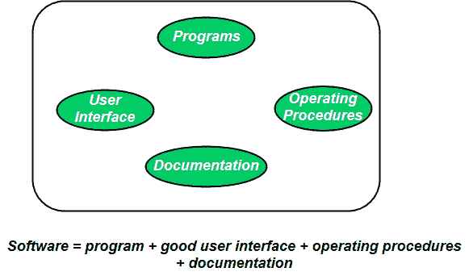
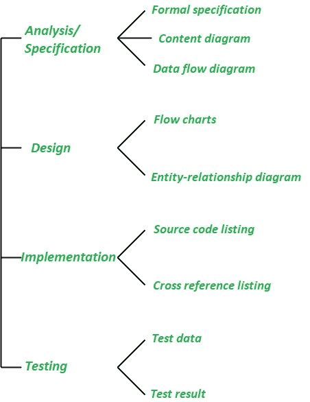
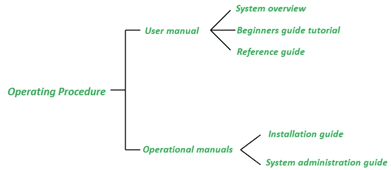

# 博客|程序 Vs 软件

> 原文:[https://www.geeksforgeeks.org/blog-program-vs-software/](https://www.geeksforgeeks.org/blog-program-vs-software/)

许多人把软件这个术语等同于计算机程序。**程序**由个人开发，供个人使用。它们通常体积小，功能有限。一个程序的作者自己使用和维护他的程序，这些通常没有一个好的用户界面和缺乏适当的文档。鉴于**软件产品**有多个用户，因此应具有良好的用户界面、适当的操作程序和良好的文档支持。

既然一个**软件产品**拥有大量的用户，那么它就必须经过适当的设计、仔细的实施和适当的测试。*任何程序都是软件*的一个子集，只有准备好文档和操作程序手册，它才成为软件。程序由一组指令组成，这些指令是源代码和目标代码的组合。

文档由各种手册组成，如下所示:

操作程序包括设置和使用系统的说明以及如何应对系统故障的说明。

一般来说，软件产品太大，不能由一个程序员开发。所以**软件产品**是由一群软件工程师开发的。软件工程师关心的是开发软件产品，而程序员关心的是编写程序。软件产品的开发需要一个定义明确且系统化的方法，没有这个方法，软件开发团队将无法生产出合适的软件产品。