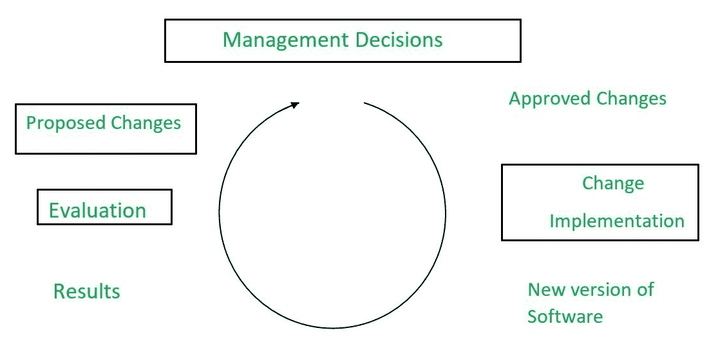

# 波姆的软件维护模型

> 原文:[https://www . geesforgeks . org/boehms-软件-维护-模型/](https://www.geeksforgeeks.org/boehms-software-maintenance-model/)

1983 年，鲍姆提出了一个基于经济模型和原理的维修过程模型。经济学模型并不是什么新鲜事物，经济决策是许多过程的主要组成部分，Boehm 的论点是经济学模型和原理不仅可以提高维护中的生产率，而且有助于很好地理解过程。

Boehm 维护流程模型表示为**闭环循环**，如下图所示。



他的理论是，推动这一过程的是做出管理决策的平台。在这一阶段，通过将特定的战略和成本效益评估应用于一组提议的变更来确定一组所需的变更。这些批准的变更伴随着公司预算，这将在很大程度上决定资源扩展的程度和类型。

Boehm 明白维护经理的任务是平衡和追求维护目标与维护工作所处环境的约束。这就是为什么，维护过程应该由维护经理的决策来驱动，这些决策通常基于目标和约束的平衡。Boehm 提出了一个计算维护成本的公式，因为它是 [COCOMO 模型](https://www.geeksforgeeks.org/software-engineering-cocomo-model/)的一部分。从各个项目中收集的所有数据，公式是根据努力形成的。

Boehm 使用了一个称为年度收费流量(ACT)的量，其定义为:

软件产品的源代码说明在一年中通过添加、删除或修改而改变的部分。
ACT 与变更请求的数量相关，

```
ACT = KLOCadded +  KLOCdeleted /  KLOCtotal 
```

以人月为单位的年度维护工作量(AME)计算如下:

```
AME = ACT * SDE
```

其中，
ACT =年度变更流量，
SDE =以人月为单位的软件开发工作量。

**示例–**
软件系统的年度变更流量(ACT)为每年 20%。开发工作是 700 个项目经理。计算年度维护工作量的估计值(AME)。如果项目的寿命是 15 年，项目的总工作量是多少？

**说明:**
给定，
开发工作量= 700PM
年收费流量(ACT) = 20%
计算工作量的总持续时间= 15 年。

维护工作是开发工作的一部分，并且被认为是不变的。

```
AME 
= ACT * SDE
= 0.20 * 700 
= 140PM 
```

15 年的维护工作，

```
= 15 * 140 
= 2100PM 
```

所以，全力以赴，

```
= 700 + 2100 
= 2800PM 
```