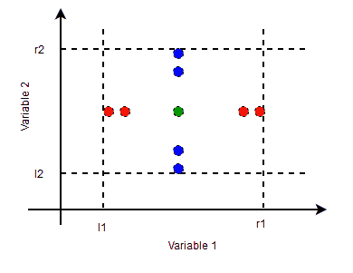

# 边值分析-三角问题

> 原文:[https://www . geesforgeks . org/boundary-value-analysis-triangle-problem/](https://www.geeksforgeeks.org/boundary-value-analysis-triangle-problem/)

**边界值分析(BVA)** 是一种黑盒软件测试技术，其中使用边界值设计测试用例。BVA 基于*单一故障假设*，也称为临界故障假设，该假设指出故障很少是两个或多个同时故障的产物。因此，在为 BVA 设计测试用例时，我们将除一个变量之外的所有变量都保留为标称值，并允许剩余的变量取极值。

**BVA 的测试用例设计:**
在为 BVA 设计测试用例时，我们首先确定问题中输入变量的数量。然后，对于每个输入变量，我们确定它可以取值的范围。然后我们确定每个输入变量的极值和标称值。

考虑一个取值范围为[l，r]的输入变量 t。t 的极值为–



```
t = l
t = l+1
t = r-1
t = r 
```

变量的标称值可以是(l，r)范围内的任何值。
在大多数 BVA 实现中，它被视为范围(r+l)/2 的中间值。
右图显示了一个双变量问题的分析边界值的标称值和极值。

在单一故障假设下，在 BVA，一个有 n 个输入的问题的测试用例总数是 4n+1。
4n 个案例对应测试案例，每个变量的四个极值保持另 n-1 个变量在标称值。另一种情况是所有变量都保持在一个标称值。

使用 BVA 进行测试用例设计的一个常见问题是*三角形问题*，这将在下面讨论

三角形问题接受三个整数——a，b，c 作为三角形的三条边。我们还将三角形的边定义为[l，r]，其中 l>0。它返回由 a、b、c 构成的三角形类型(不等边三角形、等腰三角形、等边三角形、非三角形)

a、b、c 要形成三角形，应满足以下条件–

```
a < b+c
b < a+c
c < a+b 
```

如果违反这些条件中的任何一个，输出不是三角形。

*   对于等边三角形，所有边都相等。
*   对于等腰三角形，正好有一对边相等。
*   对于不等边三角形，所有的边都是不同的。

该表显示了三角形问题的测试用例设计。量程值[l，r]取为[1，100]，标称值取为 50。

总的测试用例是，

```
4n+1 = 4*3+1 = 13 
```

<figure class="table">

| 测试用例标识 | a | b | c | 预期产出 |
| --- | --- | --- | --- | --- |
| 一种网络的名称(传输率可达 1.54mbps) | one | Fifty | Fifty | 等腰的 |
| T2 | Two | Fifty | Fifty | 等腰的 |
| T3 | Ninety-nine | Fifty | Fifty | 等腰的 |
| T4 | One hundred | Fifty | Fifty | 不是三角形 |
| T5 | Fifty | Fifty | Fifty | 等边的 |
| T6 | Fifty | one | Fifty | 等腰的 |
| T7 | Fifty | Two | Fifty | 等腰的 |
| T8 | Fifty | Ninety-nine | Fifty | 等腰的 |
| T9 | Fifty | One hundred | Fifty | 不是三角形 |
| T10 | Fifty | Fifty | one | 等腰的 |
| T11 | Fifty | Fifty | Two | 等腰的 |
| T12 | Fifty | Fifty | Ninety-nine | 等腰的 |
| T13 | Fifty | Fifty | One hundred | 不是三角形 |

</figure>