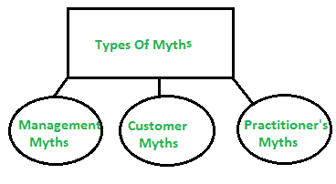
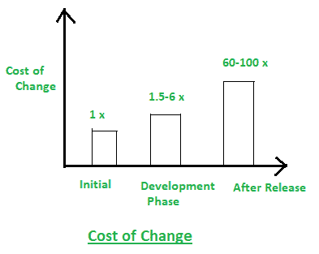

# 软件神话简述

> 原文:[https://www . geeksforgeeks . org/简短描述-关于-软件-神话/](https://www.geeksforgeeks.org/brief-description-about-software-myths/)

**软件神话:**

大多数有经验的专家已经看到了神话或迷信(错误的信仰或解释)误导的态度(赤裸裸的用户)

管理和技术人员面临的主要问题。下面列出了软件相关神话的相反类型。

软件神话的类型

**(一)管理神话:**

**神话 1:**

我们有软件开发的所有标准和程序，即软件开发人员有所有的要求。

事实:

*   软件专家不知道他们都是什么水平。
*   目前/现代软件工程方法中，这样的实践可能会也可能不会过期。
*   而且现有的所有流程都是不完整的。

**神话 2 :**

最新硬件程序的加入将改进软件开发。

事实:

*   最新硬件对标准软件开发的作用不是很高；相反(CASE)工程工具有助于计算机它们比硬件更重要以产生质量和生产力。
*   因此，硬件资源被滥用。

**神话 3 :**

*   经理们认为，随着更多的人员和计划者加入到软件开发中，可以帮助满足项目的最后期限(如果落后的话)。

事实:

*   软件开发不是，像生产一样做事的过程；在这里，在前几个阶段增加人员可以减少用于生产性开发的时间，因为新来的人会占用现有开发人员对文件项目的定义和理解的时间。然而，有计划的增加是有组织的，它可以帮助完成项目。

神话的不同阶段

**(二)客户神话:**

客户可以是软件的直接用户、技术团队、营销/销售部门或其他公司。客户有神话

导致错误的期望(客户)&这就是为什么你会引起开发人员的不满。

**神话 1 :**

一般的意图声明足以开始编写计划(软件开发)，目标的细节可以随着时间的推移而完成。

事实:

*   对数据库功能、道德表现、沟通、结构问题和验证过程的正式和详细描述非常重要。
*   正在发生的情况是，客户和开发人员之间需要完全的沟通。

**神话 2 :**

*   项目需求不断变化，但是，由于软件的灵活性，变化可能很容易。

事实:

*   对软件开发的最后阶段进行了更改，但这些更改的成本会随着软件开发的最新阶段而增长

发展。应该对用户需求进行详细的分析，以最小化变更需求。图显示了中的过渡成本

尊重发展的范畴。

**(三)从业者的神话:**

**神话 1 :**

他们相信他们的工作已经随着计划的编写而完成，并且他们收到了它来工作。

事实:

*   确实，每 60-80%的努力都进入了维护阶段(从后面的软件发布开始)。需要努力，产品首先交付给客户。

**神话 2 :**

没有其他方法可以达到系统质量，在它的背后完成运行。

事实:

*   项目技术的系统评审是有效的软件质量验证方法。这些更新是质量过滤器，比测试更容易访问。

**神话 3 :**

操作系统是唯一可以成功导出项目的产品。

事实:

*   光有一个工作系统是不够的，还需要合适的文件手册和小册子。提供指导和软件支持。

**神话 4 :**

工程软件将使我们能够建立强大和不必要的文件&总是拖延我们。

事实:

*   软件工程不处理文本构建，而是在创建更好的质量的同时减少回收&这正在被研究用于快速产品交付。