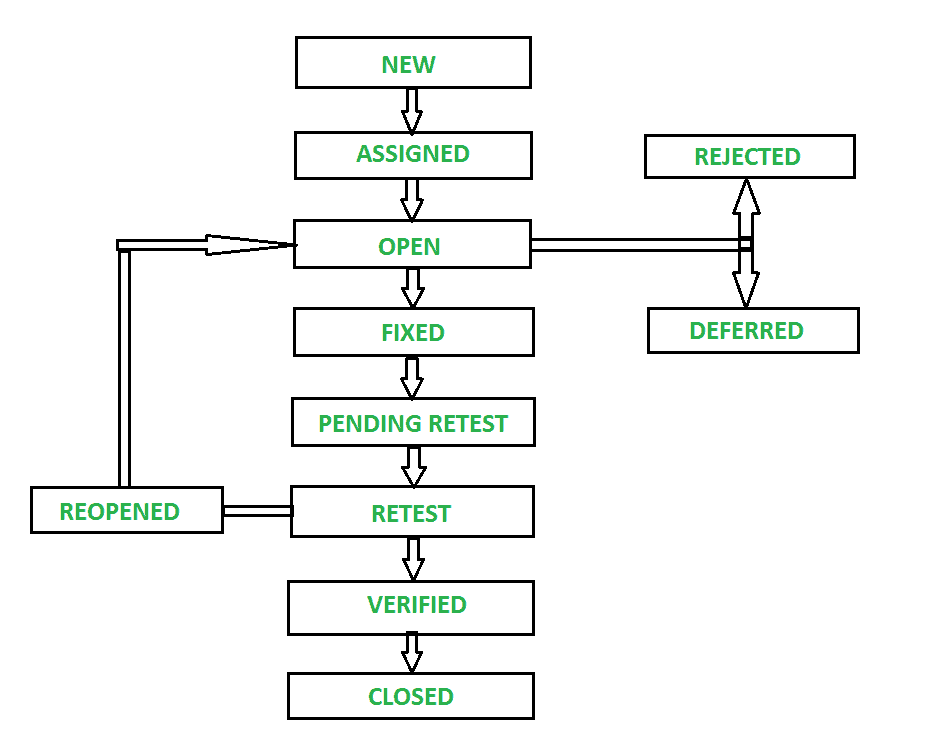

# 软件开发中的 Bug 生命周期

> 原文:[https://www . geesforgeks . org/bug-软件开发生命周期/](https://www.geeksforgeeks.org/bug-life-cycle-in-software-development/)

正如我们所知，在任何软件产品的开发过程中，开发团队都遵循[软件开发生命周期(SDLC)](https://www.geeksforgeeks.org/software-development-life-cycle-sdlc/) 流程。但是开发过程并没有那么容易，总是顺利进行。在开发过程中，当产品被开发时，不同类型的缺陷或 bug 会随着产品出现。因此，这些缺陷在整个开发过程中被识别和解决，只是为了最终交付一个高质量的软件产品。因此，在本文中，我们将讨论软件开发过程中的这些错误，以及如何在[软件测试](https://www.geeksforgeeks.org/software-testing-basics/)、[T5】期间识别这些错误，以及如何解决这些错误。](https://www.geeksforgeeks.org/software-testing-basics/)

**什么是 Bug/缺陷？**

缺陷是应用程序中的错误或 bug，它是在构建或设计软件的过程中产生的，由于它，软件在使用过程中开始表现出异常行为。因此，测试人员的一个重要职责就是找到尽可能多的缺陷，以确保产品质量不受影响，最终产品完美地满足其设计的所有要求，并为最终用户提供所需的服务。因为尽可能多的缺陷将被识别和解决，那么软件将按照预期完美运行。

让我们首先了解缺陷生命周期，然后，我们将转向工作流和缺陷的不同状态。

**缺陷生命周期**–

在软件开发过程中，缺陷生命周期是缺陷或 bug 的生命周期，缺陷或 bug 在其整个生命周期中覆盖特定的一组状态。bug 生命周期主要是指从检测到一个新的缺陷到测试人员关闭该缺陷的整个状态。或者，它也被称为 Bug 生命周期。

缺陷周期的旅程因组织而异，也因项目而异，因为开发过程和平台以及测试方法和测试工具因组织和项目而异。缺陷经历的状态数量也因软件测试期间使用的不同工具和遵循的流程而异。

**缺陷/Bug 生命周期的工作流程–**

下图说明了缺陷生命周期的实际工作流程。

上图显示了缺陷生命周期中缺陷的不同状态，如下所示:

**1。新–**

当测试人员发现任何新的缺陷时，它就处于“新”状态。这是 Bug 生命周期的第一个状态。测试人员向开发团队提供适当的缺陷文档，以便开发团队可以参考缺陷文档并相应地修复错误。

**2。已分配–**

处于“新”状态的缺陷将被批准，新识别的缺陷被分配给开发团队处理缺陷并加以解决。当缺陷被分配给开发团队时，bug 的状态将变为“已分配”状态。

**3。打开–**

在这种“开放”状态下，缺陷由开发团队解决，开发团队处理缺陷以修复缺陷。基于某些特定的原因，如果开发团队认为缺陷不合适，那么它将被转移到“拒绝”或“延迟”状态。

**4。固定–**

在对代码进行必要的更改后，或者在修复了识别出的错误后，开发团队将状态标记为“已修复”。

**5。待定重测–**

在缺陷修复完成期间，开发团队将新代码传递给测试团队进行重新测试。并且代码/应用程序在测试方等待重新测试，因此状态被指定为“等待重新测试”。

**6。重测–**

在这个阶段，测试人员开始重新测试缺陷，检查缺陷是否被开发人员修复，状态标记为“重新测试”。

**7。重新开放–**

在“重新测试”之后，如果测试团队发现即使开发团队已经修复了错误，错误仍然像以前一样继续，那么错误的状态将再次更改为“重新打开”。bug 再次进入“打开”状态，再次经历生命周期。这意味着开发团队需要重新修复。

**8。已验证–**

测试人员在被开发团队修复后重新测试错误，如果测试人员没有发现任何类型的缺陷/错误，则错误被修复，状态被指定为“已验证”。

**9。关闭–**

这是缺陷周期的最终状态，在开发人员团队修复缺陷之后，当测试发现缺陷已经被解决并且没有持续存在时，他们将缺陷标记为“关闭”状态。

**很少有更多的状态也属于这个缺陷生命周期–**

**1。被拒绝–**

如果开发团队认为缺陷不被认为是真正的缺陷而拒绝缺陷，那么他们将状态标记为“拒绝”。拒绝的原因可能是这三个原因中的任何一个，即重复缺陷、非缺陷、不可复制。

**2。延期–**

所有的缺陷对开发的软件都有不好的影响，并且基于他对软件的影响也有一个等级。如果开发团队认为所识别的缺陷不是主要优先事项，并且它可以在进一步的更新或发布中得到修复，那么开发团队可以将状态标记为“延迟”。意味着从当前的缺陷生命周期开始，它将被终止。

**3。重复–**

有时可能会出现缺陷重复出现两次或缺陷与任何其他缺陷相同的情况，然后将其标记为“重复”状态，然后缺陷被“拒绝”。

**4。不是缺陷–**

如果缺陷对软件的其他功能没有影响或作用，则它被标记为“非缺陷”状态和“已拒绝”。

**5。不可再现–**

如果由于平台不匹配、数据不匹配、构建不匹配或任何其他原因导致缺陷无法重现，开发人员会将缺陷标记为“不可重现”状态。

**6。无法修复–**

如果开发团队由于技术支持、修复错误的成本更高、缺乏所需技能或任何其他原因而未能修复缺陷，则开发团队将缺陷标记为“无法修复”状态。

**7。需要更多信息–**

这种状态非常接近“不可再现”状态。但它与此不同。当开发团队由于测试人员提供的步骤/文档不充分或缺陷文档不清晰而无法重现缺陷时，开发团队可以将状态更改为“需要更多信息”。当测试人员团队提供了一个好的缺陷文档，那么开发人员团队就开始修复这个错误。

**遵循缺陷生命周期的优势:**

*   交付高质量的产品
*   通过降低开发成本提高投资回报
*   更好的沟通、团队合作和连通性
*   更早发现问题并了解缺陷趋势
*   更好的服务和客户满意度

**缺陷生命周期中的困难:**

*   Bug 生命周期的变化
*   测试环境不受控制