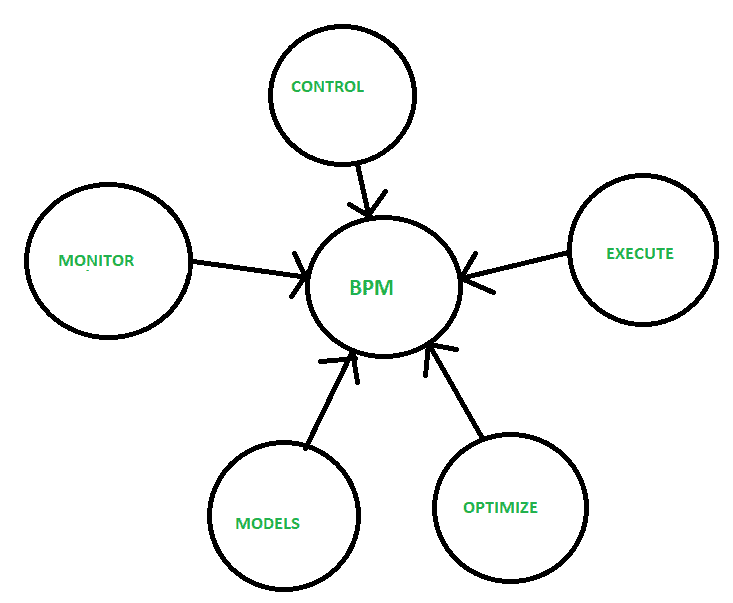

# 业务流程管理(BPM)

> 原文:[https://www . geesforgeks . org/business-process-management-BPM/](https://www.geeksforgeeks.org/business-process-management-bpm/)

**业务流程管理(BPM)** 实时更新流程。这是一种以流程为中心的方法，用于将信息技术与治理方法相结合来提高业务绩效。这是一系列有助于业务顺利运行的活动。这些过程从公司的活动开始，从开始阶段到最终销售。

BPM 涉及的关键流程有[风险管理](https://www.geeksforgeeks.org/software-engineering-risk-management/)、业务流程建模、业务流程外包、员工激励、产品库存。它的主要目标是提高公司业务的有效性和效率，并改善运营绩效。

**优势:**

*   指导用户做出决策。
*   自动确定工作的优先顺序和路线。
*   跨地域标准化解决方案。
*   监控业务事件并启动行动。
*   实时可见性和过程控制。
*   自动化关键决策。
*   改进预测。
*   提高生产率。
*   成本更低。

**缺点:**

*   不允许重复过程。
*   它有它的极限。
*   缺乏沟通。