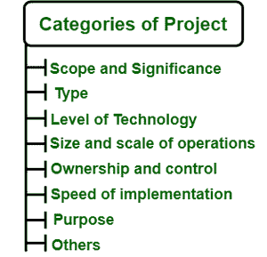

# 项目类别

> 原文:[https://www.geeksforgeeks.org/categories-of-project/](https://www.geeksforgeeks.org/categories-of-project/)

在[项目管理](https://www.geeksforgeeks.org/software-engineering-project-management-process/)中，有很多类别在规划项目时也需要规划。您将详细看到每个类别，即我们如何定义项目的类别。您将看到一些类别，如范围和重要性、项目类型、技术水平、规模和运营规模、所有权和控制权、项目的实现和目的，这些都是常用的类别。

如果你正在计划一个项目并且想要实现，那么你可以考虑这些类别。项目通常根据其范围、规模、实施速度、位置、类型和技术进行分类。该项目可以根据以下理由进行分类。

**范围和意义:**
项目通常根据其运营的覆盖范围和规模进行分类。所以在范围的基础上，项目可以是国家的或国际的。

1.  **国家项目–**
    也有由政府自己承担或分配给一个国家的私营企业家的项目。在印度这样的国家，公共和私营部门并存，承担着重大和次要的项目。政府项目和私人项目在截然不同的环境中运作，具有不同的优势和劣势。国家项目的唯一目的是经济的增长和发展以及维持现有的生活水平。
2.  **国际项目–**
    由“外国投资者”通过建立其单位的单独或分支机构或仅仅通过参与任何国内公司的股权而启动的项目被称为国际项目。这些形式可以是合资企业、跨国公司和两家公司之间的合作。

**类型:**
根据类型，项目可以是工业类，也可以是非工业类。

1.  **工业–**
    这些都是为了发展经济而进行的项目。
2.  **非工业–**
    这些项目可能与福利和维持经济中的生活水平有关。

**技术水平:**
技术在项目管理中发挥着重要作用。项目可以根据技术细分为四类。这些如下。

*   **常规技术项目–**
    这些是在连续过程中使用已知技术的项目。例如钢铁、水泥、糖、化学品和肥料等。
*   **非常规技术–**
    这类项目即使不是最新的，至少也是当代模式的技术，例如使用起重机的项目，即机械提升方式。
*   **高科技项目–**
    这几类项目在技术上投入巨大，如航天项目、核电项目等。
*   **低投资项目–**
    这些类型的项目对技术的投资要求较低，例如化妆品和家用电器等。

**经营规模和规模:**
在经营规模和规模的基础上，项目可以是大规模、中规模、小规模。

*   **小规模项目–**
    这些是可以在 1-2 年时间内完成，投资在 rs 以下的项目。500 万。
*   **中型项目–**
    这些项目可以在 2-5 年的时间内完成，投资在卢比之间。5 至 Rs。一万块。
*   **大型项目–**
    这些是可以在 5-10 年时间内完成，投资在卢比以上的项目。十亿欧元。

**所有权和控制权:**
项目根据其治理情况可分为 3 类。

*   **公共部门项目–**
    这些项目完全由政府拥有和控制，例如发电和开采矿产等。
*   **私营部门项目–**
    这些项目完全由个人和公司所有，如报纸和杂志等。
*   **联合部门项目–**
    这些由政府和私人运营和控制的项目都属于这一类。

**执行速度:**
根据执行速度，项目可以是正常、崩溃、灾难项目。

*   **正常项目–**
    在这一类别中，允许有足够的时间实施。它需要最小的资本成本。
*   **速成项目–**
    在这一类别中，会产生额外的资本以节省时间。
*   **灾难项目–**
    在这一类别中，资本成本自然会上升，但项目时间会大幅减少。质量不合格被接受。

**目的:**
凡事总有目的。因此，这些项目按照目的分类如下。

*   **康复项目–**
    这些项目由财务状况良好的投资集团承担，为患病单位提供服务。在这样的项目中，风险很大，成功也很少。
*   **平衡项目–**
    这些项目是为了应对生产要素经济的供应方面的变化，消除实际能力的利用不足，并提高效率和效力。
*   **维护项目–**
    这些项目包括定期检修机器、修理和修补活动。
*   **现代化项目–**
    需要对旧厂房进行现代化改造，以应对动态环境。

**其他** :
其他一些类型的项目如下。

1.  **产能扩张项目–**
    这涉及扩大产品的现有产能。
2.  **员工福利项目–**
    此类项目的目标是安装基础设施，以改善工作条件和劳动关系，并发展员工的技能。