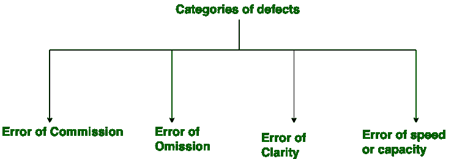

# 软件缺陷的类别

> 原文:[https://www . geesforgeks . org/categories-of-software-default/](https://www.geeksforgeeks.org/categories-of-software-defect/)

**软件缺陷**是开发团队的某种错误、瑕疵或某种错误，阻碍了软件的顺利运行。它直接影响软件质量，软件质量是一些你的软件有多流畅和可靠的事情。流畅度和可靠性是指你的软件缺陷有多少。

**缺陷类别:**
缺陷类别为:佣金错误、遗漏错误、清晰度错误、速度和容量错误。

这些解释如下。

1.  **委托错误:**
    委托是指发出的指令或某种命令。现在委托中的错误是指命令或指示中的错误。例如，假设我写了一个循环，我试图运行 10 次，但我错误地命令它运行 10 次以上，这是佣金的错误。

*   **遗漏的错误:**
    顾名思义，遗漏的错误是偶然发生的事情。省略一词意味着被遗漏或被执行的东西。这个错误最常见的例子是，假设我们在编程中让一个函数打开它的括号，但最后却忘了关闭。*   **清晰度错误:**
    自然语言中最常见的错误。这个错误的发生是由于开发人员和客户之间缺乏理解。它大部分时间从需求传递到软件。*   **速度或容量的误差:**
    这个误差的名字本身就足以说明我认为是这个误差。你的软件工作正常，但没有在要求的时间内工作，这是速度的误差。说到容量，它可能与内存有关。例如，在需要长整数的地方声明一个小整数。