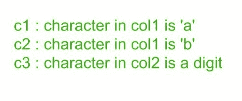
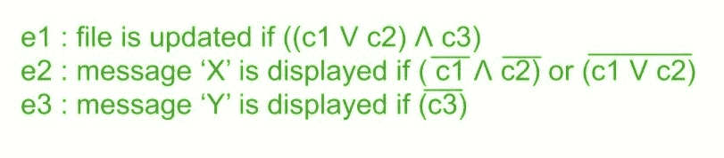
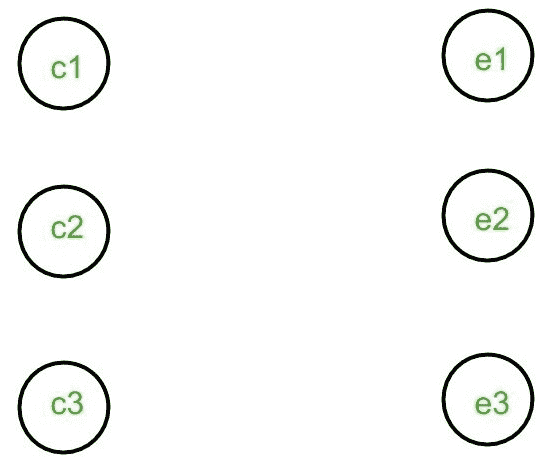
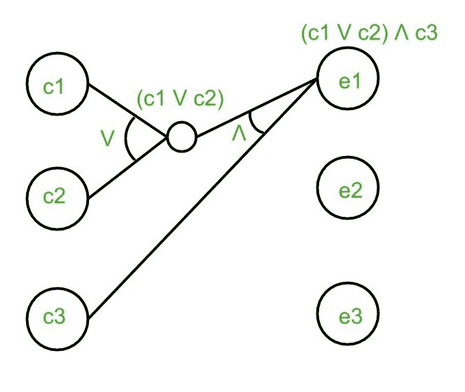
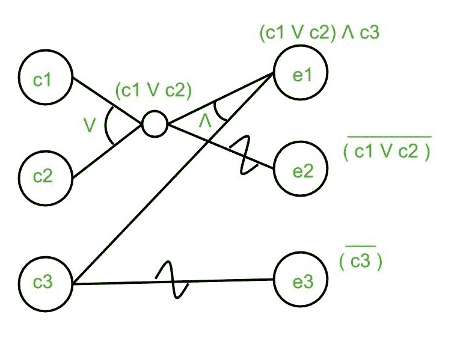
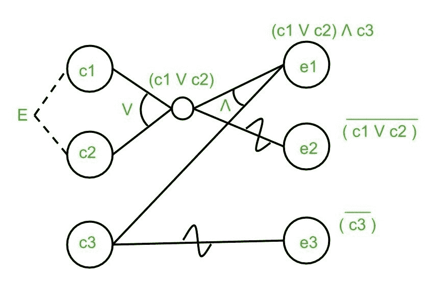

# 软件工程因果图示例

> 原文:[https://www . geesforgeks . org/因果图-软件工程示例/](https://www.geeksforgeeks.org/cause-effect-graphing-example-in-software-engineering/)

**问题:**有两列:col1 和 col2。第 1 列中允许的字符是“a”或“b”。第 2 列中允许的字符是数字 0-9。如果第 1 列和第 2 列都正确，则更新文件。如果列 1 不正确，则显示消息“X”，如果列 2 不正确，则显示消息“Y”。画出给定问题的因果图。

**解决方案:**

执行以下步骤来创建因果图:

**1。确定原因:**

**2。识别影响:**

**3。为所有因果创建节点:**

**4。使用 AND、NOT、OR 和 Identity 函数建立因果关系:**

1.e1 以下列方式从 c1、c2 和 c3 获得:

2.e2 通过以下方式从 c1 和 c2 获得:

3.e3 以下列方式从 c3 获得:

**5。向图表添加约束条件(如果有):**

C1 和 c2 原因之间存在排他约束(或 E-约束)，因为在一个时间点，它们中只有一个可以是 1，即它们不能同时是 1。因此，在它们之间应用了电子约束。上面显示的图表是针对给定问题获得的最终因果图。