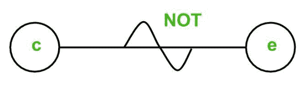
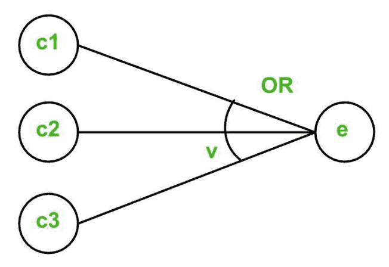
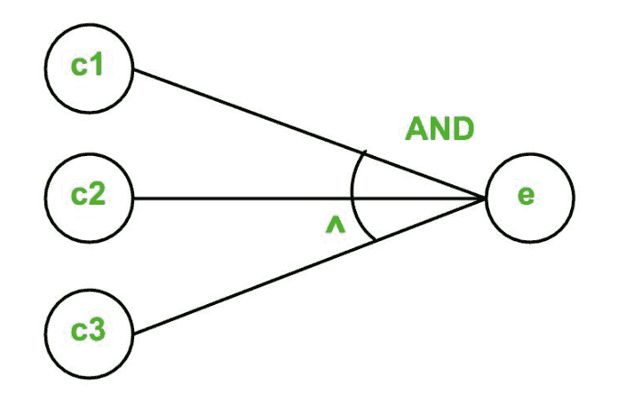
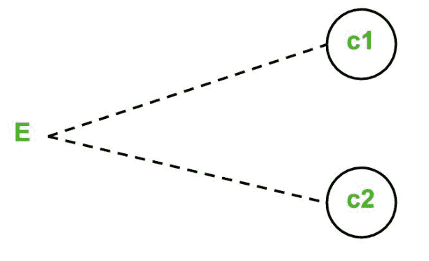
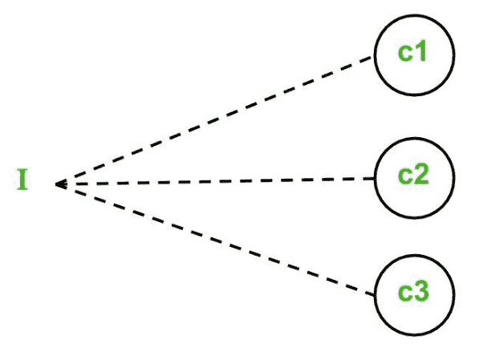
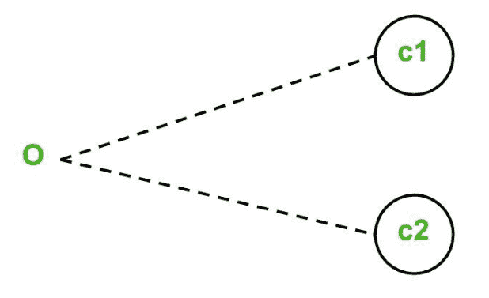
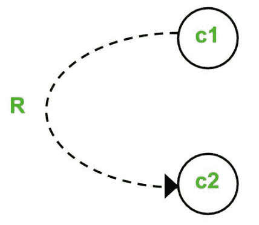
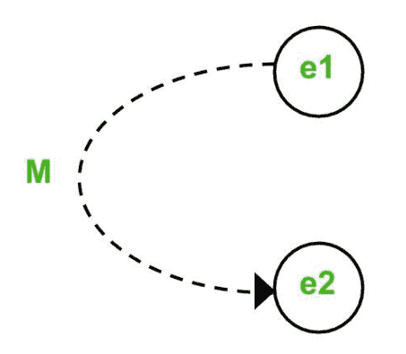

# 软件工程中的因果图

> 原文:[https://www . geeksforgeeks . org/软件工程因果图/](https://www.geeksforgeeks.org/cause-effect-graphing-in-software-engineering/)

先决条件–[黑盒测试](https://www.geeksforgeeks.org/software-engineering-black-box-testing/)

**基于因果图的技术**是一种使用图来表示输入条件组合情况的技术。然后将该图转换成决策表，以获得测试用例。使用因果图技术是因为边界值分析和等价类划分方法不考虑输入条件的组合。但由于在考虑输入条件的某些组合时，可能会有一些关键行为需要测试，这就是为什么使用因果图技术的原因。

**使用这种技术导出测试用例的步骤是:**

1.  **规格的划分:**
    由于大规格的因果图很复杂，很难处理，所以将规格划分成可操作的小块，然后分别转换成因果图。

*   **因果识别:**
    这包括识别规范中的原因(不同的输入条件)和结果(输出条件)。*   **将规格转换为因果图:**
    使用布尔表达式将因果链接在一起，以获得因果图。如果可能的话，还会在原因和结果之间添加约束。*   **转换成决策表:**
    然后将因果图转换成限定条目决策表。如果您不知道决策表的概念，请查看[这个](https://www.geeksforgeeks.org/software-engineering-decision-table/)链接。*   **Deriving test cases:**
    Each column of the decision-table is converted into a test case.

    **因果图中使用的基本符号:**
    这里 **c** 代表**原因**和 **e** 代表**效果**。

    以下符号总是用在原因和结果之间:

    1.  **Identity Function:** if c is 1, then e is 1\. Else e is 0.

        

    2.  **NOT Function:** if c is 1, then e is 0\. Else e is 1.

        

    3.  **OR Function:** if c1 or c2 or c3 is 1, then e is 1\. Else e is 0.

        

    4.  **AND Function:** if both c1 and c2 and c3 is 1, then e is 1\. Else e is 0.

        

为了表示一些不可能的原因组合或不可能的结果组合，使用了约束。因果图中使用了以下**约束条件**:

1.  **Exclusive constraint** or **E-constraint:** This constraint exists between causes. It states that either c1 or c2 can be 1, i.e., c1 and c2 cannot be 1 simultaneously.

    

2.  **Inclusive constraint** or **I-constraint:** This constraint exists between causes. It states that atleast one of c1, c2 and c3 must always be 1, i.e., c1, c2 and c3 cannot be 0 simultaneously.

    

3.  **One and Only One constraint** or **O-constraint:** This constraint exists between causes. It states that one and only one of c1 and c2 must be 1.

    

4.  **Requires constraint** or **R-constraint:** This constraint exists between causes. It states that for c1 to be 1, c2 must be 1\. It is impossible for c1 to be 1 and c2 to be 0.

    

5.  **Mask constraint** or **M-constraint:** This constraint exists between effects. It states that if effect e1 is 1, the effect e2 is forced to be 0.

    