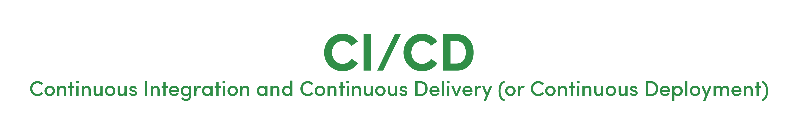
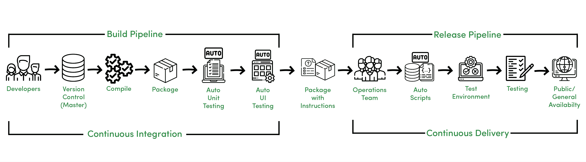
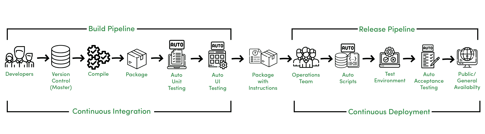

# CI/CD:持续集成和持续交付

> 原文:[https://www . geesforgeks . org/ci-CD-continuous-integration-and-continuous-delivery/](https://www.geeksforgeeks.org/ci-cd-continuous-integration-and-continuous-delivery/)

开发人员遵循一个被称为软件开发生命周期的过程/模型来开发软件项目。传统的 [SDLC](https://www.geeksforgeeks.org/software-engineering-sdlc-v-model/) 有不同的发展阶段

1.  **规划–**记录和确定项目结构和进度。
2.  **分析–**分析项目需求，收集资源。
3.  **设计–**用架构和界面设计设计软件模型。
4.  **实施–**通过考虑设计和需求来开发实际产品。
5.  **测试–**测试构建的，修复错误&bug，重构代码。
6.  **部署和维护–**部署和监控软件以获得进一步增强。

传统软件开发过程

**特性–**

上图所示的传统 [SDLC](https://www.geeksforgeeks.org/basic-frame-structure-of-sdlc/) 的概述以以下方式工作。

*   不同的开发团队维护不同的代码库。
*   构建和集成团队集成代码。
*   集成代码被编译为一个包。
*   带有说明的包被发送给运营团队。
*   运营团队将包推入测试环境，包由测试团队进行测试。
*   测试团队将任何可能的问题告知开发团队，否则将为产品发布发出绿色信号。

然而，在这个快速适应的世界中，实践上述过程和模型(如瀑布模型)是没有价值的，在瀑布模型中，我们必须等到最后才能收到功能性产品，通常在周期结束时交付。

**CI/CD 定义:**

这就是 CI/CD 拯救的地方。与其说是工具，不如说是一种文化和实践，但什么是 CI/CD？

> **“CI/CD 代表持续集成和持续交付(或持续部署)，它是关于如何利用共享存储库中的集成代码，在自动化的帮助下，每天多次将软件发布到生产中。”**

**持续整合:**

持续集成是关于开发人员如何在自动化的帮助下，每天多次使用共享存储库集成代码。

**连续交付:**

持续交付是指自动向测试或生产环境发布软件。

持续集成和持续交付流程

**特性–**

上图显示了持续集成和持续交付流程，由于以下原因，该流程不同于传统的 SDLC:

*   开发人员管理共享存储库中的代码。
*   编译后，执行自动化单元和用户界面测试。
*   运营团队需要处理进一步进入测试环境的自动化脚本。
*   执行测试，并在批准后，将软件发送到生产。

在这里，持续集成可以称为构建管道，持续交付可以称为发布管道。

**持续部署:**

持续部署是指在没有人工干预的情况下自动将软件发布到生产环境中。

持续集成和持续部署流程

连续部署是一种进步，它减少了操作和测试团队将软件部署到生产环境的手动工作，因为它是在自动验收测试后自动部署到生产环境的。

**特性–**

CI/CD 有助于通过以下方式实现快速可靠的软件开发。

*   自动化和快速的代码集成。
*   由于周期和迭代短，错误检测和响应很快。
*   不太容易出现人为错误。
*   由于自动化脚本，比遵循手动指令更快。
*   一天可以部署几次。

而且 [DevOps](https://www.geeksforgeeks.org/lifecycle-of-devops/) 中的 CI/CD 是关于统一流程和自动化的，它有助于充当开发和运营团队之间的桥梁，使流程更加可靠和自适应。