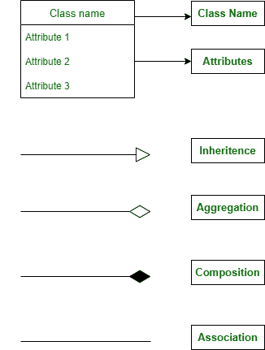
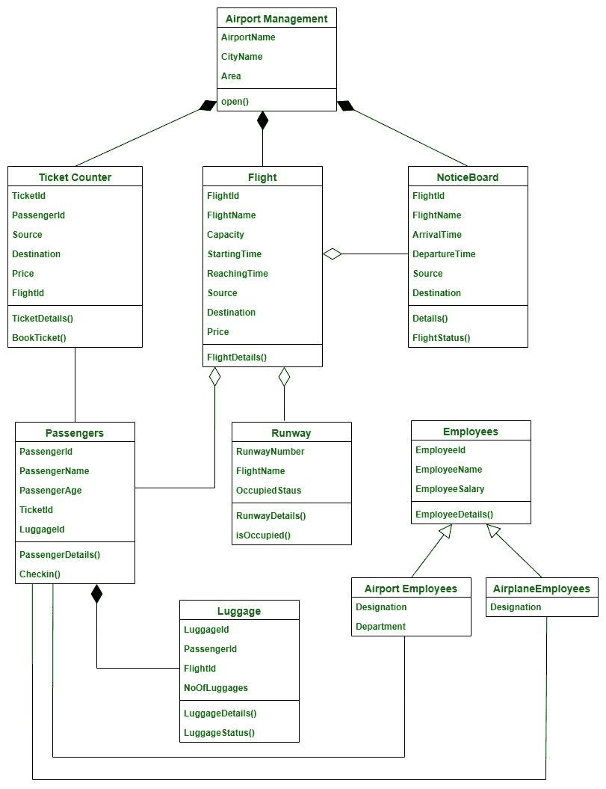

# 机场管理系统类图

> 原文:[https://www . geesforgeks . org/机场管理系统类图/](https://www.geeksforgeeks.org/class-diagram-for-airport-management-system/)

机场是一个复杂的系统，每天有成千上万的国内和国际航班在其中运行，需要适当的规划和执行才能使其成为一个管理系统。

**类:**

*   **机场管理**–本课程包含机场的整体细节。
*   **车票计数器**–它允许乘客购买车票并支付车票费用。
*   **航班**–这包含了机场的所有航班信息。
*   **员工**–员工可以是两种类型–机场员工和飞机员工。这个类是两个子类的父类——机场雇员和飞机雇员
*   **airport Employees**–该类是 Employees 的子类。它描述了在机场工作的员工。它包含他们的名称和部门，如海关、票务、食品等。
*   **航空公司员工**–该类是员工的子类，包含空姐、飞行员等称谓。表示在飞机内工作的员工。
*   **跑道**–这包含了跑道的详细信息，并且它还告诉特定的跑道是否被任何航班占用。
*   **乘客**–该类别包含乘客详细信息。
*   **公告栏**–该类别包含当前航班和特定日期尚未到达和离开的航班。
*   **行李**–该类包含特定乘客的行李详情

**属性:**

*   **机场管理**–机场名称、城市名称、区域
*   **ticket counter**–ticket id，PassengerId，Source，Destination，Price，FlightId。
*   **航班**–航班编号、航班名称、运力、出发时间、到达时间、来源、目的地、价格
*   **员工**–员工 Id、员工姓名、员工工资
*   **机场员工**–名称、部门
*   **航空公司员工**–名称
*   **跑道**–运行航路号、航班名称、占用状态
*   **乘客**–乘客识别号、乘客姓名、乘客姓名、机票号码、行李识别号。
*   **公告栏**–航班编号、航班名称、到达时间、出发时间、源目的地
*   **行李**–行李舱、乘客舱、飞行舱、行李舱

**方法:**

**1 .机场管理:**

*   **open()**-这表示机场是否在运行，帮助我们启动和停止机场运行。

**2 .售票员:t1]**

*   **ticket details()**–此方法显示我们的机票和可用航班的详细信息及其价格。
*   **book ticket()**–这个方法就是订票

**3。航班:**

*   **航班详细信息()**–该方法用于显示航班的所有详细信息以及每个航班预订的机票数量。

**4。员工:**

*   **员工详细信息()**–该方法用于显示员工的详细信息及其指定。

**5。跑道:**

*   **runway details()**–该方法给出跑道长度、已预留跑道的航班以及当前在该跑道上的航班。
*   **isocupied()**–表示跑道是否有人。

**6。乘客:**

*   **乘客详细信息()**–该方法显示机场内乘客的全部详细信息。
*   **签入()**–这个方法是为了登机。

**7。布告栏:**

*   **详细信息()**–该方法显示所有在机场的航班的详细信息，还显示已经起飞和即将抵达的航班的时间和详细信息。
*   **航班状态()**–该方法显示特定航班的状态，并显示航班是否延误或即将起飞，以及乘客数量。

**8。行李:**

*   **行李详细信息()**–该方法显示与特定乘客相关的所有行李的详细信息。
*   **LuggageStatus()**–此方法用于指示行李的状态，并表示是否托运。

**关系:**

**继承:**

继承是子类从父类或基类获取资源的概念。在继承中，允许共享属性的类称为父类，从父类获取属性的类称为子类。继承大大减少了重新编码的需要，并允许代码重用。

> 这里员工类是父类，机场员工和飞机员工是其子类。

**关联:**

关联是一种关系，在这种关系中，两个类使用彼此和它们的方法。在关联中，没有一个类是另一个类的所有者，因为两个类相互使用，仍然保留在自己的空间中。

> 在这里，乘客和员工之间存在关联关系，因为乘客需要员工，员工为乘客服务，但他们都存在于自己的空间中。

**聚合:**

聚合是一种关系，其中一个类依赖于另一个类，但即使没有另一个类也可以存在。简而言之，依赖类在物理上并不包含在独立类中。

> 这里这三个类遵循聚合，
> 
> *   航班和乘客
> *   航班和通知板
> *   飞行和跑道
> 
> 乘客、通知板和跑道在某种程度上与飞行有关，但它们也可以在没有飞行的情况下存在，一个飞行可以被另一个飞行代替。

**成分:**

组合是一种关系类型，其中一个特定的类拥有另一个类。在组合中，依赖类不能在没有独立类的情况下存在，并且物理上包含在独立类中。

> 在这里，乘客和行李遵循一种组合关系，因为没有主人(乘客)，行李甚至不能存在。

**符号:**

**类图:**

