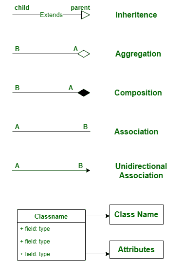
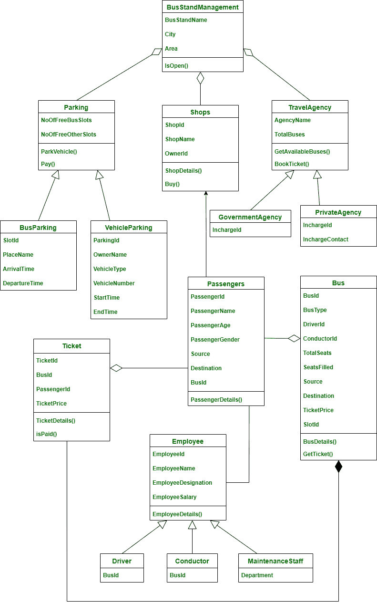

# 公交站台管理系统类图

> 原文:[https://www . geesforgeks . org/总线支架管理系统类图/](https://www.geeksforgeeks.org/class-diagram-for-bus-stand-management-system/)

公共汽车站是所有公共汽车都可以在一个州内和其他州之间运输的地方。在本文中，我们将看到一个典型的印度汽车站的汽车站管理及其类图。

**类:**

*   **公交站台管理**–本课程包含公交站台的详细信息。
*   **员工**–本课为我们详细介绍了所有在公交站台工作的员工，包括零售商、支持人员等。这个班是司机、售票员和维修人员的父班，因为他们都是员工。
*   **司机**–司机是员工的子阶级。它给出了公共汽车站所有公共汽车司机的详细信息。
*   **列车长**–列车长是员工的子类。这给了我们公交车售票员的详细信息。
*   **维修人员**–维修人员是员工的子阶级。它给出了所有维护人员的详细信息。
*   **停车**–大多数情况下，所有公交站台旁边都会有一个停车位。这堂课给我们提供了停车场的详细信息，关于车辆和车主的信息。
*   **公交停车**–公交停车是停车的子类。这是过去公共汽车停放的地方。在印度，开往特定地点的公交车在公交站台会有一些分配的区域，所以那些公交车需要停在那里。
*   **车辆停放**–车辆停放是停放的子类别。它包含了其他车辆的细节，如双轮车、轿车和汽车。
*   **旅行社**-这些是卖长途汽车票的旅行社。它有两个子类政府机构和私人机构。
*   **政府机构**–是 TravelAgency 的子类。它包含了负责的政府机构和长途旅行可用的政府公共汽车的详细信息。
*   **private agency**–是 TravelAgency 的子类。它包含可用于预订长途旅行票的非政府公共汽车和旅行服务的详细信息。
*   **公交**–这个班给我们公交站牌里公交车的详细信息，它帮助我们拿到那辆公交车的车票，获取座位的信息。
*   **乘客**–该类给出公交站台乘客的信息。
*   **车票**–此处保存已预订旅行车票的信息。它将包含乘客的详细信息和公共汽车以及旅行的时间。
*   **商店**–该类别包含公交车站内所有商店的详细信息。

**属性:**

*   **敲门管理**—敲门名称、城市、地区
*   **员工**–员工标识、员工姓名、员工签名、员工姓名
*   **驱动程序**–商务
*   **导体**–商务
*   **维护人员**–部门
*   **停车场**–nooffreebusts noofforersotros，，
*   **公交停车**–槽号、地名、到达时间、出发时间
*   **车辆停放**—停车证、车主姓名、车辆类型、车辆编号、启动时间、结束时间
*   **旅行社**–旅行社名称，总巴士
*   **政府机构**–主管
*   **私人机构**–肿胀，肿胀接触
*   **总线**–总线、总线类型、驱动器号、导线号、总席位数、席位数、源、目的地、票价、插槽号
*   **乘客**–乘客姓名、乘客姓名、乘客姓名、乘客姓名、来源、目的地、业务
*   **机票**–机票、商务、乘客、票价
*   **商店**–商店标识、商店名称、所有者标识

**方法:**

1 .敲门管理:

*   **IsOpen()**–此方法表示公交车站是否在运行。

**2。员工:**

*   **员工详细信息()**–该方法获取员工详细信息。

**3。停车:**

*   **停放车辆()**–这种方法是停放车辆。
*   **支付()**–支付方式为支付停车费。

**4。旅行社**

*   **getavailable bus()**–此方法显示可用于行驶的公交车。
*   **book ticket()**–这个方法为我们订票。

**5。总线**

*   **总线详细信息()**–该方法给出特定总线的信息。
*   **GetTicket()**–这个方法可以帮助我们预订特定公交的车票。

**6。乘客**

*   **乘客详细信息()**–这种方法是获取特定乘客的详细信息。

**7。票**

*   **Ticket details()**–使用此方法可以查看特定乘客的车票详情。
*   **isPaid()**–此方法显示乘客是否购买并支付了机票。

**8。店铺**

*   **商店详情()**–它显示了汽车站的商店以及那里可用的物品。
*   **购买()**–这种方法是在那些商店购买物品。

**关系:**

**1。继承:**

继承是从一个类到另一个类获取所需属性的实践。获取属性的类称为子类。允许获取其属性的类称为父类。这就是所谓的亲子关系。Ie。**“Is-a”**关系

> 在这里，
> 
> 1.司机、售票员、维修工员工是员工的子类。
> 
> *   司机是员工
> *   售票员是雇员
> *   维护员工是员工
> 
> 它正确地满足**“is-a”**关系
> 
> 2.政府机构和私人机构是旅游机构的子类
> 
> *   政府机构是一个旅行社
> *   私人旅行社是一家旅行社
> 
> 它正确地满足**“is-a”**关系
> 
> 3.公共汽车停车和车辆停车是停车的子类别
> 
> *   公共汽车停车场是一个停车场
> *   车辆停车就是停车
> 
> 它正确地满足**“is-a”**关系

**2。聚合:**

在聚合中，A 类和 B 类是相互依赖的，这表明 A 有一个 B and B 的实例，B 有一个实例，但它们在物理上并不包含在彼此内部。简单来说，B 类可以没有 a 类而存在，它遵循**“有-a”**关系。

> 在这里，
> 
> *   公共汽车站管理和商店——商店可以在没有公共汽车站的情况下存在。
> *   公交站台管理和停车–没有公交站台也可以停车。
> *   巴士站管理和旅行社–旅行社可以在没有巴士站的情况下存在。
> *   车票和乘客–乘客可以在没有车票的情况下存在。
> *   公共汽车和乘客——乘客可以在没有公共汽车的情况下存在。
> 
> 遵循聚合关系。

**3。组成:**

在组合中，A 类和 B 类是相互依赖的，这表明 A 类在 A 类中有一个 B 类的实例，换句话说，B 类物理上包含在 A 类中，所以 B 类没有 A 类就不能存在，它遵循“有-有”的关系。

> 在这里，
> 
> *   公共汽车和车票-没有公共汽车车票就不能存在
> 
> 遵循构图关系。

**4。关联:**

在关联中，一个类不以任何方式委托给另一个类，但是这两个类相互使用，并在各自的空间中运行。它遵循“使用”关系。

> 在这里，
> 
> *   员工和乘客–员工使用乘客，乘客使用员工。
> 
> 遵循关联关系。

**5。单向关联:**

在单向关联中，两个类在某些方面是相关的，但是只有一个类使用另一个类，而另一个类没有从这种关系中受益。甲类可以叫乙类，乙类不能叫甲类

> 在这里，
> 
> *   乘客和商店-乘客使用商店
> 
> 遵循单向关联。

**符号:**

**类图:**

