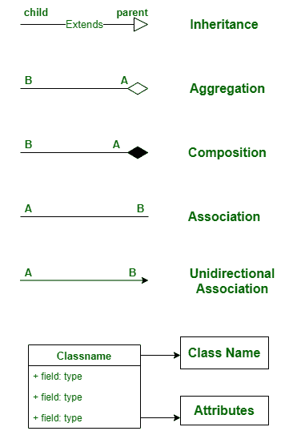
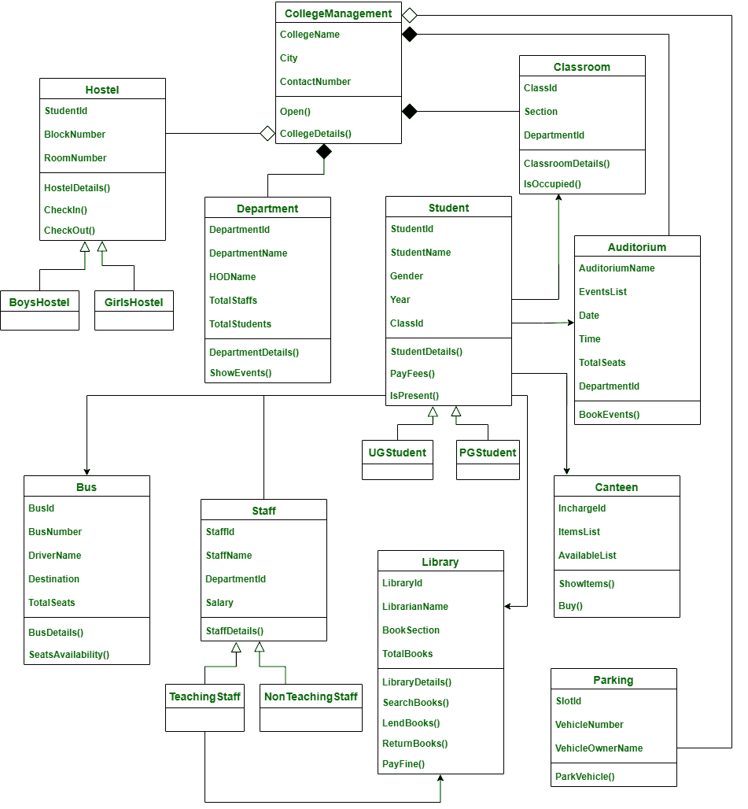

# 学院管理系统类图

> 原文:[https://www . geeksforgeeks . org/学院管理系统班级图/](https://www.geeksforgeeks.org/class-diagram-for-college-management-system/)

类图是表示类之间关系的方式。在本文中，我们将看到学院管理系统的类图。

**类:**

*   **college management**–这个班是整个系统的整体主班。
*   **系**–本课包含学院各个系的详细情况。
*   **学生**–这个班是给学生的，是两个子班——UGStudent 和 PGStudent 的基础班。因为学生是学生，学生是学生
*   **UGStudent**–该类是 Student 的子类，包含 UGStudent 的详细信息。
*   **PGStudent**–该类是 Student 的子类，包含 PGStudent 的详细信息。
*   **人员**–学院有两种人员。所以这个类是两个子类的基类——教学人员和非教学人员
*   **教练组**–该班是教练组的子班。因为教工就是教工。
*   **非教学人员**–该类是人员的子类。因为非教学人员是工作人员。
*   **教室**–这门课包含了整个学院每一个教室的细节。
*   **食堂**–这个班是用来存放学院内部食堂的详细资料的
*   **图书馆**–这门课包含了学院中某个特定图书馆的详细信息
*   **总线**–该类包含总线的详细信息以及总线驱动程序的详细信息
*   **招待所**–招待所有两种类型。所以这个类是两个子类的基类——BoysHostel 和 GirlsHostel。
*   **BoysHostel**–这个班是招待所的儿童班。因为男孩旅馆是一家招待所。
*   **女生宿舍**–这个班是招待所的子班。因为女生宿舍是招待所。
*   **停车**–本课包含某学院停车区的详细信息。停车区可供学生、工作人员、游客等使用。
*   **礼堂**–礼堂是任何活动或嘉宾演讲发生的地方。这个类包含了它的细节。

**属性:**

*   **大学管理**—大学名称、城市、联系号码
*   **部门**–部门标识、部门名称、部门名称、总员工、总学生
*   **学生**–学生标识、学生姓名、性别、年份、班级标识
*   **员工**–员工名称、员工姓名、部门标识、工资
*   **教室**–教室号、教室号、部门号
*   **食堂**–在目标，项目列表，可用列表
*   **图书馆**–图书馆标识、图书馆名称、图书部分、总图书
*   **公交车**–公交车、公交车号、司机名、目的地、总座位
*   **主机**-学生代号、区块号、房间号
*   **停车**–槽号、车辆号、车辆所有者名称
*   **礼堂**–礼堂名称、事件列表、日期、时间、总座位、部门标识

**方法:**

**1 .高校管理:t1]**

*   **Open()**–这个方法告诉学院是否开放。
*   **学院详细信息()**–该方法包含学院的详细信息，如名称、位置和联系电话。

**2。部门:**

*   **department details()**–此方法包含部门名称及其对应的部门负责人名称，每个部门的学生总数。
*   **show events()**–此方法用于显示特定部门的任何事件。

**3。学生:**

*   **student details()**–该方法包含了学院中每个学生的所有信息。
*   **缴费()**–该方式包含每个学生的缴费状态。
*   **IsPresent()**–此方法显示学生是否在特定日期出现在学院。

**4。工作人员:**

*   **StaffDetails()**–该方法包含教师和非教师的详细信息以及他们的工资详细信息。

**5。教室:**

*   **class room details()**–此方法显示每个教室的详细信息以及教室属于哪个部门。
*   **isocupied()**–此方法告知教室是否有人

**6。食堂:**

*   **显示项目()**–该方法显示食堂中存在的项目
*   **Buy()**–此方法用于在学院食堂购买任何物品。

**7。库:**

*   **library details()**–此方法包含学院内部图书馆的详细信息
*   **search books()**–此方法用于搜索图书馆中的任何一本书。
*   **LendBooks()**–这个方法是从图书馆取书。
*   **还书()**–此方法用于包含还书的详细信息。
*   **支付罚款()**–此方法包含支付罚款的详细信息。

**8。总线:**

*   **公交详情()**–该方法包含区域详情、公交名称、司机详情等公交详情。
*   **座位可用性()**–该方法显示特定公交车中可用座位的详细信息。

**9。招待所:**

*   **招待所详细信息()**–该方法包含招待所的详细信息，如街区数量、典狱长详细信息、食物详细信息等。
*   **签入()**–这种方法是检查学生是否在宿舍。
*   **结账()**–这种方法是检查学生在外地时是否从招待所结账。

**10。停车:**

*   **park vehicle()**–该方法用于存储学院内停放车辆的详细信息。

**11 时。礼堂:**

*   **BookEvents()**–这种方法是预订礼堂进行活动。

**关系:**

**1。继承:**

继承是从一个类到另一个类获取所需属性的实践。获取属性的类称为子类。允许获取其属性的类称为父类。这就是所谓的亲子关系。Ie。**“Is-a”**关系

> 这里，下面的类遵循继承
> 
> *   学生 UGStudent 和 PGStudent
> *   教职员工-教职员工和非教职员工
> *   旅舍-博雅苏德和向日葵旅舍
> 
> **学生-UG 学生和 PG 学生:**
> 
> UG Student 和 PG student 是学生的子班级，UG 是学生，PG 是学生。
> 
> **教职员工-教职员工和非教职员工:**
> 
> 教职员工和非教职员工是教职员工的子班级。教职员工是教职员工，非教职员工也是教职员工。
> 
> **旅舍-博雅苏德和向日葵旅舍:**
> 
> BoysHostel 和 GirlsHostel 是旅社的儿童班。男生宿舍是招待所，女生宿舍是招待所。

**2。聚合:**

在聚合中，A 类和 B 类是相互依赖的，这表明 A 有一个 B and B 的实例，B 有一个实例，但它们在物理上并不包含在彼此内部。简单来说，B 类可以没有 a 类而存在，它遵循**“有-a”**关系。

> 这里，下面的类遵循聚合，
> 
> *   学院管理和宿舍
> *   大学管理和停车。
> 
> 他们遵循聚合，因为没有学院，招待所和停车场也能存在。

**3。组成:**

在组合中，A 类和 B 类是相互依赖的，这表明 A 类在 A 类中有一个 B 类的实例，换句话说，B 类物理上包含在 A 类中，所以 B 类没有 A 类就不能存在，它遵循一种**“has-A”**的关系。

> 在这里，
> 
> *   学院管理和系
> *   学院管理和礼堂
> *   大学管理与课堂
> 
> 遵循构图。
> 
> 因为院系、礼堂、教室离不开学院管理，是在学院管理内部物理构成的。

**4。关联:**

在关联中，一个类不以任何方式委托给另一个类，但是这两个类相互使用，并在各自的空间中运行。它遵循“使用”关系。

> 在这里，
> 
> *   学生和工作人员
> 
> 遵循关联，因为学生使用员工，员工使用学生

**5。单向关联:**

在单向关联中，两个类在某些方面是相关的，但是只有一个类使用另一个类，而另一个类没有从这种关系中受益。甲类可以叫乙类，乙类不能叫甲类

> 在这里，
> 
> *   学生与课堂
> *   学生与图书馆
> *   教师与图书馆
> *   学生和公共汽车
> *   学生和礼堂
> *   学生和食堂
> 
> 遵循单向关联，因为教室、图书馆、公共汽车、礼堂和食堂正在被学生使用，而另一方面，教室、图书馆、公共汽车、礼堂和食堂并没有从与学生的关系中受益。所以他们遵循单向联想。

**符号:**

**类图:**

