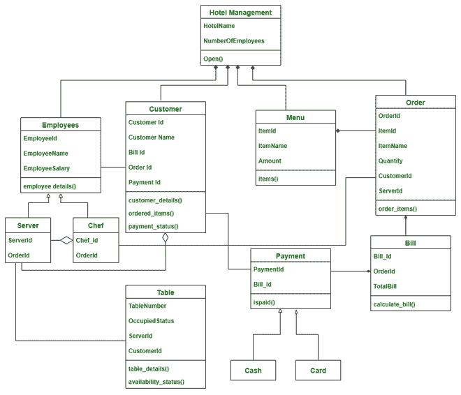

# 酒店管理系统类图

> 原文:[https://www . geesforgeks . org/酒店管理系统类图/](https://www.geeksforgeeks.org/class-diagram-for-hotel-management-system/)

类图是一种展示各种对象之间的属性和关系的 UML 图**。**

**级:**

该系统中使用的类有，

*   **酒店管理:**这个类描绘的是整个酒店，说的是酒店是开业还是关门。
*   **员工:**包含员工的详细信息。有两种员工，服务员和厨师。这个雇员类是两个子类——服务器和厨师的父类
*   **服务器:**它包含服务器的详细信息、它们被分配到的表、当前服务的订单等。
*   **厨师:**包含厨师在做特定订单的细节。
*   **客户:**包含客户的详细信息。
*   **表:**它包含表的详细信息，如表号和分配给该表的服务器。
*   **菜单:**菜单包含餐厅中所有可提供的食物项目、它们的可用性、奖品等。
*   **订单:**订单描述与特定表格和客户相关的订单。
*   **账单:**账单使用订单和菜单计算。
*   **支付:**这个班是做支付的。付款有两种方式，现金或信用卡。所以支付是父类，现金和卡是子类。
*   **现金:**可以现金支付
*   **刷卡:**付款可以刷卡，也可以在线

**属性:**

*   **酒店管理**–酒店名称，员工人数
*   **员工**–员工 Id、员工姓名、员工工资
*   **伺服器**–伺服器，顺序 Id
*   **厨师**–厨师 Id，定语
*   **客户**–客户标识、客户名称、账单标识、订单标识、付款标识
*   **表**–表号、占用状态、服务器标识、客户标识
*   **菜单**–item id、ItemName、Amount
*   **订单**–订单标识、项目标识、项目名称、数量、客户标识、服务器标识
*   **条例草案**—条例草案 _Id、订单编号、合计条例草案
*   **付款**–付款编号，账单编号

**方法:**

**1。酒店管理:**

*   **open()**-用于指示酒店是否在运行。

**2。员工:**

*   **员工详细信息()**–此方法包含员工的详细信息。

**3。客户:**

*   **customer _ details()**–这描述了客户的详细信息。
*   **ordered _ items()**–此方法包含客户订购的项目。
*   **付款 _ 状态()**-表示客户是否付款。

**4。表:**

*   **table _ details()**–此方法包含了表的详细信息以及客户和座位数。
*   **availability _ status()**–此方法表示表是否被占用。

**5。菜单:**

*   **项目()**–该方法显示菜单项、其可用性和价格。

**6。订单:**

*   **order _ items()**–该方法对用户从菜单中选择的项目进行排序。

**7。账单:**

*   **calculate _ bill()**–此方法计算特定表格的账单。

**8。付款:**

*   **is paid()**–显示支付是否成功。

**关系:**

**继承:**

继承是**“是关系”**。它有一个父类及其对应的子类。子类从父类继承所需的方法和属性。

> 这里，雇员是父类，服务器和厨师是子类，因为服务器是雇员，厨师是雇员。

**关联:**

在关联中，两个类相互关联，但在物理上并不相互包含。用“关系称为**。在关联关系中，考虑我们有两个类 A 和 B，其中类 A 调用类 B，类 B 也调用类 A。**

> 在这里，
> 
> *   员工和客户
> *   服务器和表
> *   客户和付款
> *   厨师和点菜
> 
> 遵循关联关系。

**成分:**

也叫**“有”**关系，A 类有 B 类的一个实例，B 类在 A 类内部构成，没有 A 类就不能独立存在，所以在构成上一个类完全依赖于另一个类，物理上包含在里面。

> 在这里，
> 
> *   菜单和顺序
> *   订单和账单
> *   账单和付款
> 
> 遵循组成关系
> 
> 没有菜单就不能有订单，没有订单就不能有账单，没有账单就不能有付款。所以这里订单包含在菜单中，账单包含在订单中，付款包含在账单中。

**聚合:**

也称为**“有”**关系，其中 A 类有 B 类的实例，但是 B 类不是在 A 类内部组成的，没有 A 类可以独立存在，所以在聚合中，两个类相互依赖，相互使用，但是没有一个包含在另一个内部。

> 在这里，
> 
> *   客户和服务器
> *   厨师和服务员
> 
> 遵循聚合关系
> 
> 服务器与客户相关联，但也可以在没有客户的情况下存在，同样，厨师与服务器相关联，但也可以在没有服务器的情况下存在。

**符号:**

**类图:**

