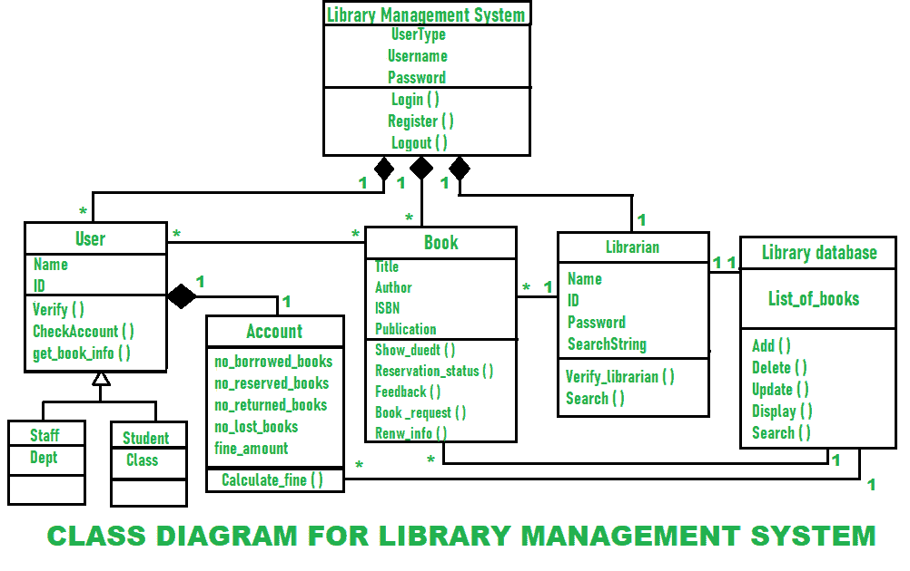

# 图书管理系统类图

> 原文:[https://www . geesforgeks . org/类图库管理系统/](https://www.geeksforgeeks.org/class-diagram-for-library-management-system/)

在[面向对象建模](https://www.geeksforgeeks.org/types-of-models-in-object-oriented-modeling-and-design/)中，主要构建块一般表示系统中不同的对象、它们的属性、它们的不同功能以及对象之间的关系。这些构件被称为**类图**。

类图通常用于软件应用程序静态视图的概念建模，以及以详细的方式将模型转换成编程代码的建模。在开发或构建软件系统时，类图被广泛使用。它们也用于数据建模。它用于显示类、类之间的关系、接口、关联等。类图中的类只是一个对象的蓝图。它简单地描述和解释了系统中不同类型的对象，以及它们之间存在的不同类型的关系。

**图书馆管理系统的类图:**
聚合和多重性是设计类图时需要考虑的两个要点。让我们详细了解一下。

1.  **聚合–**
    聚合只是简单地展示了一个事物可以独立于其他事物而存在的关系。它意味着在定义一个类时一起创建或组合不同的抽象。聚合在类图中表示为关系的一部分。在下面给出的图表中，我们可以看到聚合是由菱形末端指向超类的边来表示的。“图书馆管理系统”是由各种类组成的超类。

如图所示，这些类是用户类、图书类和图书管理员类。此外，对于“帐户”类，“用户”是一个超类。所有这些都共享一种关系，这些关系被称为聚合关系。

*   **Multiplicity –**
    Multiplicity means that number of elements of a class is associated with another class. These relations can be one-to-one, many-to-many, and many-to-one or one-to-many. For denoting one element we use **1**, for zero elements we use **0**, and for many elements we use *****. We can see in diagram; many users are associated with many books denoted by ***** and this represents a **many-to-many** type of relationship. One user has only one account that is denoted by 1 and this represents a **one-to-one** type of relationship.

    许多书与一个图书管理员相关联，这代表了**多对一**或**一对多**类型的关系。所有这些关系都显示在图表中。

    图书馆管理系统类图简单描述了图书馆管理系统类的结构、属性、方法或操作、对象之间的关系。

    **图书馆管理系统的类别:**

    *   **图书馆管理系统类–**
        管理图书馆管理系统的所有操作。它是为其设计软件的组织的核心部分。
    *   **用户类–**
        管理用户的所有操作。
    *   **图书管理员类–**管理图书管理员的所有操作。
    *   **图书类–**
        管理图书的所有操作。它是系统的基本构件。
    *   **账户类–**
        管理账户的所有操作。
    *   **库数据库类–**
        管理库数据库的所有操作。
    *   **员工班–**
        管理员工的所有操作。
    *   **学生班–**
        管理学生的所有操作。

    **图书馆管理系统属性:**

    *   **库管理系统属性–**
        用户类型、用户名、密码
    *   **用户属性–**
        姓名、身份证
    *   **图书管理员属性–**
        姓名、身份证、密码、搜索字符串
    *   **图书属性–**
        书名、作者、国际标准书号、出版物
    *   **账户属性–**
        无借出书、无预留书、无归还书、无遗失书、无罚款金额
    *   **图书馆数据库属性–**
        图书列表
    *   **员工类别属性–**
        部门
    *   **学生班级属性–**
        班级

    **图书馆管理系统方法:**

    *   **图书馆管理系统方法–**
        登录()，注册()，注销()
    *   **用户方法–**
        验证()，检查帐户()，获取 _book_info()
    *   **图书管理员方法–**
        验证 _ 图书管理员()，搜索()
    *   **预订方法–**
        显示 _duedt()，预订 _ 状态()，反馈()，预订 _ 请求()，续订 _ 信息()
    *   **核算方法–**
        计算 _ 精细()
    *   **库数据库方法–**
        添加()、删除()、更新()、显示()、搜索()

    **图书管理系统类图:**

    