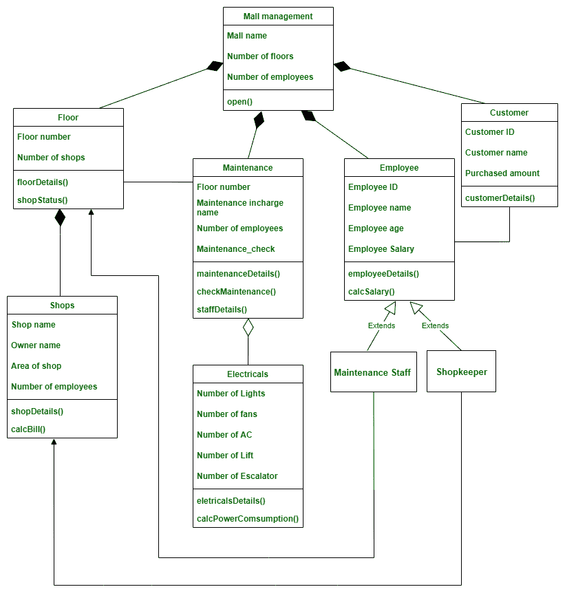

# 商场管理系统类图

> 原文:[https://www . geesforgeks . org/class-diagram-for-mall-management-system/](https://www.geeksforgeeks.org/class-diagram-for-mall-management-system/)

类图是由许多类组成的 UML 图之一，它描述了各种对象之间的属性和关系。

**类:**

商场管理系统的类别有

*   **商场管理****—**
    正是这个阶层描绘了整个商场。
*   **楼层****—**
    包含商场各楼层的详细信息。
*   **商铺****–**
    包含各楼层商铺的详细信息
*   **维护****—**
    包含商场的维护，检查所有的清洁活动是否做好。它还确保相应楼层的维护检查。
*   **员工****—**
    包含商场所有员工。但是可以有两种类型的员工，比如商店的员工和商场的员工。所以这个 Employee 类是两个子类- >店主和维修人员的父类。
*   **店主**–
    包含店主详细信息的员工子类别
*   **维修人员****—**
    员工的子班级，包含商场维修人员的详细信息。
*   **客户****–**
    包含在商场内购买任何产品的客户的详细信息。
*   **电气****–**
    它维护电梯、风扇、灯、空调和自动扶梯等所有电气设备。

**属性:**

*   **商场管理**–商场名称、楼层数、员工数
*   **楼层**–楼层号、商铺数量
*   **店铺**–店铺名称、业主名称、店铺面积、员工人数
*   **维护**–楼层号、维护负责人姓名、员工人数、维护 _ 检查
*   **员工**–员工 id、员工姓名、员工年龄、员工工资
*   **客户**–客户 id、客户名称、采购金额
*   **电气**–灯的数量、风扇的数量、空调的数量、电梯的数量、自动扶梯的数量。

**方法:**

**1。商场管理:**

*   **open()**-这个方法是通过说商场是开着还是关着来表示商场的状态。

**2。**楼 **:**

*   **地板细节()**–该方法包含地板的所有细节。
*   **shopping status()**–此方法用于指示楼层内所有店铺的状态、已开业店铺的总数以及正在关闭的店铺数量。

**3。店铺:**

*   **shopping details()**–这个方法是描述店铺，比如店铺销售的商品类型、店铺面积、物品的奖品等。
*   **calcBill()**–此方法计算特定店铺的账单金额。

**4。维护:**

*   **维修工 etails()**–该方法包含维修工部门的详细信息、他们完成的工作等。
*   **check maintenance()**-这种方法是对商场进行维护检查，如清洁地板、检查电器、清洁厕所、安全检查等。
*   **staffDetails()**-此方法用于显示所有为维护工作的员工的详细信息。

**5。员工:**

*   **employeeDetails()**–该方法包含为商店和商场工作的员工的详细信息。
*   **calcSalary()**–该方法根据每个员工的指定和完成的工作来计算他们的工资。

**6。客户:**

*   **客户详细信息()**–该方法显示客户的详细信息、他们购买的商品数量、他们购买的商店数量等。

**7。电气:**

*   **电器详情()**–该方法显示商场内所有电器的详情、工作状态、效率等
*   **calcpowercomustion()**-这个方法是计算电梯、风扇、灯、空调、自动扶梯等每个电器的耗电量。

**关系:**

**1。继承:**
继承是从一个类到另一个类获取所需属性的实践。获取属性的类称为子类。允许获取其属性的类称为父类。这就是所谓的亲子关系。Ie。“是-是”关系

```
Here,  
Shopkeeper and Maintenance staff class is the child class of the Employee class. 
Shopkeeper is an Employee. 
Maintenance staff is an Employee
It correctly satisfies “Is-a” relationship.
```

**2。聚合:**
在聚合中，A 类和 B 类是相互依赖的，这表明 A 有一个 B and B 的实例，B 有一个实例，但它们在物理上并不包含在彼此内部。它遵循“有-有”关系。

```
Here, 
class Maintenance and class Electricals have an aggregation relation.
Electrical can exist even without maintenance.
```

**3。构图:**
在构图中，A 类和 B 类是相互依赖的，这说明 A 类在 A 类里面有一个 B 类的实例，换句话说，B 类物理上包含在 A 类里面，所以 B 类没有 A 类就不能存在，它遵循**“有-A”**关系。

```
Here, 
class Floor and class shops have composition relation, i.e., Floor has a Shop.
But the reason for this being composition is Shop cannot exist without a particular floor.
```

**4。关联:**
在关联中，一个类不以任何方式致力于另一个类，但两个类都在各自的空间中相互使用和发挥作用。它遵循“使用”关系。

```
Here, 
Class Floor and Class Maintenance have an association relation. 
Ie. Floor is using maintenance and maintenance is using the floor.  
In addition, class  Customer and class Employee have association relations 
I.e. Customer is using employee, employee is using customer.
```

**5。单向关联:**
在单向关联中，两个类在某些方面是相关的，但只有一个类利用了另一个类，而另一个类并没有从这种关系中受益。

```
Here, class Shopkeeper and class Shops, 
class Maintenance staff and class Floor have a unidirectional association.
```

**符号:**


**类图:**

