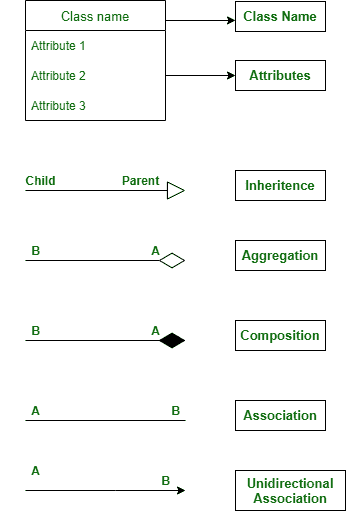
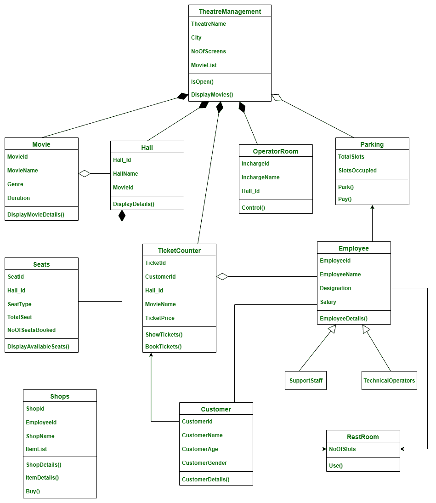

# 剧场管理系统类图

> 原文:[https://www . geesforgeks . org/class-diagram-for-theory-management-system/](https://www.geeksforgeeks.org/class-diagram-for-theatre-management-system/)

剧院是每个人都在公共场合欣赏电影的地方。在本文中，让我们看看典型的印度剧院管理系统及其类图。

**类:**

*   **剧院管理:**本课程包含剧院的详细信息。
*   **电影:**包含电影的细节以及他们的厅号和时间安排。
*   **大厅:**这个班包含了剧场里的电影银幕，是人们坐着看电影的地方。
*   **座位:**这显示了特定大厅中座位的细节，并描述了座位的类型。座椅的类型可以是前排座椅、后排座椅、阳台座椅。
*   **客户:**包含客户的相关信息。
*   **TicketCounter :** 这个类是根据电影的费率给客户卖票。
*   **员工:**该类用于存储员工数据。员工可以有两种类型。所以这个类是两个子类的基类——技术操作员和支持人员
*   **技术操作员:**该类是 Employees 的子类。技术人员是操作屏幕和音响系统的人。
*   **SupportStaff :** 这也是 Employee 的子类。这些人负责清洁、发行门票、守卫和维护剧院。
*   **停车:**此类包含停车场的详细信息。在这里我们可以停车并支付停车费。
*   **商店:**此类包含剧院内出售小吃和其他东西的商店的详细信息。
*   **操作室:**这个房间负责展示电影。这个房间里的操作员控制着剧院的屏幕和音响系统。
*   **洗手间:**这门课是关于剧院的洗手间，以及它们的可用性等。

**属性:**

*   **管理:**重命名、城市、无屏幕、电影列表
*   **电影:**电影 Id、电影名称、类型、时长
*   **大厅:**大厅 _Id，大厅名称，电影 Id
*   **座位:**座位号、大厅号、座位类型、总座位号、无座位预订
*   **客户:**客户标识、客户名称、客户区域、客户名称
*   **TicketCounter :** TicketId，CustomerId，Hall_Id，MovieName，TicketPrice
*   **员工:**员工 Id，员工姓名，职务，工资
*   **停车:**总槽数，槽数，
*   **店铺:**店铺编号、员工编号、店铺名称、商品列表
*   **操作室:**主管，主管名，大厅号
*   **洗手间:**洗手间

**方法:**

**1。管理员:**

*   **IsOpen()**–此方法告知特定剧院是开放还是关闭。
*   **display movies()**–此方法显示特定影院的电影列表。

**2。电影:**

*   **DisplayMovieDetails()**–它显示电影的详细描述，如电影的屏幕数量、时间和类型。

**3。大厅:**

*   **display details()**–此方法显示剧场内大厅的细节。

**4。座位:**

*   **显示可用座位()**–该方法显示每个类别中特定大厅的可用座位**。**

**5。客户:**

*   **CustomerDetails()**–此方法包含来剧院看电影的客户的详细信息。

**6。售票员:t1]**

*   **show tickets()**–此方法显示电影的可用门票及其价格。
*   **预订门票()**–此方法用于预订特定演出的门票。

**7。员工:**

*   **员工详细信息()**–该方法用于显示员工的详细信息以及他们的名称。

**8。停车:**

*   **停放()**–这种方法是将车辆停放在可用的插槽中。
*   **支付()**–这种方式是支付停车费。

**9。店铺:**

*   **shop details():**–此方法显示店铺的详细信息。
*   **项目详细信息()**–该方法显示可用项目及其成本价。
*   **Buy()**–此方法用于购买店铺内的物品。

**10。操作室:**

*   **控制()**–这个方法是控制屏幕、显示的电影以及音响系统的音量等控制。

**11 时。休息室:**

*   **使用()**–这个方法是使用洗手间

**关系:**

**继承:**

继承是子类从父类或基类获取资源的概念。在继承中，允许共享属性的类称为父类，从父类获取属性的类称为子类。继承大大减少了重新编码的需要，并允许代码重用。

> 这里员工是父类，技术人员和支持人员是子类。

**成分:**

组合是一种关系类型，其中一个特定的类拥有另一个类。在组合中，依赖类不能在没有独立类的情况下存在，并且物理上包含在独立类中。

> 这里这些类之间存在组合关系，
> 
> *   管理和操作室
> *   管理和大厅
> *   剧院管理与电影
> *   大厅和座位
> *   剩余管理和票证
> 
> 因此，在这里，如果没有剧院，操作室、大厅、电影和票甚至不能存在，所以它们实际上包含在剧院内。同样，没有大厅，就没有座位。

**关联:**

关联是一种关系，在这种关系中，两个类使用彼此和它们的方法。在关联中，没有一个类是另一个类的所有者，因为两个类相互使用，仍然保留在自己的空间中。

> 这里，关联关系存在于
> 
> *   客户和员工
> *   顾客和商店
> 
> 因为他们顾客需要员工，员工需要顾客，同样，顾客从商店购物，商店从顾客那里获利。

**单向关联:**

顾名思义，单向关联是一种关系只在一个方向上的关联。只有一个类使用另一个类的方法，而另一个类没有从这种关系中受益。

> 这里这些类之间存在单向关联，
> 
> *   顾客和洗手间
> *   客户和机票
> *   员工和停车
> *   员工和洗手间
> 
> 这里顾客使用洗手间和车票，员工使用停车场和洗手间。在这里，只有前者受益于后者。

**聚合:**

聚合是一种关系，其中一个类依赖于另一个类，但即使没有另一个类也可以存在。简而言之，依赖类在物理上并不包含在独立类中。

> 这里这些类之间存在聚合关系
> 
> *   剧院管理和停车
> *   电影和大厅
> *   TickerCounter 和员工
> 
> 这些类相互使用，但并不完全相互依赖，也不是物理上包含的。

**符号:**

**类图:**

