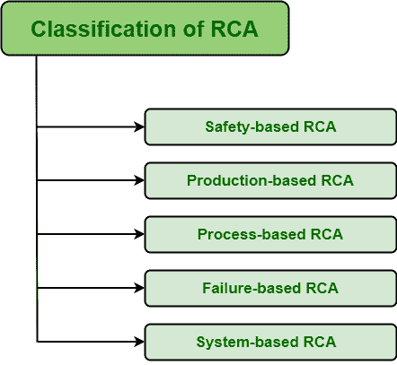

# 基于领域的 RCA 分类

> 原文:[https://www . geeksforgeeks . org/按域分类 RCA/](https://www.geeksforgeeks.org/classification-of-rca-on-basis-of-domain/)

[根本原因分析(RCA)](https://www.geeksforgeeks.org/advantages-and-disadvantages-of-root-cause-analysis/) 基本上被认为是一种调查，目的只是确定问题的真正原因。它还旨在找到非常必要的行动和措施，通过永久解决而不是解决症状来消除它。RCA 是一种简单识别和解决问题或缺陷的反应式方法。由此，我们可以说，分析是在问题或缺陷发生后进行的。RCA 通常根据其应用领域进行分类。分类如下:

这些解释如下。

1.  **基于安全的 RCA–**
    基于安全的 RCA，顾名思义，就是在安全的基础上进行的分析。这些安全可以被认为是职业安全、健康安全等。在这种情况下，如果在安全、健康等领域出现任何问题或事件。，然后使用 RCA 技术来分析或调查问题。在此 RCA 中，根本原因可能是安全屏障不可用、危险或尚未确定的损坏等。

*   **基于生产的 RCA–**
    基于生产的 RCA，顾名思义，就是在生产的基础上进行的分析。这些产品可被视为与制造产品相关的行业的质量控制。在这种情况下，如果生产领域出现任何问题或事件，则使用 RCA 技术来分析或调查问题。在这种 RCA 中，根本原因可能是功能故障、生产线错误等。*   **基于过程的 RCA–**
    基于生产的 RCA，顾名思义，就是在过程的基础上进行的分析。在这种情况下，如果在现场软件开发过程(即改进设计、产品管理和项目管理的过程)中出现任何问题或事件，则使用 RCA 技术来分析或调查问题。在这个 RCA 中，根本原因可能是个人过程中的失败、过程步骤中的错误等。*   **基于失败的 RCA–**
    基于失败的 RCA，顾名思义，就是在失败的基础上进行的分析。如果在软件维护领域出现任何问题或事件，即修改、更新、提高软件可靠性和性能的过程，则使用 RCA 技术来分析或调查问题。在这种 RCA 中，根本原因可能是维护失败。*   **基于系统的 RCA–**
    基于系统的 RCA，顾名思义，就是在系统的基础上进行的分析。如果任何问题或事件发生在变更管理领域，即请求、评估、规划、实施系统变更的过程，或风险管理领域，即识别、管理或控制软件开发过程中形成的风险的过程，等等。，然后使用 RCA 技术来分析或调查问题。在这种 RCA 中，根本原因可能是组织文化、战略管理的失败。